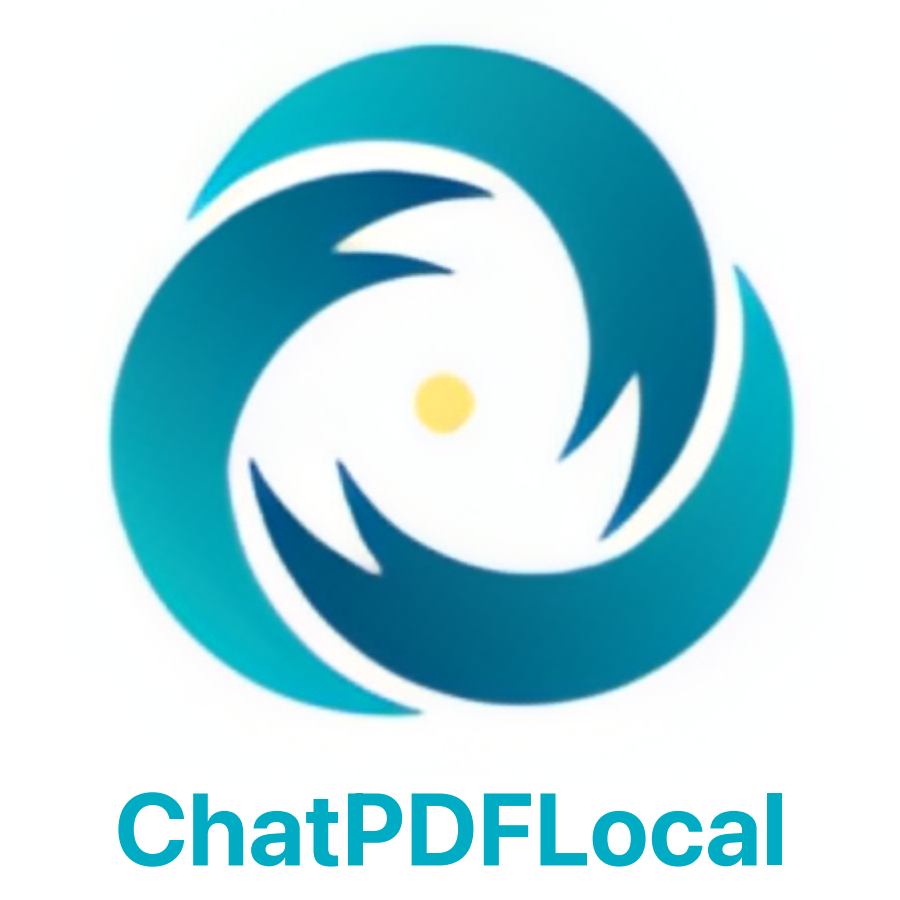

# Awesome DeepSeek Integrations 

Integrate the DeepSeek API into popular softwares. Access [DeepSeek Open Platform](https://platform.deepseek.com/) to get an API key.

English/[简体中文](https://github.com/deepseek-ai/awesome-deepseek-integration/blob/main/README_cn.md)/[繁體中文](https://github.com/deepseek-ai/awesome-deepseek-integration/blob/main/README_zh_tw.md)/[日本語](https://github.com/deepseek-ai/awesome-deepseek-integration/blob/main/README_ja.md)/[Español](https://github.com/deepseek-ai/awesome-deepseek-integration/blob/main/README_es.md)

## Table of Contents

- [Awesome DeepSeek Integrations ](#awesome-deepseek-integrations-)
  - [Table of Contents](#table-of-contents)
  - [Project List](#project-list)
    - [Applications](#applications)
    - [AI Agent frameworks](#ai-agent-frameworks)
    - [Data AI Applications frameworks](#data-ai-applications-frameworks)
    - [RAG frameworks](#rag-frameworks)
    - [FHE (Fully Homomorphic Encryption) frameworks](#fhe-fully-homomorphic-encryption-frameworks)
    - [Solana frameworks](#solana-frameworks)
    - [Synthetic data curation](#synthetic-data-curation)
    - [IM Application Plugins](#im-application-plugins)
    - [Office Addin](#office-addin)
    - [Browser Extensions](#browser-extensions)
    - [VS Code Extensions](#vs-code-extensions)
    - [Visual Studio Extensions](#visual-studio-extensions)
    - [neovim Extensions](#neovim-extensions)
    - [JetBrains Extensions](#jetbrains-extensions)
    - [Discord Bots](#discord-bots)
    - [Native AI Code Editor](#native-ai-code-editor)
    - [Emacs](#emacs)
    - [Security](#security)
    - [Providers](#providers)
    - [Others](#others)
    - [Star History](#star-history)

## Project List

###  Applications

<table>
    <tr>
        <td></td>
        <td><a href="https://github.com/AAswordman/Operit">Operit AI</a></td>
        <td>An open-source system integration AI assistant for the Android platform, supporting almost complete mcp usage and highly compatible with the Android system. The software features both high customization and a low learning threshold, with built-in tools for file operations, searches, automatic clicks, format conversions, and an integrated DeepSeek API webpage.</td>
    </tr>
    <tr>
        <td></td>
        <td><a href="https://migo.intern-ai.org.cn/">Migo</a></td>
        <td>A free AI innovation accelerator offering intelligent Q&A, in-depth paper comprehension, cutting-edge AI tools, and a personal academic knowledge base. As your exploration partner, Migo helps you discover and realize outstanding ideas!</td>
    </tr>
    <tr>
        <td></td>
        <td><a href="https://github.com/Lucassssss/eechat">eechat</a></td>
        <td>A simple and user-friendly tool for local deployment of large language models, supporting local private deployment of open-source models such as DeepSeek-R1, DLlama 3, Phi-4, Mistral, Gemma 3, etc., while also supporting remote LLM API calls.</td>
    </tr>
    <tr>
        <td></td>
        <td><a href="https://openrouter.ai/">OpenRouter</a></td>
        <td>OpenRouter provides a unified API that gives you access to hundreds of AI models through a single endpoint, while automatically handling fallbacks and selecting the most cost-effective options. Get started with just a few lines of code using your preferred SDK or framework.</td>
    </tr>
    <tr>
        <td></td>
        <td><a href="https://github.com/aingdesk/AingDesk">AingDesk</a></td>
        <td>One-click deployment of AI models on your computer with a visual interface, featuring an elegant chat UI. It allows online sharing for collaborative use, supports various models like DeepSeek, and enables web search and third-party API integration.</td>
    </tr>
    <tr>
        <td></td>
        <td><a href="https://www.dingtalk.com/">DingTalk</a></td>
        <td>DingTalk AI Assistant integrates multiple AI product features from the DingTalk platform to intelligently support enterprises in their daily workflows. It possesses various intelligent capabilities, including but not limited to smart communication, smart collaboration, and smart management.
With these functionalities, the AI assistant can summarize key points within an organization, generate meeting minutes, and provide users with relevant task notifications and schedule reminders. Additionally, DingTalk AI Assistant leverages its knowledge base to intelligently answer common employee inquiries regarding company administrative processes, HR policies, and other related topics.</td>
    </tr>
    <tr>
        <td></td>
        <td><a href="https://chatdoc.com">ChatDOC</a></td>
        <td>ChatDOC is an AI-powered document reading tool equipped with robust traceability features, ensuring that the source of every piece of information is clear and verifiable, helping you efficiently and accurately grasp the core of your documents.</td>
    </tr>
    <tr>
        <td>  </td>
        <td> <a href="docs/SwiftChat/README.md">SwiftChat</a></td>
        <td> <a href="https://github.com/aws-samples/swift-chat">SwiftChat</a> is a lightning-fast, cross-platform AI chat application built with React Native. It delivers native performance on Android, iOS, and macOS. Features include real-time streaming chat, rich Markdown support, AI image generation, customizable system prompts, quick model selection and multimodal capabilities. Supports multiple AI providers including DeepSeek, Amazon Bedrock, Ollama and OpenAI Compatible Modles with clean UI and high performance.</td>
    </tr>
    </tr>
        <td></td>
        <td><a href="https://github.com/deepseek-ai/awesome-deepseek-integration/blob/main/docs/4EVERChat/README.md">4EVERChat</a></td>
        <td><a href="https://chat.4everland.org/">4EVERChat</a> is an intelligent model selection platform integrating hundreds of LLMs, enabling real-time comparison of model performance. Leveraging <a href="https://www.4everland.org/">4EVERLAND</a> AI RPC's unified API endpoint, it achieves cost-free model switching and automatically selects combinations with fast responses and low costs.</td>
    </tr>
    <tr>
        <td></td>
        <td><a href="./docs/xhai_browser/README.md">xhai Browser</a></td>
        <td>xhai Browser is an Android desktop management & AI browser, DeepSeek is the default AI dialog engine.It has the ultimate performance (0.2 seconds to start), slim size (apk 3M), no ads, ultra-fast ad blocking, multi-screen classification, screen navigation, multi-search box, a box multiple search!</td>
    </tr>
    <tr>
        <td></td>
        <td><a href="https://intellibar.app/">IntelliBar</a></td>
        <td>IntelliBar is a beautiful assistant for the Mac that lets you use advanced models like DeepSeek R1 with any app on your Mac — ex: edit emails in your mail app or summarize articles in your browser.</td>
    </tr>
    <tr>
        <td> </td>
        <td><a href="https://www.gptbots.ai/docs">GPTBots</a></td>
        <td><a href="https://www.gptbots.ai/">GPTBots</a> is a no-code AI agent building platform that integrates major international LLMs, including Deepseek. It offers modules for RAG-based knowledge storage/retrieval, tool customization/calling, and workflow orchestration. Additionally, it allows agents to be integrated into multiple mainstream platforms (such as WhatsApp, Telegram, etc.), providing end-to-end AI solutions for businesses and helping them stand out in the AI era.</td>
    </tr>
    <tr>
        <td></td>
        <td><a href="https://github.com/ThinkInAIXYZ/deepchat/blob/main/README.md">DeepChat</a></td>
        <td>DeepChat is a fully free desktop smart assistant, with a powerful DeepSeek large model, supporting multi-round conversations, internet search, file uploads, knowledge bases, and more.</td>
    </tr>
    <tr>
        <td width=80>  </td>
        <td> <a href="https://github.com/quantalogic/quantalogic">Quantalogic</a> </td>
        <td> QuantaLogic is a ReAct (Reasoning & Action) framework for building advanced AI agents. </td>
    </tr>
    <tr>
        <td>  </td>
        <td> <a href="https://github.com/deepseek-ai/awesome-deepseek-integration/blob/main/docs/chatbox/README.md">Chatbox</a> </td>
        <td> Chatbox is a desktop client for multiple cutting-edge LLM models, available on Windows, Mac and Linux. </td>
    </tr>
    <tr>
        <td>  </td>
        <td> <a href="https://github.com/deepseek-ai/awesome-deepseek-integration/blob/main/docs/chatgpt_next_web/README.md"> ChatGPT-Next-Web </a> </td>
        <td> ChatGPT Next Web is a cross-platform ChatGPT web UI, with GPT3, GPT4 & Gemini Pro support. </td>
    </tr>
    <tr>
        <td>  </td>
        <td> <a href="https://casibase.org/docs/category/beginner-guide/">Casibase</a></td>
        <td> <a href="https://casibase.org">Casibase</a> is an open source AI knowledge base and dialogue system that combines the latest RAG technology, SSO functionality, and support for a wide range of mainstream AI models. Casibase is designed to provide enterprises and developers with a powerful, flexible, and easy-to-use knowledge management and intelligent dialogue platform. </td>
    </tr>
    <tr>
        <td>  </td>
        <td> <a href="docs/Coco AI/README.md">Coco AI</a></td>
        <td> <a href="https://coco.rs">Coco AI</a> is a fully open-source, cross-platform unified search and productivity tool that connects and searches across various data sources, including applications, files, Google Drive, Notion, Yuque, Hugo, and more, both local and cloud-based. By integrating with large models like DeepSeek, Coco AI enables intelligent personal knowledge management, emphasizing privacy and supporting private deployment, helping users quickly and intelligently access their information. </td>
    </tr>
    <tr>
        <td>  </td>
        <td> <a href="https://github.com/deepseek-ai/awesome-deepseek-integration/blob/main/docs/liubai/README.md">Liubai</a> </td>
        <td> Liubai allows DeepSeek to have arms and legs to manipulate your notes, tasks, calendars, and to-do lists just on WeChat! </td>
    </tr>
    <tr>
        <td>  </td>
        <td> <a href="https://github.com/deepseek-ai/awesome-deepseek-integration/blob/main/docs/pal/README.md"> Pal - AI Chat Client (iOS, ipadOS) </a> </td>
        <td> Pal is a customized chat playground on iOS. </td>
    </tr>
    <tr>
        <td>  </td>
        <td> <a href="https://www.librechat.ai/docs/configuration/librechat_yaml/ai_endpoints/deepseek">LibreChat</a> </td>
        <td> LibreChat is a customizable open-source app that seamlessly integrates DeepSeek for enhanced AI interactions. </td>
    </tr>
     <tr>
        <td>  </td>
        <td> <a href="https://github.com/longevity-genie/just-chat">Just-Chat</a> </td>
        <td> Make your LLM agent and chat with it simple and fast!</td>
     </tr>
    <tr>
        <td>  </td>
        <td> <a href="https://github.com/papersgpt/papersgpt-for-zotero">PapersGPT</a> </td>
        <td> PapersGPT is a Zotero plugin that seamlessly with DeepSeek and other multiple AI models for quickly reading papers in Zotero. </td>
    </tr>
    <tr>
        <td>  </td>
        <td> <a href="https://github.com/deepseek-ai/awesome-deepseek-integration/blob/main/docs/rss_translator/README.md"> RSS Translator </a> </td>
        <td> Translate RSS feeds into your language! </td>
    </tr>
    <tr>
        <td>  </td>
        <td> <a href="https://relingo.net"> Relingo </a> </td>
        <td> Build and master vocabulary while you browse website and watch youtube! </td>
    </tr>
    <tr>
        <td>  </td>
        <td> <a href="https://github.com/deepseek-ai/awesome-deepseek-integration/blob/main/docs/enconvo/README.md"> Enconvo </a> </td>
        <td> Enconvo is the Launcher of the AI era, the entry point for all AI functions, and a thoughtful intelligent assistant.</td>
    </tr>
    <tr>
        <td></td>
        <td><a href="https://github.com/deepseek-ai/awesome-deepseek-integration/blob/main/docs/cherrystudio/README.md">Cherry Studio</a></td>
        <td>A powerful desktop AI assistant for producer</td>
    </tr>
    <tr>
        <td>  </td>
        <td> <a href="https://github.com/deepseek-ai/awesome-deepseek-integration/blob/main/docs/tomemo/README.md"> ToMemo (iOS, ipadOS) </a> </td>
        <td> A phrasebook + clipboard history + keyboard iOS app with integrated AI macromodeling for quick output use in the keyboard.</td>
    </tr>
    <tr>
        <td>  </td>
        <td> <a href="https://github.com/buxuku/video-subtitle-master">Video Subtitle Master</a></td>
        <td> Batch generate subtitles for videos, with the ability to translate subtitles into other languages. This is a client-side tool that supports both Mac and Windows platforms and integrates with multiple translation services such as Baidu, Volcengine, DeepLx, OpenAI, DeepSeek, and Ollama.</td>
    </tr>
    <tr>
        <td>  </td>
        <td> <a href="https://github.com/UnknownEnergy/chatgpt-api/blob/master/README.md">Chatworm</a> </td>
        <td> Chatworm is a webapp for multiple cutting-edge LLM models, open-source and also available on Android. </td>
    </tr>
    <tr>
        <td>  </td>
        <td> <a href="https://github.com/tisfeng/Easydict">Easydict</a></td>
        <td> Easydict is a concise and easy-to-use translation dictionary macOS App that allows you to easily and elegantly look up words or translate text. Supports calling large language model APIs for translation.</td>
    </tr>
    <tr>
        <td>  </td>
        <td> <a href="docs/raycast/README.md">Raycast</a></td>
        <td> <a href="https://raycast.com/?via=ViGeng">Raycast</a> is a productivity tool for macOS that lets you control your tools with a few keystrokes. It supports various extensions including DeepSeek AI.</td>
    </tr>
    <tr>
        <td>  </td>
        <td> <a href="https://www.chatpdflocal.com">ChatPDFLocal</a> </td>
        <td> ChatPDFLocal is an AI powered Mac OS App for helping to chat PDF, it works seamlessly with DeepSeek and other multiple AI models to improve your reading efficiency. </td>
    </tr>
    <tr>
        <td>  </td> <td> <a href="https://niceprompt.app">Nice Prompt</a></td> <td> <a href="https://niceprompt.app">Nice Prompt</a> Organize, share and use your prompts in your code editor, with Cursor and VSCode。</td>
    </tr>
    <tr>
        <td>  </td>
        <td> <a href="https://github.com/deepseek-php/deepseek-php-client/blob/master/README.md">PHP Client</a> </td>
        <td> Deepseek PHP Client is a robust and community-driven PHP client library for seamless integration with the Deepseek API. </td>
    </tr>
        <tr>
  <td>
    
  </td>
  <td>
    <a href="https://github.com/tornikegomareli/DeepSwiftSeek/blob/main/README.md">DeepSwiftSeek</a>
  </td>
  <td>
    DeepSwiftSeek is a lightweight yet powerful Swift client library, pretty good integration with the DeepSeek API.
    It provides easy-to-use Swift concurrency for chat, streaming, FIM (Fill-in-the-Middle) completions, and more.
  </td>
</tr>
        <td>  </td>
        <td> <a href="https://github.com/deepseek-php/deepseek-laravel/blob/master/README.md">Laravel Integration</a> </td>
        <td> Laravel wrapper for Deepseek PHP client, to seamless deepseek API integration with laravel applications.</td>
    </tr>
    <tr>
        <td>  </td>
        <td> <a href="https://github.com/cohesion-org/deepseek-go/blob/main/README.md">Deepseek Go</a> </td>
        <td>  A Deepseek client written for Go supporting Chat and Reasoning Models. Also supports external providers like Azure, OpenRouter and others. </td>
    </tr>
    <tr>
        <td>  </td>
        <td> <a href="docs/zotero/README_cn.md">Zotero</a></td>
        <td> <a href="https://www.zotero.org">Zotero</a> is a free, easy-to-use tool to help you collect, organize, annotate, cite, and share research. It can use deepseek as translation service.</td>
    </tr>
    <tr>
        <td>  </td>
        <td> <a href="docs/SiYuan/README.md">SiYuan</a> </td>
        <td> SiYuan is a privacy-first personal knowledge management system that supports complete offline usage, as well as end-to-end encrypted data sync.</td>
    </tr>
    <tr>
        <td>  </td>
        <td> <a href="https://github.com/ArvinLovegood/go-stock/blob/master/README.md">go-stock</a> </td>
        <td>go-stock is a Chinese stock data viewer built by Wails with NativeUI and powered by LLM.</td>
    </tr>
    <tr>
        <td>  </td>
        <td> <a href="docs/wordware/README.md">Wordware</a> </td>
        <td><a href="https://www.wordware.ai/">Wordware</a> is a toolkit that enables anyone to build, iterate, and deploy their AI stack with just natural language.</td>
    </tr>
    <tr>
        <td>  </td>
        <td> <a href="https://github.com/langgenius/dify/">Dify</a> </td>
        <td> <a href="https://dify.ai/">Dify</a> is an LLM application development platform that supports DeepSeek models for creating assistants, workflows, text generators, and more. </td>
    </tr>
    <tr>
        <td>  </td>
        <td> <a href="https://github.com/enricoros/big-AGI/blob/v2-dev/README.md">Big-AGI</a> </td>
        <td><a href="https://big-agi.com/">Big-AGI</a> is a groundbreaking AI suite designed to democratize access to advanced artificial intelligence for everyone.</td>
    </tr>
    <tr>
        <td>  </td>
        <td> <a href="https://github.com/LiberSonora/LiberSonora/blob/main/README_en.md">LiberSonora</a> </td>
        <td> LiberSonora, meaning "Voice of Freedom", is an AI-powered, robust, open-source audiobook toolkit that includes features like intelligent subtitle extraction, AI title generation, multilingual translation, with support for GPU acceleration and batch offline processing.</td>
    </tr>
    <tr>
        <td>  </td>
        <td> <a href="https://bobtranslate.com/">Bob</a></td>
        <td> <a href="https://bobtranslate.com/">Bob</a> is a macOS translation & OCR tool ready to use in any app — right out of the box!</td>
    </tr>
    <tr>
        <td>  </td>
        <td> <a href="https://agenticflow.ai/">AgenticFlow</a> </td>
        <td> <a href="https://agenticflow.ai/">AgenticFlow</a> is a no-code platform where marketers build agentic AI workflows for go-to-market automation, powered by hundreds of everyday apps as tools for your AI agents.</td>
    </tr>
    <tr>
        <td>  </td>
        <td> <a href="https://stranslate.zggsong.com/en/">STranslate</a></td>
        <td> <a href="https://stranslate.zggsong.com/en/">STranslate</a>（Windows） is a ready-to-go translation ocr tool developed by WPF </td>
    </tr>
    <tr>
        <td>  </td>
        <td> <a href="https://devinci.onicai.com/">DeVinci</a></td>
        <td> <a href="https://devinci.onicai.com/">DeVinci</a> is the end-to-end decentralized AI chat app to privately chat with open-source LLMs.</td>
    </tr>
     <tr>
        <td>  </td>
        <td> <a href="https://github.com/Anwar-alhitar/Deepseek.Asp.Client/blob/master/README.md">ASP Client</a> </td>
        <td><a href="https://github.com/Anwar-alhitar/Deepseek.Asp.Client/blob/master/README.md">Deepseek.ASPClient</a>  is a lightweight ASP.NET wrapper for the Deepseek AI API, designed to simplify AI-driven text processing in .NET applications.. </td>
    </tr>
    <tr>
        <td>  </td>
        <td> <a href="https://www.gptaiflow.tech/docs/product/api-keys-setup#setup-deepseek-api-keys">GPT AI Flow</a></td>
        <td>
            The ultimate productivity weapon built by engineers for efficiency enthusiasts (themselves): <a href="https://www.gptaiflow.tech/">GPT AI Flow</a>
            <ul>
                <li>`Shift+Alt+Space` Wake up desktop intelligent hub</li>
                <li>Local encrypted storage</li>
                <li>Custom instruction engine</li>
                <li>On-demand calling without subscription bundling</li>
            </ul>
​        </td>
​    </tr>
​    <tr>
​        <td>  </td>
​        <td> <a href="https://github.com/alecm20/story-flicks">Story-Flicks</a></td>
​        <td>With just one sentence, you can quickly generate high-definition story short videos, supporting models such as DeepSeek.</td>
​    </tr>
​    <tr>
​        <td>  </td>
​        <td> <a href="docs/16x_prompt/README.md">16x Prompt</a> </td>
​        <td> <a href="https://prompt.16x.engineer/">16x Prompt</a> is an AI coding tool with context management. It helps developers manage source code context and craft prompts for complex coding tasks on existing codebases.</td>
​    </tr>
​    <tr>
​        <td>  </td>
​        <td> <a href="https://github.com/deepseek-ai/awesome-deepseek-integration/blob/main/docs/Alpha派/README.md"> Alpha Pai </a> </td>
​        <td> AI Research Assistant / The Next-Generation Financial Information Portal Driven by AI. Proxy for investors to attend meetings and take notes, as well as providing search and Q&A services for financial information and quantitative analysis for investment research.</td>
​    </tr>
​        <td>  </td>
​        <td> <a href="https://www.xark-argo.com">argo</a> </td>
​        <td>Locally download and run Ollama and Huggingface models with RAG on Mac/Windows/Linux. Support LLM API too.</td>
​    </tr>
​    <tr>
​        <td>  </td>
​        <td> <a href="https://www.petercat.ai">PeterCat</a> </td>
​        <td> A conversational Q&A agent configuration system, self-hosted deployment solutions, and a convenient all-in-one application SDK, allowing you to create intelligent Q&A bots for your GitHub repositories.</td>
​    </tr>
​    <tr>
​        <td>  </td>
​        <td> <a href="https://fastgpt.cn/en">FastGPT</a> </td>
​        <td>
​            FastGPT is an open-source AI knowledge base platform built on large language models (LLMs), supporting various models including DeepSeek and OpenAI. We provide out-of-the-box capabilities for data processing, model invocation, RAG retrieval, and visual AI workflow orchestration, enabling you to effortlessly build sophisticated AI applications.
​        </td>
   </tr>
   <tr>
​        <td>  </td>
​        <td> <a href="docs/ruzhiai_note/README.md">RuZhi AI Notes</a> </td>
​        <td>RuZhi AI Notes is an intelligent knowledge management tool powered by AI, providing one-stop knowledge management and application services including AI search & exploration, AI results to notes conversion, note management & organization, knowledge presentation & sharing. Integrated with DeepSeek model to provide more stable and higher quality outputs.</td>
​    </tr>
​    <tr>
​        <td>  </td>
​        <td> <a href="https://github.com/zhayujie/chatgpt-on-wechat">Chatgpt-on-Wechat</a> </td>
​        <td> Chatgpt-on-Wechat(CoW) is a flexible chatbot framework that supports seamless integration of multiple LLMs, including DeepSeek, OpenAI, Claude, Qwen, and others, into commonly used platforms or office software such as WeChat Official Accounts, WeCom, Feishu, DingTalk, and websites. It also supports a wide range of custom plugins. </td>
​    </tr>
​    <tr>
​        <td>  </td>
​        <td> <a href="https://athenalab.ai/">Athena</a> </td>
​        <td>The world's first autonomous general AI with advanced cognitive architecture and human-like reasoning capabilities, designed to tackle complex real-world challenges.</td>
​    </tr>
​    <tr>
​        <td>  </td>
​        <td> <a href="https://github.com/1Panel-dev/MaxKB">MaxKB</a> </td>
​        <td> <a href="https://maxkb.cn/">MaxKB</a> is a ready-to-use, flexible RAG Chatbot. </td>
​    </tr>
​    <tr>
​        <td>  </td>
​        <td> <a href="https://ttm.financial/gpt">TigerGPT</a> </td>
​        <td>TigerGPT is the first financial AI investment assistant of its kind based on OpenAI, developed by Tiger Group. TigerGPT aims to provide intelligent investment decision-making support for investors. On February 18, 2025, TigerGPT officially integrated the DeepSeek-R1 model to provide users with online Q&A services that support deep reasoning. </td>
​    </tr>
​    <tr>
​        <td>  </td>
​        <td> <a href="https://hix.ai">HIX.AI</a> </td>
​        <td>Try DeepSeek for free and enjoy unlimited AI chat on HIX.AI. Use DeepSeek R1 for AI chat, writing, coding & more. Experience next-gen AI chat now!</td>
​    </tr>
​    <tr>
​        <td>  </td>
​        <td> <a href="https://github.com/sharmt1411/askanywhere">Askanywhere</a> </td>
​        <td>Select text anywhere and start a conversation with Deepseek</td>
​    </tr>
​    <tr>
​        <td>  </td>
​        <td> <a href="https://github.com/OJZen/1chat">1chat</a> </td>
​        <td>An iOS app that lets you chat with the DeepSeek-R1 model locally.</td>
​    </tr>
​    <tr>
​        <td>  </td>
​        <td> <a href="https://chatlabsai.com">Access 250+ text, image LLMs in one app</a> </td>
​        <td> 1AI iOS Chatbot integrates with 250+ text, image, voice models allowing users chat with any model in the world including Deepseek R1 and Deepseek V3 models.</td>
​    </tr>
​    <tr>
​        <td>  </td>
​        <td> <a href="https://popai.pro">PopAi</a> </td>
​        <td>PopAi launches DeepSeek R1!  Enjoy lag-free, lightning-fast performance with PopAi. Seamlessly toggle online search on/off.</td>
​    </tr>
​    <tr>
​        <td>  </td>
​        <td> <a href="https://pot-app.com/">Pot</a></td>
​        <td> <a href="https://pot-app.com/">Pot</a> 🌈 A cross-platform software for text translation and recognition. </td>
​    </tr>
​    <tr>
​        <td></td>
​        <td><a href="https://github.com/Byaidu/PDFMathTranslate">PDFMathTranslate</a></td>
​        <td>PDF Math Translate is an AI-based full-text bilingual translation tool that fully preserves the layout of PDF documents.</td>
​    </tr>
​    <tr>
​        <td></td>
​        <td><a href="https://github.com/Richasy/Bili.Copilot">Bili.Copilot</a></td>
​        <td>Bilibili third-party Windows desktop client, a native application built with the Windows App SDK.</td>
​    </tr>
​    <tr>
​        <td></td>
​        <td><a href="https://www.tensorbounce.com/">LawAgent</a></td>
​        <td>LawAgent is a legal AI product developed by the Tensorbounce team, integrating a knowledge base with AI Agent capabilities. It boasts a vast repository of tens of millions of official legal-related data points and also allows for custom knowledge base configurations. The professional mode leverages the reasoning abilities of DeepSeek-R1 to assist users in legal analysis, contract review, document generation, file translation, and other legal scenarios.</td>
​    </tr>
​    <tr>
​        <td width=80>  </td>
​        <td> <a href="https://alphabot.x-pai.com/">AlphaBot</a> </td>
​        <td> AlphaBot is an intelligent stock analysis assistant that integrates multi-source data with AI analysis technology to provide technical analysis, predictions, and risk assessment, helping investors make data-driven trading decisions. It supports one-click deployment, easy operation，Support Windows/Linux/MacOS and other platforms</td>
​     <tr>
​        <td></td>
​        <td><a href="https://github.com/jiqi136/DS-AI">Real-time Web-Access AI Assistant</a></td>
​        <td>The AI assistant supports direct API access to the strongest Claude Code model via the DeepSeek-V3.1 interface, enabling usage without network relay (costs slashed by 90%). It supports image and PDF file parsing with free image generation capabilities, allows custom integration of other AI models, and enables real-time web searches by connecting to local browsers for vast online content retrieval. Alternatively, free models online content retrieval. Alternatively, free models like R1 are also available.
</td>
​    </tr>
​    <tr>
​    <td></td>
​    <td><a href="https://www.remio.ai/">remio</a></td>
​    <td>remio is an AI-powered personal knowledge hub that builds personalized knowledge bases by automatically capturing browsed web content, parsing local files, and integrating personal notes. It enables search and natural language Q&A within your personal knowledge base for instant insights while offering smart writing assistance—adapting to your style to streamline drafting, refining, and completing content with ease. Designed with local-first storage, remio prioritizes data privacy while centralizing fragmented information for maximum productivity.</td>
​    </tr> 
​    <tr>
​    <td></td>
​    <td><a href="https://dockit.geekfun.club/">DocKit</a></td>
​    <td>DocKit is an AI powered desktop GUI client designed for NoSQL database, support Elasticsearch and OpenSearch across Mac, windows and Linux. By integrating with large models like DeepSeek, DocKit can help developers to write complex DSL queries, and provide a better experience for data management and analysis. </td>
​    </tr> 
​    <tr>
​        <td>  </td>
​        <td> <a href="https://github.com/glidea/zenfeed">zenfeed</a> </td>
​        <td> Empower RSS with AI, automatically filter, summarize, and push important information to overcome information overload. </td>
​    </tr>
    <tr>
        <td>  </td>
        <td> <a href="https://github.com/codexu/note-gen">NoteGen</a> </td>
        <td> NoteGen is a cross-platform Markdown note-taking application dedicated to using AI to bridge recording and writing, organizing fragmented knowledge into a readable note. </td>
    </tr>
    <tr>
        <td> </td>
        <td> <a href="https://github.com/SamYuan1990/i18n-agent-action">i18n-agent-action</a> </td>
        <td> The i18n Agent is an AI-powered tool designed to streamline and automate internationalization (i18n) and localization (l10n) workflows. By leveraging advanced natural language processing (NLP) and machine learning, it helps developers, translators, and product teams efficiently manage multilingual content—eliminating manual errors and accelerating global deployments. </td>
    </tr>
</table>

<a href="#table-of-contents">^ Back to Contents ^</a>

###  AI Agent frameworks

<table>
    <tr>
        <td width=80>  </td>
        <td> <a href="https://github.com/huggingface/smolagents/tree/main"> smolagents </a> </td>
        <td> The simplest way to build great agents. Agents write python code to call tools and orchestrate other agents. Priority support for open models like DeepSeek-R1!  </td>
    </tr>
    <tr>
        <td></td>
        <td><a href="https://github.com/deepseek-ai/awesome-deepseek-integration/blob/main/docs/yomo/README.md">YoMo</a></td>
        <td>Stateful Serverless LLM Function Calling Framework with Strongly-typed Language Support</td>
     </tr>
    <tr>
        <td>  </td>
        <td> <a href="https://github.com/deepseek-ai/awesome-deepseek-integration/blob/main/docs/superagentx/README.md">SuperAgentX</a> </td>
        <td>SuperAgentX: A Lightweight Open Source AI Framework Built for Autonomous Multi-Agent Applications with Artificial General Intelligence (AGI) Capabilities.</td>
    </tr>
    <tr>
        <td>  </td>
        <td> <a href="https://github.com/deepseek-ai/awesome-deepseek-integration/blob/main/docs/anda/README.md">Anda</a> </td>
        <td>A Rust framework for AI agent development, designed to build a highly composable, autonomous, and perpetually memorizing network of AI agents.</td>
    </tr>
    <tr>
        <td>  </td>
        <td> <a href="https://rig.rs">RIG</a> </td>
        <td>Build modular and scalable LLM Applications in Rust.</td>
    </tr>
    <tr>
        <td>  </td>
        <td> <a href="https://github.com/longevity-genie/just-agents">Just-Agents</a> </td>
        <td>A lightweight, straightforward library for LLM agents - no over-engineering, just simplicity!</td>
    </tr>
    <tr>
        <td>  </td>
        <td> <a href="https://github.com/bob-robert-ai/bob/blob/main/alice/readme.md">Alice</a> </td>
        <td>An autonomous AI agent on ICP, leveraging LLMs like DeepSeek for on-chain decision-making. Alice combines real-time data analysis with a playful personality to manage tokens, mine BOB, and govern ecosystems.</td>
    </tr>
    <tr>
        <td>  </td>
        <td> <a href="https://github.com/Upsonic/Upsonic">Upsonic</a> </td>
        <td>Upsonic offers a cutting-edge enterprise-ready agent framework where you can orchestrate LLM calls, agents, and computer use to complete tasks cost-effectively.</td>
    </tr>
    <tr>
        <td>  </td>
        <td> <a href="https://github.com/APRO-com">ATTPs</a> </td>
        <td>A foundational protocol framework for trusted communication between agents. Any agents based on DeepSeek, By integrating with the <a href="https://docs.apro.com/attps">ATTPs</a> SDK, can access features such as agent registration, sending verifiable data, and retrieving verifiable data. So that it can make trusted communication with agents from other platforms. </td>
    </tr>
    <tr>
        <td>  </td>
        <td> <a href="docs/translate.js/README.md">translate.js</a> </td>
        <td> AI i18n for front-end developers. It can achieve fully automatic HTML translation with just two lines of JavaScript. You can switch among dozens of languages with a single click. There is no need to modify the page, no language configuration files are required, and it supports dozens of fine-tuning extension instructions. It is SEO-friendly. Moreover, it opens up a standard text translation API interface.  </td>
    </tr>
    <tr>
        <td width=80>  </td>
        <td> <a href="https://github.com/antgroup/agentUniverse"> agentUniverse </a> </td>
        <td> agentUniverse is a multi-agent collaboration framework designed for complex business scenarios. It offers rapid and user-friendly development capabilities for LLM agent applications, with a focus on mechanisms such as agent collaborative scheduling, autonomous decision-making, and dynamic feedback. The framework originates from Ant Group's real-world business practices in the financial industry. In June 2024, agentUniverse achieved full integration support for the DeepSeek series of models.  </td>
    </tr>
        <tr>
            <td width=80>  </td>
            <td> <a href="https://github.com/SciSharp/BotSharp"> BotSharp </a> </td>
            <td> BotSharp is an open-source multi-agent application development framework. From simple chatbots to multi-agent collaboration and complex tasks like the Text To SQL framework, it provides out-of-the-box solutions to quickly integrate large model capabilities into existing business systems. It also includes built-in knowledge base and session management features. The framework has been thoroughly tested with DeepSeek V3 models, and thanks to the performance of DeepSeek V3, the framework's performance is on par with other proprietary models. </td>
        </tr>
           <tr>
            <td width=80>  </td>
            <td> <a href="https://github.com/cloudwego/eino"> Eino </a> </td>
            <td> Eino (pronounced like "I know") aims to be the best LLM application development framework in the Go language. It draws on the design concept of excellent LLM frameworks in open source communities such as LangChain and LlamaIndex, while absorbing cutting-edge research results and practical application experience, providing a LLM application development framework that is more in line with Go programming conventions, emphasizing simplicity, scalability, reliability and efficiency. </td>
        </tr>
    </tr>
    <tr>
        <td width=80>  </td>
        <td> <a href="https://github.com/Tencent/Youtu-agent/"> Youtu-Agent </a> </td>
        <td> <a href="https://github.com/Tencent/Youtu-agent/"> Youtu-Agent </a> is a flexible, high-performance framework for building, running, and evaluating autonomous agents. Beyond topping the benchmarks, this framework delivers powerful agent capabilities, e.g. data analysis, file processing, and deep research, all with open-source models. </td>
    </tr>
</table>

<a href="#table-of-contents">^ Back to Contents ^</a>

###  Data AI Applications frameworks

<table>
    <tr>
        <td width="80">  </td>
        <td width="120"> <a href="https://github.com/deepseek-ai/awesome-deepseek-integration/blob/main/docs/dbgpt/README.md"> DB-GPT </a> </td>
        <td> 🤖 DB-GPT is an open source AI native data app development framework with AWEL(Agentic Workflow Expression Language) and agents.
The purpose is to build infrastructure in the field of large models, through the development of multiple technical capabilities such as multi-model management (SMMF), Text2SQL effect optimization, RAG framework and optimization, Multi-Agents framework collaboration, AWEL (agent workflow orchestration), etc. Which makes large model applications with data simpler and more convenient.

 </td>
    </tr>
</table>

<a href="#table-of-contents">^ Back to Contents ^</a>

###  RAG frameworks

<table>
    <tr>
        <td width="80">  </td>
        <td> <a href="https://github.com/deepseek-ai/awesome-deepseek-integration/blob/main/docs/ragflow/README.md"> RAGFlow </a> </td>
        <td> An open-source RAG (Retrieval-Augmented Generation) engine based on deep document understanding. It offers a streamlined RAG workflow for businesses of any scale, combining LLM (Large Language Models) to provide truthful question-answering capabilities, backed by well-founded citations from various complex formatted data. </td>
    </tr>
    <tr>
        <td width="80">  </td>
        <td> <a href="https://github.com/deepseek-ai/awesome-deepseek-integration/blob/main/docs/autoflow/README.md"> Autoflow </a> </td>
        <td> <a href="https://github.com/pingcap/autoflow">AutoFlow</a> is an open-source knowledge base tool based on GraphRAG (Graph-based Retrieval-Augmented Generation), built on <a href="https://www.pingcap.com/ai?utm_source=tidb.ai&utm_medium=community">TiDB</a> Vector, LlamaIndex, and DSPy. It provides a Perplexity-like search interface and allows easy integration of AutoFlow's conversational search window into your website by embedding a simple JavaScript snippet. </td>
    </tr>
    <tr>
        <td width="80">  </td>
        <td> <a href="https://github.com/zilliztech/deep-searcher"> DeepSearcher </a> </td>
        <td> DeepSearcher combines powerful LLMs (DeepSeek, OpenAI, etc.) and Vector Databases (Milvus, etc.) to perform search, evaluation, and reasoning based on private data, providing highly accurate answer and comprehensive report.  </td>
    </tr>
    <tr>
        <td width="80">  </td>
        <td> <a href="https://github.com/OpenSPG/KAG/blob/master/README.md"> KAG </a> </td>
        <td> KAG is a logical reasoning and Q&A framework based on the <a href="https://github.com/OpenSPG/openspg">OpenSPG</a> engine and large language models, which is used to build logical reasoning and Q&A solutions for vertical domain knowledge bases. KAG can effectively overcome the ambiguity of traditional RAG vector similarity calculation and the noise problem of GraphRAG introduced by OpenIE. KAG supports logical reasoning and multi-hop fact Q&A, etc.</td>
    </tr>
    <tr>
        <td width="80">  </td>
        <td> <a href="https://github.com/TencentCloudADP/Youtu-GraphRAG"> Youtu-GraphRAG </a> </td>
        <td>Youtu-GraphRAG proposes a new graph retrieval-augmented generation paradigm which vertically unifies graph construction, indexing and retrieval through schema. It advances GraphRAG towards enterprise-level applications, allowing seamless cross-domain adaptation with minimum human intervention, with (i) a dynamic schema-bounded extraction; (ii) a comprehensive community detection algorithm and (iii) a schema-guided query decomposition for iterative reflection and reasoning.</td>
    </tr>
</table>

<a href="#table-of-contents">^ Back to Contents ^</a>

###  FHE (Fully Homomorphic Encryption) frameworks

<table>
    <tr>
        <td>  </td>
        <td> <a href="https://github.com/mind-network/mind-sdk-deepseek-rust"> Mind FHE Rust SDK </a> </td>
        <td> 
An open-source SDK for encrypting AI with Fully Homomorphic Encryption (FHE) and integrating with Mind Network for agent consensus. FHE is considered the <b>holy grail of cryptography</b>, enabling computations directly on encrypted data without the need for decryption. With FHE, agents can safeguard their privacy while using Deepseek, ensuring both model integrity and result consensus -<b> all without exposing their data </b>- by connecting to Mind Network. The SDK <a href="https://github.com/mind-network/mind-sdk-deepseek-rust"> source code </a> is implemented in pure <b>Rust</b>> and the package also available on <a href="https://crates.io/crates/mind_sdk_deepseek"> crates.io </a>. 
 </td>
    </tr>
</table>

<a href="#table-of-contents">^ Back to Contents ^</a>

###  Solana frameworks

<table>
    <tr>
        <td>  </td>
        <td> <a href="https://github.com/deepseek-ai/awesome-deepseek-integration/blob/main/docs/solana-agent-kit/README.md"> Solana Agent Kit </a> </td>
        <td>An open-source toolkit for connecting AI agents to Solana protocols. Now, any agent, using any Deepseek LLM, can autonomously perform 60+ Solana actions: </td>
    </tr>
</table>

<a href="#table-of-contents">^ Back to Contents ^</a>

###  Synthetic data curation

<table>
    <tr>
        <td>  </td>
        <td> <a href="https://github.com/deepseek-ai/awesome-deepseek-integration/blob/main/docs/curator/README.md"> Curator </a> </td>
        <td> An open-source tool to curate large scale datasets for post-training LLMs. </td>
    </tr>
    <tr>
        <td>  </td>
        <td> <a href="https://github.com/Kiln-AI/Kiln"> Kiln </a> </td>
        <td>Generate synthetic datasets and distill R1 models into custom fine-tunes. </td>
    </tr>
    <tr>
        <td>  </td>
        <td> <a href="https://github.com/DataEval/dingo"> Dingo </a> </td>
        <td>Dingo: A Comprehensive Data Quality Evaluation Tool. </td>
    </tr>
</table>

<a href="#table-of-contents">^ Back to Contents ^</a>

###  IM Application Plugins

<table>
    <tr>
        <td>  </td>
        <td> <a href="https://github.com/deepseek-ai/awesome-deepseek-integration/blob/main/docs/huixiangdou/README_cn.md">HuixiangDou (wechat,lark)</a> </td>
        <td>Domain knowledge assistant in personal WeChat and Feishu, focusing on answering questions.</td>
    </tr>
    <tr>
        <td>  </td>
        <td> <a href="https://github.com/RockChinQ/LangBot">LangBot （QQ, Lark, WeCom）</a> </td>
        <td> LLM-based IM bots framework, supports QQ, Lark, WeCom, and more platforms.</td>
    </tr>
    <tr>
        <td>  </td>
        <td> <a href="https://github.com/KomoriDev/nonebot-plugin-deepseek">NoneBot （QQ, Lark, Discord, TG, etc.）</a> </td>
        <td> Based on NoneBot framework, provide intelligent chat and deep thinking functions, supports QQ, Lark, Discord, TG, and more platforms.</td>
    </tr>
    <tr>
        <td>  </td>
        <td> <a href="https://github.com/Soulter/AstrBot/">AstrBot （QQ, WeChat, WeCom, Lark, TG, etc.）</a> </td>
        <td> User-friendly LLM-based multi-platform chatbot with a WebUI, supporting long-term-memory, RAG, LLM agents, and plugins integration.</td>
    </tr>
    <tr>
        <td>  </td>
        <td> <a href="https://github.com/KroMiose/nekro-agent">NekroAgent (QQ, Discord, BiliBiliLive, Minecraft etc.)</a> </td>
        <td> Nekro Agent is a smart and elegant AI agent execution framework. At its core, it leverages a powerful and flexible prompt engineering system to guide AI in generating code and executing it within a secure sandbox. It delivers robust cross-platform event stream processing through a native multi-platform adapter architecture, seamlessly supporting major platforms like OneBot v11 (QQ), Discord, Minecraft, and Bilibili Live (powering V-Tuber performances). The project also boasts a highly extensible plugin system, a shared ecosystem for personas and plugins, and supports efficient interactions in complex, multi-user group chats. Its goal is to offer both users and developers a developer-friendly intelligent hub that is extremely efficient, highly flexible, and easy to use. </td>
    </tr>
</table>

<a href="#table-of-contents">^ Back to Contents ^</a>

###  Office Addin

<table>
    <tr>
        <td>  </td>
        <td> <a href="https://www.bukenghezi.com/">BKOffice</a> </td>
        <td>An Office plugin that supports the Word, Excel, and PPT suite (also supports the WPS suite), adding more than 300 functions to Office.</td>
    </tr>
      <tr>
        <td>  </td>
        <td> <a href="https://www.aippt.cn/">AiPPT</a> </td>
        <td>AiPPT.com，chosen by over 20 million users，One sentence, one minute, one click to generate PPT。</td>
    </tr>
    <tr>
        <td>  </td>
        <td> <a href="https://github.com/office-sec/OfficeAI">OfficeAI Assistant</a> </td>
        <td>OfficeAI Assistant is a free office plugin that provides functions such as AI Q&A, AI proofreading, AI typesetting, AI creation, and AI data processing within Office. It can improve office efficiency and is compatible with both Microsoft Office and WPS Office.</td>
    </tr>
</table>

<a href="#table-of-contents">^ Back to Contents ^</a>

###  Browser Extensions

<table>
    <tr>
        <td></td>
        <td><a href="./docs/deepshare/README.md">Tiny AI Bee</a></td>
        <td> Tiny AI Bee is a free login-free one-click grease monkey plugin for sharing AI chats,
            Specialized in solving the problem of sending thousands of words of AI Q&A to friends, causing their phones to be brushed, or long screenshots to be compressed and opened blurred, not easy to read.
            Satisfy users' need to share their crystallized wisdom with AI to others
        </td>
    </tr>
    <tr>
        <td></td>
        <td><a href="https://chromewebstore.google.com/detail/cjapgnecnkblehipjghhegiccobeloka?utm_source=item-share-cb">Migo</a></td>
        <td> Migo offers comprehensive text processing, information search, and knowledge Q&A functions, adapting to various online work and research scenarios (such as Feishu, arXiv, Overleaf, etc.).</td>
    </tr>
    <tr>
        <td>  </td>
        <td> <a href="https://github.com/deepseek-ai/awesome-deepseek-integration/blob/main/docs/immersive_translate/README.md"> Immersive Translate </a> </td>
        <td> Immersive Translate is a bilingual webpage translation plugin. </td>
    </tr>
    <tr>
        <td>  </td>
        <td> <a href="https://github.com/deepseek-ai/awesome-deepseek-integration/blob/main/docs/immersive_reading_guide/README.md"> Immersive Reading Guide </a> </td>
        <td> NO Sidebar!!! Immersive AI web summarization, ask questions... </td>
    </tr>
    <tr>
        <td>  </td>
        <td> <a href="https://github.com/deepseek-ai/awesome-deepseek-integration/blob/main/docs/chatgpt_box/README.md"> ChatGPT Box </a> </td>
        <td> ChatGPT Box is a ChatGPT integration in browser, completely for free. </td>
    </tr>
    <tr>
        <td>  </td>
        <td> <a href="https://github.com/deepseek-ai/awesome-deepseek-integration/blob/main/docs/hcfy/README.md"> hcfy (划词翻译) </a> </td>
        <td> hcfy (划词翻译) is a web browser extension to integrate multiple translation services. </td>
    </tr>
    <tr>
        <td>  </td>
        <td> <a href="docs/Lulu Translate/README.md"> Lulu Translate </a> </td>
        <td> The plugin provides mouse selection translation, paragraph-by-paragraph comparison translation, and PDF document translation functionalities. It can utilize various translation engines, such as DeepSeek AI, Bing, GPT, Google, etc. </td>
    </tr>
    <tr>
        <td>  </td>
        <td> <a href="https://fluent.thinkstu.com/"> FluentRead </a> </td>
        <td> A revolutionary open-source browser translation plugin that enables everyone to have a native-like reading experience </td>
    </tr>
    <tr>
        <td>  </td>
        <td> <a href="https://www.ncurator.com/"> Ncurator </a> </td>
        <td> Knowledge Base AI Q&A Assistant - Let AI help you organize and analyze knowledge</td>
    </tr>
    <tr>
        <td>  </td>
        <td> <a href="https://rssflow.oinchain.com"> RssFlow </a> </td>
        <td>An intelligent RSS reader browser extension with AI-powered RSS summarization and multi-dimensional feed views. Supports DeepSeek model configuration for enhanced content understanding. </td>
    </tr>
    <tr>
        <td>  </td>
        <td> <a href="https://refinereader.cuihuaer.com"> Refine Reader </a> </td>
        <td> A Chrome extension that uses AI (DeepSeek, OpenAI, etc.) to help you quickly understand and summarize articles. </td>
    </tr>
    <tr>
        <td>  </td>
        <td> <a href="https://chromewebstore.google.com/detail/deepchat-power-of-deepsee/femhcibnncinlabdboehojdhfcihpkpl?hl=en"> DeepChat </a> </td>
        <td>A Chrome extension that enables users to chat with DeepSeek by opening a sidebar on any website. In addition, it provides a floating menu underneath any selected text on any website that allows users to generate text summaries, check grammar issues, and translate content.</td>
    </tr>
     <tr>
        <td>  </td>
        <td> <a href="https://www.typral.com/"> Typral </a> </td>
        <td> Fast AI writer assistant - Let AI help you quickly improve article, paper, text...</td>
    </tr>
    <tr>
        <td>  </td>
        <td> <a href="https://www.trancy.org/"> Trancy </a> </td>
        <td>Immersive bilingual translation, video bilingual subtitles, sentence/word selection translation extension</td>
    </tr>
    <tr>
        <td>  </td>
        <td> <a href="https://github.com/baotlake/anything-copilot"> Anything Copilot </a> </td>
        <td> Anything Copilot is a browser extension that enables seamless access to mainstream AI tools directly from your sidebar. </td>
    </tr>
    <tr>
        <td>  </td>
        <td> <a href="https://cliprun.com/"> Cliprun </a> </td>
        <td> Python code runner & playground. Right-click Python code on DeepSeek to run it instantly in your browser. </td>
    </tr>
    <tr>
        <td>  </td>
        <td> <a href="https://github.com/deepseek-ai/awesome-deepseek-integration/blob/main/docs/docky-ai/README.md"> Docky AI </a> </td>
        <td>Docky AI is a powerful browser extension that allows you to have real-time conversations with multiple AI models through a sidebar. It supports simultaneous communication with multiple models and can assist you in reading web pages, writing, translating, and creating images</td>
    </tr>
    <tr>
        <td>  </td>
        <td> <a href="https://readfrog.mengxi.work"> 🐸 Read Frog </a> </td>
        <td> Translate and understand any webpage in depth with AI assistance. </td>
    </tr>
</table>

<a href="#table-of-contents">^ Back to Contents ^</a>

###  VS Code Extensions

<table>
    <tr>
        <td>  </td>
        <td> <a href="https://github.com/deepseek-ai/awesome-deepseek-integration/blob/main/docs/continue/README.md"> Continue </a> </td>
        <td> Continue is an open-source autopilot in IDE. </td>
    </tr>
    <tr>
        <td>  </td>
        <td> <a href="https://github.com/deepseek-ai/awesome-deepseek-integration/blob/main/docs/cline/README.md"> Cline </a> </td>
        <td> Meet Cline, an AI assistant that can use your CLI aNd Editor. </td>
    </tr>
    <tr>
        <td>  </td>
        <td> <a href="https://github.com/Sitoi/ai-commit/blob/main/README.md"> AI Commit </a> </td>
        <td> Use AI to generate git commit messages in VS Code. </td>
    </tr>
    <tr>
        <td>  </td>
        <td> <a href="https://github.com/titusTong/seekCodeCopilot/blob/main/README.md"> SeekCode Copilot </a> </td>
        <td> vscode intelligent coding assistant supports configuring locally deployed DeepSeek models </td>
    </tr>
    <tr>
        <td>  </td>
        <td> <a href="https://github.com/intellism/vscode-comment-translate/blob/master/README.md"> Comment Translation </a> </td>
        <td> This extension helps developers translate comments, strings, code hints, error messages, and variable names in their code. </td>
    </tr>
    <tr>
        <td>  </td>
        <td> <a href="https://code.visualstudio.com/docs/intelligentapps/overview"> AI Toolkit </a> </td>
        <td> AI Toolkit for Visual Studio Code is a comprehensive extension that empowers developers and AI engineers to build, test, and deploy intelligent applications using generative AI models. </td>
    </tr>
</table>

<a href="#table-of-contents">^ Back to Contents ^</a>

###  Visual Studio Extensions

<table>
    <tr>
        <td>  </td>
        <td> <a href="https://marketplace.visualstudio.com/items?itemName=MerryYellow.Comment2GPT"> Comment2GPT </a> </td>
        <td> Use OpenAI ChatGPT, Google Gemini, Anthropic Claude, DeepSeek and Ollama through your comments </td>
    </tr>
    <tr>
        <td>  </td>
        <td> <a href="https://marketplace.visualstudio.com/items?itemName=MerryYellow.CodeLens2GPT"> CodeLens2GPT </a> </td>
        <td> Use OpenAI ChatGPT, Google Gemini, Anthropic Claude, DeepSeek and Ollama through the CodeLens </td>
    </tr>
    <tr>
        <td>  </td>
        <td> <a href="https://marketplace.visualstudio.com/items?itemName=MerryYellow.UCA-Lite"> Unity Code Assist Lite </a> </td>
        <td> Code assistance for Unity scripts </td>
    </tr>
</table>

<a href="#table-of-contents">^ Back to Contents ^</a>

###  neovim Extensions

<table>
    <tr>
        <td>  </td>
        <td> <a href="https://github.com/deepseek-ai/awesome-deepseek-integration/blob/main/docs/avante.nvim/README.md"> avante.nvim </a> </td>
        <td> avante.nvim is an open-source autopilot in IDE. </td>
    </tr>
    <tr>
        <td>  </td>
        <td> <a href="docs/llm.nvim/README.md"> llm.nvim </a> </td>
        <td> A free large language model (LLM) plugin that allows you to interact with LLM in Neovim. Supports any LLM, such as Deepseek, GPT, GLM, Kimi or local LLMs (such as ollama). </td>
    </tr>
    <tr>
        <td>  </td>
        <td> <a href="docs/codecompanion.nvim/README.md"> codecompanion.nvim </a> </td>
        <td> AI-powered coding, seamlessly in Neovim. </td>
    </tr>
    <tr>
        <td>  </td>
        <td> <a href="docs/minuet-ai.nvim/README.md"> minuet-ai.nvim </a> </td>
        <td> Minuet offers code completion as-you-type from popular LLMs including Deepseek, OpenAI, Gemini, Claude, Ollama, Codestral, and more. </td>
    </tr>
</table>

<a href="#table-of-contents">^ Back to Contents ^</a>

###  JetBrains Extensions

<table>
    <tr>
        <td>  </td>
        <td> <a href="https://ide.unitmesh.cc/quick-start"> AutoDev </a> </td>
        <td>‍AutoDev is an open-source AI coding assistant in JetBrain's IDE. </td>
    </tr>
    <tr>
        <td>  </td>
        <td> <a href="https://plugins.jetbrains.com/plugin/21410-onegai-copilot"> Onegai Copilot </a> </td>
        <td>Onegai Copilot is an AI coding assistant in JetBrain's IDE. </td>
    </tr>
    <tr>
        <td>  </td>
        <td> <a href="https://github.com/deepseek-ai/awesome-deepseek-integration/blob/main/docs/continue/README.md"> Continue </a> </td>
        <td> Continue is an open-source autopilot in IDE. </td>
    </tr>
    <tr>
        <td>  </td>
        <td> <a href="https://plugins.jetbrains.com/plugin/18336-chinese-english-translate">Chinese-English Translate</a> </td>
        <td> Chinese-English Translate is a multiple translation services in JetBrain's IDE. </td>
    </tr>
    <tr>
        <td>  </td>
        <td> <a href="https://plugins.jetbrains.com/plugin/24851-ai-git-commit">AI Git Commit</a> </td>
        <td> This plugin uses AI to automatically generate commit messages based on the changes in your code. </td>
    </tr>
    <tr>
        <td>  </td>
        <td> <a href="https://intellij-translation.yiiguxing.top/#/en/">IntelliJ Translation Plugin</a> </td>
        <td> A translation plugin for IntelliJ-based IDEs that integrates multiple translation services, including OpenAI Translator (compatible with DeepSeek, Doubao, Ollama, etc.), allowing direct translation of code texts like comments and documentation within the IDE at any time. </td>
    </tr>
</table>

<a href="#table-of-contents">^ Back to Contents ^</a>

###  Discord Bots

<table>
    <tr>
        <td>  </td>
        <td> <a href="docs/Geneplore AI/README.md"> Geneplore AI </a> </td>
        <td> Geneplore AI runs one of the largest AI Discord bots, now with Deepseek v3 and R1. </td>
    </tr>
</table>

<a href="#table-of-contents">^ Back to Contents ^</a>

###  Native AI Code Editor

<table>
    <tr>
        <td>  </td>
        <td> <a href="https://www.cursor.com/"> Cursor </a> </td>
        <td>‍The AI Code Editor based on VS Code</td>
    </tr>
    <tr>
        <td>  </td>
        <td> <a href="https://codeium.com/windsurf"> WindSurf </a> </td>
        <td>Another AI Code Editor based on VS Code by Codeium</td>
    </tr>
    <tr>
        <td>  </td>
        <td> <a href="docs/wusigram/README.md"> 无思微程序 </a> </td>
        <td>A mobile AI code writing and running tool. DeepSeek Programming Companion</td>
    </tr>
</table>

<a href="#table-of-contents">^ Back to Contents ^</a>

###  Emacs

<table>
    <tr>
        <td>  </td>
        <td> <a href="https://github.com/karthink/gptel"> gptel </a> </td>
        <td>A simple LLM client for Emacs</td>
    </tr>
    <tr>
        <td>  </td>
        <td> <a href="https://github.com/milanglacier/minuet-ai.el"> Minuet AI </a> </td>
        <td>Dance with Intelligence in Your Code 💃</td>
    </tr>
</table>

<a href="#table-of-contents">^ Back to Contents ^</a>

###  Security

<table>
    <tr>
        <td>  </td>
        <td> <a href="https://github.com/stacklok/codegate/"> CodeGate </a> </td>
        <td> CodeGate: secure AI code generation</td>
    </tr>
    <tr>
        <td>  </td>
        <td> <a href="https://github.com/tencent/AI-Infra-Guard"> AI-Infra-Guard </a> </td>
        <td> Tencent's Hunyuan Security Team - AI infrastructure security assessment tool designed to discover and detect potential security risks in AI systems.</td>
    </tr>
</table>

<a href="#table-of-contents">^ Back to Contents ^</a>

###  Providers

<table>
    <tr>
        <td>  </td>
        <td> <a href="https://docs.aimlapi.com/api-references/text-models-llm?utm_source=awesome-deepseek-integrations&utm_medium=github&utm_campaign=integration"> AI/ML API </a> </td>
        <td> AI/ML API gives users enterprise-grade access to 200+ models with just one API. This includes Deepseek R1 and V3, alongside closed and open-source models. All at 99% uptime and with 24/7 human support.</td>
    </tr>
</table>

<a href="#table-of-contents">^ Back to Contents ^</a>

###  Others

<table>
    <tr>
        <td>  </td>
        <td> <a href="https://mlflow.org/docs/latest/tracing/integrations/deepseek"> MLflow </a></td>
        <td> Open-source MLOps / LLMOps platform for build, test, deploy, and monitor AI applications with DeepSeek. </td>
    </tr>
    <tr>
        <td style="font-size: 64px">🤖</td>
        <td> <a href="https://github.com/wangrongding/wechat-bot/blob/main/README.md"> Wechat-Bot </a></td>
        <td> A wechat robot based on WeChaty combined with DeepSeek and other Ai services. </td>
    </tr>
    <tr>
        <td style="font-size: 64px">&#128032;</td>
        <td> <a href="https://github.com/lunary-ai/abso/blob/main/README.md"> Abso </a></td>
        <td> TypeScript SDK to interact with any LLM provider using the OpenAI format. </td>
    </tr>
    <tr>
        <td>  </td>
        <td> <a href="https://github.com/djcopley/ShellOracle/"> ShellOracle </a> </td>
        <td> A terminal utility for intelligent shell command generation. </td>
    </tr>
    <tr>
        <td>  </td>
        <td> <a href="https://github.com/bolna-ai/bolna/"> Bolna </a> </td>
        <td> Use DeepSeek as the LLM for conversational voice AI agents</td>
    </tr>
    <tr>
        <td>  </td>
        <td> <a href="https://github.com/fatwang2/siri-ultra"> Siri Ultra </a> </td>
        <td> A GitHub project with 1000 stars, supporting internet connectivity, multi-turn conversations, and DeepSeek series models </td>
    </tr>
    <tr>
        <td>  </td>
        <td> <a href="https://github.com/deepseek-ai/awesome-deepseek-integration/tree/main/docs/siri_deepseek_shortcut"> siri_deepseek_shortcut </a> </td>
        <td> Siri equiped with the DeepSeek API </td>
    </tr>
    <tr>
        <td>  </td>
        <td> <a href="https://github.com/rubickecho/n8n-deepseek"> n8n-nodes-deepseek </a> </td>
        <td> An N8N community node that supports direct integration with the DeepSeek API into workflows. </td>
    </tr>
    <tr>
        <td>  </td>
        <td> <a href="https://github.com/Portkey-AI/gateway"> Portkey AI </a> </td>
        <td> Portkey is a unified API for interacting with over 1600+ LLM models, offering advanced tools for control, visibility, and security in your DeepSeek apps. Python & Node SDK available. </td>
    </tr>
    <tr>
        <td>  </td>
        <td> <a href="https://github.com/BerriAI/litellm"> LiteLLM </a> </td>
        <td> Python SDK, Proxy Server (LLM Gateway) to call 100+ LLM APIs in OpenAI format. Supports DeepSeek AI with cost tracking as well. </td>
    </tr>
    <tr>
        <td>  </td>
        <td> <a href="https://github.com/mem0ai/mem0"> Mem0 </a> </td>
        <td> Mem0 enhances AI assistants with an intelligent memory layer, enabling personalized interactions and continuous learning over time. </td>
    </tr>
    <tr>
        <td>  </td>
        <td> <a href="https://simplismart.ai/"> Simplismart AI </a> </td>
        <td> Simplismart enables seamless GenAI deployments with the fastest inference for LLMs, Diffusion, and Speech models. Deploy Deepseek effortlessly on the Simplismart Cloud or with your own Cloud. </td>
    </tr>
    <tr>
        <td>  </td>
        <td> <a href="docs/promptfoo/README.md"> promptfoo </a> </td>
        <td> Test and evaluate LLM prompts, including DeepSeek models. Compare different LLM providers, catch regressions, and evaluate responses. </td>
    </tr>
    <tr>
        <td>  </td>
        <td> <a href="https://github.com/AndersonBY/deepseek-tokenizer"> deepseek-tokenizer </a> </td>
        <td> An efficient and lightweight tokenization library for DeepSeek models, relying solely on the `tokenizers` library without heavy dependencies like `transformers`. </td>
    </tr>
    <tr>
        <td>  </td>
        <td> <a href="https://langfuse.com/docs/integrations/deepseek"> Langfuse </a> </td>
        <td> Open-source LLM observability platform that helps teams collaboratively debug, analyze, and iterate on their DeepSeek applications. </td>
    </tr>
    <tr>
        <td> CR </td>
        <td> <a href="https://github.com/hustcer/deepseek-review"> deepseek-review </a> </td>
        <td> 🚀 Sharpen Your Code, Ship with Confidence – Elevate Your Workflow with Deepseek Code Review 🚀 </td>
    </tr>
    <tr>
        <td>  </td>
        <td> <a href="https://youtu.be/T1my2gqi-7Q"> GPTLocalost </a> </td>
        <td> Use DeepSeek-R1 in Microsoft Word Locally. No inference costs. </td>
    </tr>
    <tr>
        <td>  </td>
        <td> <a href="https://github.com/suqicloud/wp-ai-chat"> WordPress ai助手 </a> </td>
        <td> Docking Deepseek api for WordPress site ai conversation assistant, post generation, post summary plugin. </td>
    </tr>
    <tr>
        <td>  </td>
        <td> <a href="https://github.com/AIDC-AI/ComfyUI-Copilot"> ComfyUI-Copilot </a> </td>
        <td> An intelligent assistant built on the Comfy-UI framework that simplifies and enhances the AI algorithm debugging and deployment process through natural language interactions. </td>
    </tr>
    <tr>
        <td>  </td>
        <td> <a href="https://github.com/Optima-CityU/llm4ad">LLM4AD</a> </td>
        <td> <a href="https://github.com/Optima-CityU/llm4ad">LLM4AD</a> is a unified open-source Python-based Platform using Large Language Models (LLMs) for Automatic Algorithm Design (AD).</td>
    </tr>
    <tr>
        <td>  </td>
        <td> <a href="https://github.com/JiauZhang/chatchat"> chatchat </a> </td>
        <td> Large Language Models Python API. </td>
    </tr>
    <tr>
        <td>    </td>
        <td> <a href="https://serpapi.com/blog/connect-deepseek-api-with-the-internet-google-search-and-more/#connect-deepseek-with-google-search-result"> SerpApi </a> </td>
        <td> Connect DeepSeek API with search results like Google. </td>
    </tr>
    <tr>
        <td>  </td>
        <td> <a href="https://github.com/yincongcyincong/telegram-deepseek-bot">telegram-deepseek-bot</a> </td>
        <td> <a href="https://github.com/yincongcyincong/telegram-deepseek-bot">telegram-deepseek-bot</a> is a Telegram bot integrated with DeepSeek AI capabilities. </td>
    </tr>
    <tr>
        <td>  </td>
        <td> <a href="https://github.com/eqld/nlsh">nlsh</a> </td>
        <td> <a href="https://github.com/eqld/nlsh">nlsh</a> is an AI-powered CLI tool to generate context-aware shell commands with multi-backend LLM support. Supports shell-specific syntax, read-only system tools, and custom inference endpoints.</td>
    </tr>
    <tr>
        <td>  </td>
        <td> <a href="https://www.godtierprompts.com">God Tier Prompts</a> </td>
        <td> <a href="https://www.godtierprompts.com">God Tier Prompts</a> is a community driven leaderboard where the best prompts rise to the top.</td>
    </tr>
</table>

<a href="#table-of-contents">^ Back to Contents ^</a>

### Star History

