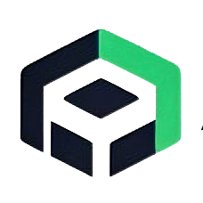
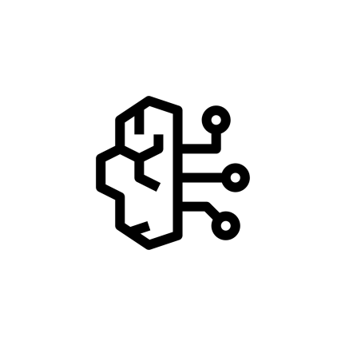
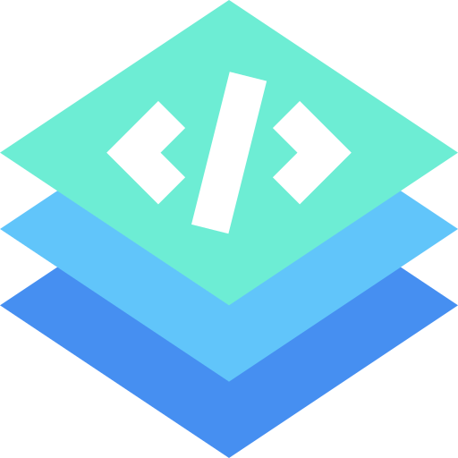
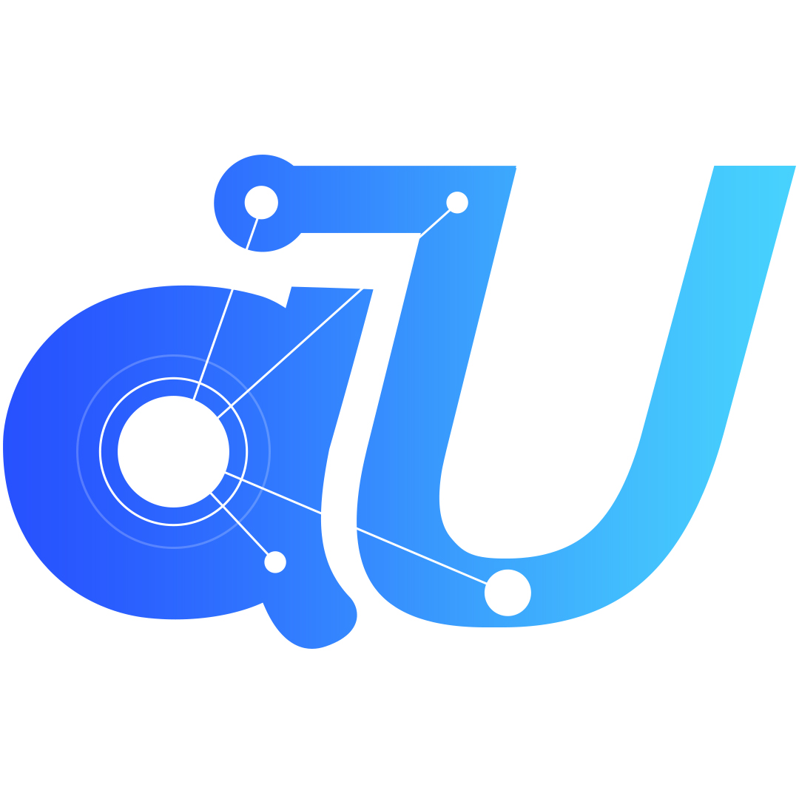

# Integraciones Asombrosas de DeepSeek 

Integra la API de DeepSeek en softwares populares. Accede a la [Plataforma Abierta de DeepSeek](https://platform.deepseek.com/) para obtener una clave API.

[English](https://github.com/deepseek-ai/awesome-deepseek-integration/blob/main/README.md)/[简体中文](https://github.com/deepseek-ai/awesome-deepseek-integration/blob/main/README_cn.md)/[繁體中文](https://github.com/deepseek-ai/awesome-deepseek-integration/blob/main/README_zh_tw.md)/[日本語](https://github.com/deepseek-ai/awesome-deepseek-integration/blob/main/README_ja.md)/Español

 
 

## Tabla de contenidos

- [Integraciones Asombrosas de DeepSeek ](#integraciones-asombrosas-de-deepseek-)
  - [Tabla de contenidos](#tabla-de-contenidos)
  - [Lista de proyectos](#lista-de-proyectos)
    - [Aplicaciones](#aplicaciones)
    - [Marcos de agentes de IA](#marcos-de-agentes-de-ia)
    - [Marcos de aplicaciones de datos de IA](#marcos-de-aplicaciones-de-datos-de-ia)
    - [Marcos RAG](#marcos-rag)
    - [Marcos FHE (Cifrado Homomórfico Completo)](#marcos-fhe-cifrado-homomórfico-completo)
    - [Marcos Solana](#marcos-solana)
    - [Curación de datos sintéticos](#curación-de-datos-sintéticos)
    - [Plugins de aplicaciones de mensajería instantánea](#plugins-de-aplicaciones-de-mensajería-instantánea)
    - [Extensiones para Navegadores](#extensiones-para-navegadores)
    - [Extensiones para VS Code](#extensiones-para-vs-code)
    - [Extensiones de Visual Studio](#extensiones-de-visual-studio)
    - [Extensiones de Neovim](#extensiones-de-neovim)
    - [Extensiones de JetBrains](#extensiones-de-jetbrains)
    - [Bots de Discord](#bots-de-discord)
    - [Editor de Código Nativo con IA](#editor-de-código-nativo-con-ia)
    - [Emacs](#emacs)
    - [Seguridad](#seguridad)
    - [Otros](#otros)
    - [Historial de Estrellas](#historial-de-estrellas)

## Lista de proyectos

###  Aplicaciones

<table>
    <tr>
        <td></td>
        <td><a href="https://github.com/AAswordman/Operit">Operit AI</a></td>
        <td>Un asistente de IA de integración de sistema de código abierto para la plataforma Android, que admite el uso casi completo de mcp y es altamente compatible con el sistema Android. El software ofrece alta personalización y bajo umbral de aprendizaje, con herramientas incorporadas para operaciones de archivos, búsquedas, clics automáticos, conversión de formatos y una página web API de DeepSeek integrada.</td>
    </tr>
    <tr>
        <td></td>
        <td><a href="https://github.com/Lucassssss/eechat">eechat</a></td>
        <td>Una herramienta simple y fácil de usar para el despliegue local de modelos de lenguaje grandes, que admite el despliegue local privado de modelos de código abierto como DeepSeek-R1, DLlama 3, Phi-4, Mistral, Gemma 3, etc., y también es compatible con llamadas a API de LLM remotos.</td>
    </tr>
    <tr>
        <td></td>
        <td><a href="https://github.com/aingdesk/AingDesk">AingDesk</a></td>
        <td>Implementa modelos de IA en tu computadora con un solo clic, operación visualizada, interfaz de chat incorporada y elegante, se puede compartir en línea para uso compartido con otros, compatible con modelos como DeepSeek, búsqueda en la web y API de terceros.</td>
    </tr>
    <tr>
        <td></td>
        <td><a href="https://www.dingtalk.com/">DingTalk</a></td>
        <td>El Asistente de IA de DingTalk integra múltiples funciones de productos de IA de la plataforma DingTalk para asistir de manera inteligente en los flujos de trabajo diarios de las empresas. El Asistente de IA de DingTalk cuenta con diversas capacidades inteligentes, incluyendo, entre otras, comunicación inteligente, colaboración inteligente y gestión inteligente. A través de estas funciones, el asistente de IA puede resumir puntos clave dentro de la empresa, generar actas de reuniones y enviar a los usuarios recordatorios de tareas laborales y horarios relevantes. Además, el Asistente de IA de DingTalk puede utilizar su base de conocimientos para responder de manera inteligente a preguntas frecuentes de los empleados sobre los procesos administrativos de la empresa, las políticas de recursos humanos y otros temas relacionados.</td>
    </tr>
    <tr>
        <td></td>
        <td><a href="https://chatdoc.com">ChatDOC</a></td>
        <td>ChatDOC es una herramienta de lectura de documentos basada en IA, equipada con sólidas funciones de trazabilidad, asegurando que la fuente de cada información sea clara y verificable, ayudándote a comprender eficientemente el núcleo de tus documentos.</td>
    </tr>
    <tr>
<td>  </td>
<td> <a href="docs/SwiftChat/README.md">SwiftChat</a></td>
<td> <a href="https://github.com/aws-samples/swift-chat">SwiftChat</a> es una aplicación de chat con IA ultrarrápida y multiplataforma construida con React Native. Ofrece rendimiento nativo en Android, iOS, iPad, tabletas Android y macOS. Incluye funciones como chat en tiempo real, soporte enriquecido de Markdown (tablas, bloques de código, LaTeX), generación de imágenes con IA, indicaciones personalizables del sistema, cambio rápido de modelo y capacidades multimodales. Compatible con múltiples proveedores de IA como DeepSeek, Amazon Bedrock, Ollama y modelos compatibles con OpenAI, con una interfaz limpia y alto rendimiento.</td>
    </tr>
    <tr>
        <td></td>
        <td><a href="https://github.com/deepseek-ai/awesome-deepseek-integration/blob/main/docs/4EVERChat/README.md">4EVERChat</a></td>
        <td><a href="https://chat.4everland.org/">4EVERChat</a> es una plataforma de selección de modelos inteligentes que integra cientos de LLMs, permitiendo la comparación en tiempo real del rendimiento de los modelos. Aprovechando el endpoint unificado de API de <a href="https://www.4everland.org/">4EVERLAND</a> AI RPC, logra cambios de modelo sin costo y selecciona automáticamente combinaciones con respuestas rápidas y costos bajos.</td>
    </tr>
    <tr>
        <td></td>
        <td><a href="./docs/xhai_browser/README.md">xhai Browser</a></td>
        <td>xhai Browser es un navegador de gestión de escritorio y AI para Android, donde DeepSeek es el motor de diálogo predeterminado impulsado por IA. Ofrece un rendimiento excepcional (0.2 segundos para iniciar), tamaño reducido (apk de 3M), sin anuncios, bloqueo de anuncios ultrarrápido, clasificación de pantallas, navegación por pantalla, caja de búsqueda múltiple y más.</td>
    </tr>
    <tr>
        <td></td>
        <td><a href="https://intellibar.app/">IntelliBar</a></td>
        <td>IntelliBar es un asistente elegante para Mac que te permite usar modelos avanzados como DeepSeek R1 con cualquier aplicación en tu Mac, por ejemplo: editar correos electrónicos en tu aplicación de correo o resumir artículos en tu navegador.</td>
    </tr>
    <tr>
        <td> </td>
        <td><a href="https://www.gptbots.ai/es_ES/docs">GPTBots</a></td>
        <td><a href="https://www.gptbots.ai/es_ES/">GPTBots</a> es una plataforma de construcción de agentes de IA sin necesidad de programación que integra importantes LLMs internacionales, incluyendo DeepSeek. Ofrece módulos para almacenamiento/recuperación de conocimiento basado en RAG, personalización/llamada de herramientas y orquestación de flujos de trabajo. Además, permite integrar agentes en múltiples plataformas principales (como WhatsApp, Telegram, etc.), proporcionando soluciones integrales de IA para empresas y ayudándolas a destacarse en la era de la IA.</td>
    </tr>
    <tr>
        <td></td>
        <td><a href="https://github.com/ThinkInAIXYZ/deepchat/blob/main/README.md">DeepChat</a></td>
        <td>DeepChat es un asistente inteligente de escritorio completamente gratuito, con un potente modelo grande DeepSeek, que admite conversaciones de múltiples rondas, búsqueda en internet, carga de archivos, bases de conocimiento y más.</td>
    </tr>
    <tr>
        <td width=80>  </td>
        <td> <a href="https://github.com/quantalogic/quantalogic">Quantalogic</a> </td>
        <td> QuantaLogic es un marco ReAct (Razonamiento y Acción) para construir agentes de IA avanzados. </td>
    </tr>
    <tr>
        <td>  </td>
        <td> <a href="https://github.com/deepseek-ai/awesome-deepseek-integration/blob/main/docs/chatbox/README.md">Chatbox</a> </td>
        <td> Chatbox es un cliente de escritorio para múltiples modelos LLM de vanguardia, disponible en Windows, Mac y Linux. </td>
    </tr>
    <tr>
        <td>  </td>
        <td> <a href="https://github.com/deepseek-ai/awesome-deepseek-integration/blob/main/docs/chatgpt_next_web/README.md"> ChatGPT-Next-Web </a> </td>
        <td> ChatGPT Next Web es una interfaz web multiplataforma para ChatGPT, con soporte para GPT3, GPT4 y Gemini Pro. </td>
    </tr>
    <tr>
        <td>  </td>
        <td> <a href="https://casibase.org/es/docs/category/beginner-guide/">Casibase</a></td>
        <td> <a href="https://casibase.org">Casibase</a> es un sistema de base de conocimientos y diálogo de IA de código abierto que combina las últimas tecnologías RAG, funcionalidades SSO y soporta varios modelos de IA principales. Su objetivo es proporcionar a empresas y desarrolladores una plataforma potente y flexible para la gestión de conocimientos y diálogo inteligente. </td>
    </tr>
    <tr>
        <td>  </td>
        <td> <a href="docs/Coco AI/README.md">Coco AI</a></td>
        <td> <a href="https://coco.rs">Coco AI</a> es una herramienta de búsqueda y productividad unificada, completamente de código abierto y multiplataforma, que conecta y busca en diversas fuentes de datos, incluyendo aplicaciones, archivos, Google Drive, Notion, Yuque, Hugo y más, tanto locales como en la nube. Al integrarse con modelos grandes como DeepSeek, Coco AI permite una gestión inteligente del conocimiento personal, destacando la privacidad y admitiendo despliegues privados, ayudando a los usuarios a acceder rápidamente a su información de manera inteligente.</td>
    </tr>
    <tr>
        <td>  </td>
        <td> <a href="https://github.com/deepseek-ai/awesome-deepseek-integration/blob/main/docs/liubai/README.md">Liubai</a> </td>
        <td> Liubai permite que DeepSeek te ayude a gestionar tus notas, tareas, calendarios y listas de pendientes directamente en WeChat. </td>
    </tr>
    <tr>
        <td>  </td>
        <td> <a href="https://github.com/deepseek-ai/awesome-deepseek-integration/blob/main/docs/pal/README.md"> Pal - Cliente de Chat AI (iOS, ipadOS) </a> </td>
        <td> Pal es un espacio de chat personalizado en iOS. </td>
    </tr>
    <tr>
        <td>  </td>
        <td> <a href="https://www.librechat.ai/docs/configuration/librechat_yaml/ai_endpoints/deepseek">LibreChat</a> </td>
        <td> LibreChat es una aplicación de código abierto personalizable que integra DeepSeek para interacciones mejoradas con IA. </td>
    </tr>
     <tr>
        <td>  </td>
        <td> <a href="https://github.com/longevity-genie/just-chat">Just-Chat</a> </td>
        <td> ¡Crea tu agente LLM y chatea con él de forma simple y rápida!</td>
     </tr>
    <tr>
        <td>  </td>
        <td> <a href="https://github.com/papersgpt/papersgpt-for-zotero">PapersGPT</a> </td>
        <td> PapersGPT es un plugin para Zotero que se integra perfectamente con DeepSeek y otros modelos de IA para leer rápidamente artículos en Zotero. </td>
    </tr>
    <tr>
        <td>  </td>
        <td> <a href="https://github.com/deepseek-ai/awesome-deepseek-integration/blob/main/docs/rss_translator/README.md"> RSS Translator </a> </td>
        <td> ¡Traduce feeds RSS a tu idioma! </td>
    </tr>
    <tr>
        <td>  </td>
        <td> <a href="https://relingo.net"> Relingo </a> </td>
        <td> ¡Construye y domina vocabulario mientras navegas por sitios web y ves YouTube! </td>
    </tr>
    <tr>
        <td>  </td>
        <td> <a href="https://github.com/deepseek-ai/awesome-deepseek-integration/blob/main/docs/enconvo/README.md"> Enconvo </a> </td>
        <td> Enconvo es el lanzador de la era de la IA, el punto de entrada para todas las funciones de IA y un asistente inteligente reflexivo.</td>
    </tr>
    <tr>
        <td></td>
        <td><a href="https://github.com/deepseek-ai/awesome-deepseek-integration/blob/main/docs/cherrystudio/README.md">Cherry Studio</a></td>
        <td>Un asistente de IA de escritorio poderoso para productores</td>
    </tr>
    <tr>
        <td>  </td>
        <td> <a href="https://github.com/deepseek-ai/awesome-deepseek-integration/blob/main/docs/tomemo/README.md"> ToMemo (iOS, ipadOS) </a> </td>
        <td> Una aplicación de iOS que combina un libro de frases, registro del portapapeles y teclado, con modelado macro de IA integrado para una salida rápida desde el teclado.</td>
    </tr>
    <tr>
        <td>  </td>
        <td> <a href="https://github.com/buxuku/video-subtitle-master">Video Subtitle Master</a></td>
        <td> Genera subtítulos para videos en lote, con la capacidad de traducir subtítulos a otros idiomas. Es una herramienta del lado del cliente que admite plataformas Mac y Windows, e integra múltiples servicios de traducción como Baidu, Volcengine, DeepLx, OpenAI, DeepSeek y Ollama.</td>
    </tr>
    <tr>
        <td>  </td>
        <td> <a href="https://github.com/UnknownEnergy/chatgpt-api/blob/master/README.md">Chatworm</a> </td>
        <td> Chatworm es una aplicación web para múltiples modelos LLM de vanguardia, de código abierto y también disponible en Android. </td>
    </tr>
    <tr>
        <td>  </td>
        <td> <a href="https://github.com/tisfeng/Easydict">Easydict</a></td>
        <td> Easydict es una aplicación de diccionario de traducción para macOS, sencilla y fácil de usar, que permite buscar palabras o traducir texto de manera elegante. Admite la llamada de APIs de modelos de lenguaje grande para traducción.</td>
    </tr>
    <tr>
        <td>  </td>
        <td> <a href="docs/raycast/README.md">Raycast</a></td>
        <td> <a href="https://raycast.com/?via=ViGeng">Raycast</a> es una herramienta de productividad para macOS que te permite controlar tus herramientas con unos pocos atajos de teclado. Admite varias extensiones, incluyendo DeepSeek AI.</td>
    </tr>
    <tr>
        <td>  </td> <td> <a href="https://niceprompt.app">Nice Prompt</a></td> <td> <a href="https://niceprompt.app">Nice Prompt</a> Organiza, comparte y utiliza tus indicaciones en tu editor de código, con Cursor y VSCode.</td>
    </tr>
    <tr>
        <td>  </td>
        <td> <a href="https://github.com/deepseek-php/deepseek-php-client/blob/master/README.md">PHP Client</a> </td>
        <td> Deepseek PHP Client es una biblioteca cliente PHP robusta y orientada a la comunidad para una integración perfecta con la API de Deepseek. </td>
    </tr>
        <tr>
  <td>
    
  </td>
  <td>
    <a href="https://github.com/tornikegomareli/DeepSwiftSeek/blob/main/README.md">DeepSwiftSeek</a>
  </td>
  <td>
    DeepSwiftSeek es una biblioteca cliente Swift ligera pero poderosa, con una buena integración con la API de DeepSeek.
    Proporciona concurrencia Swift fácil de usar para chat, streaming, FIM (Fill-in-the-Middle) completions y más.
  </td>
</tr>
        <td>  </td>
        <td> <a href="https://github.com/deepseek-php/deepseek-laravel/blob/master/README.md">Laravel Integration</a> </td>
        <td> Laravel wrapper para el cliente PHP de Deepseek, para una integración perfecta de la API de Deepseek con aplicaciones Laravel.</td>
    </tr>
    <tr>
        <td>  </td>
        <td> <a href="docs/zotero/README_cn.md">Zotero</a></td>
        <td> <a href="https://www.zotero.org">Zotero</a> es una herramienta gratuita y fácil de usar para ayudarte a recopilar, organizar, anotar, citar y compartir investigaciones. Puede usar Deepseek como servicio de traducción.</td>
    </tr>
    <tr>
        <td>  </td>
        <td> <a href="docs/SiYuan/README.md">SiYuan</a> </td>
        <td> SiYuan es un sistema de gestión de conocimiento personal centrado en la privacidad que admite un uso completamente offline, así como sincronización de datos cifrada de extremo a extremo.</td>
    </tr>
    <tr>
        <td>  </td>
        <td> <a href="https://github.com/ArvinLovegood/go-stock/blob/master/README.md">go-stock</a> </td>
        <td>go-stock es un visor de datos de acciones chinas construido por Wails con NativeUI y potenciado por LLM.</td>
    </tr>
    <tr>
        <td>  </td>
        <td> <a href="docs/wordware/README.md">Wordware</a> </td>
        <td><a href="https://www.wordware.ai/">Wordware</a> es un kit de herramientas que permite a cualquiera construir, iterar y desplegar su pila de IA solo con lenguaje natural.</td>
    </tr>
    <tr>
        <td>  </td>
        <td> <a href="https://github.com/langgenius/dify/">Dify</a> </td>
        <td> <a href="https://dify.ai/">Dify</a> es una plataforma de desarrollo de aplicaciones LLM que admite modelos DeepSeek para crear asistentes, flujos de trabajo, generadores de texto y más. </td>
    </tr>
    <tr>
        <td>  </td>
        <td> <a href="https://github.com/enricoros/big-AGI/blob/v2-dev/README.md">Big-AGI</a> </td>
        <td><a href="https://big-agi.com/">Big-AGI</a> es una suite de IA revolucionaria diseñada para democratizar el acceso a inteligencia artificial avanzada para todos.</td>
    </tr>
    <tr>
        <td>  </td>
        <td> <a href="https://github.com/LiberSonora/LiberSonora/blob/main/README_en.md">LiberSonora</a> </td>
        <td> LiberSonora, que significa "Voz de la Libertad", es un kit de herramientas de audiolibros robusto y de código abierto impulsado por IA que incluye características como extracción inteligente de subtítulos, generación de títulos con IA, traducción multilingüe, con soporte para aceleración GPU y procesamiento por lotes sin conexión.</td>
    </tr>
    <tr>
        <td>  </td>
        <td> <a href="https://bobtranslate.com/">Bob</a></td>
        <td> <a href="https://bobtranslate.com/">Bob</a> es una herramienta de traducción y OCR para macOS lista para usar en cualquier aplicación, ¡directamente desde la caja!</td>
    </tr>
    <tr>
        <td>  </td>
        <td> <a href="https://agenticflow.ai/">AgenticFlow</a> </td>
        <td> <a href="https://agenticflow.ai/">AgenticFlow</a> es una plataforma sin necesidad de programación donde los especialistas en marketing construyen flujos de trabajo de IA agentica para la automatización de salida al mercado, impulsados por cientos de aplicaciones cotidianas como herramientas para tus agentes de IA.</td>
    </tr>
    <tr>
        <td>  </td>
        <td> <a href="https://stranslate.zggsong.com/en/">STranslate</a></td>
        <td> <a href="https://stranslate.zggsong.com/en/">STranslate</a>（Windows） es una herramienta de traducción OCR lista para usar desarrollada por WPF </td>
    </tr>
    <tr>
        <td>  </td>
        <td> <a href="https://github.com/Anwar-alhitar/Deepseek.Asp.Client/blob/master/README.md">ASP Client</a> </td>
        <td><a href="https://github.com/Anwar-alhitar/Deepseek.Asp.Client/blob/master/README.md">Deepseek.ASPClient</a> es un wrapper ligero para ASP.NET diseñado para simplificar el procesamiento de texto impulsado por IA en aplicaciones .NET.</td>
    </tr>
    <tr>
        <td>  </td>
        <td> <a href="https://www.gptaiflow.tech/docs/product/api-keys-setup#setup-deepseek-api-keys">GPT AI Flow</a></td>
        <td>
            La herramienta definitiva de productividad construida por ingenieros para entusiastas de la eficiencia (ellos mismos): <a href="https://www.gptaiflow.tech/">GPT AI Flow</a>
            <ul>
                <li>`Shift+Alt+Space` Activa el hub inteligente de escritorio</li>
                <li>Almacenamiento cifrado local</li>
                <li>Motor de instrucciones personalizable</li>
                <li>Llamadas bajo demanda sin suscripción agrupada</li>
            </ul>
        </td>
    </tr>
    <tr>
        <td>  </td>
        <td> <a href="https://github.com/alecm20/story-flicks">Story-Flicks</a></td>
        <td>¡Con solo una oración, puedes generar rápidamente videos cortos de historias en alta definición, compatibles con modelos como DeepSeek!</td>
    </tr>
    <tr>
        <td>  </td>
        <td> <a href="docs/16x_prompt/README.md">16x Prompt</a> </td>
        <td> <a href="https://prompt.16x.engineer/">16x Prompt</a> es una herramienta de codificación con IA que incluye gestión de contexto. Ayuda a los desarrolladores a gestionar el contexto del código fuente y a crear indicaciones para tareas complejas en bases de código existentes.</td>
    </tr>
    <tr>
        <td>  </td>
        <td> <a href="https://github.com/deepseek-ai/awesome-deepseek-integration/blob/main/docs/Alpha派/README.md"> Alpha Pai </a> </td>
        <td> Asistente de Investigación AI / El portal de información financiera de próxima generación impulsado por IA. Proxy para inversores para asistir a reuniones y tomar notas, así como proporcionar servicios de búsqueda y preguntas y respuestas para información financiera y análisis cuantitativo para investigación de inversiones.</td>
    </tr>
        <td>  </td>
        <td> <a href="https://www.xark-argo.com">argo</a> </td>
        <td>Descarga y ejecuta localmente modelos Ollama y Huggingface con RAG en Mac/Windows/Linux. También admite API de LLM.</td>
    </tr>
    <tr>
        <td>  </td>
        <td> <a href="https://www.petercat.ai">PeterCat</a> </td>
        <td> Un sistema de configuración de agentes de preguntas y respuestas conversacionales, soluciones de despliegue autohospedadas y un SDK de aplicación todo en uno conveniente, que permite crear bots inteligentes de preguntas y respuestas para tus repositorios de GitHub.</td>
    </tr>
    <tr>
        <td>  </td>
        <td> <a href="https://fastgpt.cn/en">FastGPT</a> </td>
        <td>
            FastGPT es una plataforma de base de conocimientos de IA de código abierto construida sobre modelos de lenguaje grande (LLMs), compatible con varios modelos, incluyendo DeepSeek y OpenAI. Proporcionamos capacidades listas para usar para procesamiento de datos, invocación de modelos, recuperación RAG y orquestación visual de flujos de trabajo de IA, permitiéndote construir aplicaciones de IA sofisticadas sin esfuerzo.
        </td>
   </tr>
   <tr>
        <td>  </td>
        <td> <a href="docs/ruzhiai_note/README.md">RuZhi AI Notes</a> </td>
        <td>RuZhi AI Notes es una herramienta de gestión de conocimiento inteligente impulsada por IA, que proporciona servicios de gestión y aplicación de conocimiento todo en uno, incluyendo búsqueda y exploración con IA, conversión de resultados de IA a notas, gestión y organización de notas, presentación y compartición de conocimiento. Integrado con el modelo DeepSeek para proporcionar salidas más estables y de mayor calidad.</td>
    </tr>
    <tr>
        <td>  </td>
        <td> <a href="https://github.com/zhayujie/chatgpt-on-wechat">Chatgpt-on-Wechat</a> </td>
        <td> Chatgpt-on-Wechat(CoW) es un marco de chatbot flexible que admite la integración perfecta de múltiples LLMs, incluyendo DeepSeek, OpenAI, Claude, Qwen y otros, en plataformas comúnmente utilizadas o software de oficina como WeChat Official Accounts, WeCom, Feishu, DingTalk y sitios web. También admite una amplia gama de plugins personalizados. </td>
    </tr>
    <tr>
        <td>  </td>
        <td> <a href="https://athenalab.ai/">Athena</a> </td>
        <td>La primera IA general autónoma del mundo con arquitectura cognitiva avanzada y capacidades de razonamiento humano, diseñada para abordar desafíos complejos del mundo real.</td>
    </tr>
    <tr>
        <td>  </td>
        <td> <a href="https://github.com/1Panel-dev/MaxKB">MaxKB</a> </td>
        <td> <a href="https://maxkb.cn/">MaxKB</a> es un chatbot RAG flexible y listo para usar. </td>
    </tr>
    <tr>
        <td>  </td>
        <td> <a href="https://ttm.financial/gpt">TigerGPT</a> </td>
        <td>TigerGPT es el primer asistente de inversión financiera basado en IA de su tipo, desarrollado por Tiger Group. TigerGPT tiene como objetivo proporcionar soporte para la toma de decisiones de inversión inteligente para los inversores. El 18 de febrero de 2025, TigerGPT integró oficialmente el modelo DeepSeek-R1 para proporcionar a los usuarios servicios de preguntas y respuestas en línea que admiten razonamiento profundo. </td>
    </tr>
    <tr>
        <td>  </td>
        <td> <a href="https://hix.ai">HIX.AI</a> </td>
        <td>Prueba DeepSeek gratis y disfruta de chat ilimitado con IA en HIX.AI. Usa DeepSeek R1 para chat con IA, escritura, programación y más. ¡Experimenta el chat de próxima generación con IA ahora!</td>
    </tr>
    <tr>
        <td>  </td>
        <td> <a href="https://github.com/sharmt1411/askanywhere">Askanywhere</a> </td>
        <td>Selecciona texto en cualquier lugar y comienza una conversación con Deepseek</td>
    </tr>
    <tr>
        <td>  </td>
        <td> <a href="https://github.com/OJZen/1chat">1chat</a> </td>
        <td>Una aplicación iOS que te permite chatear con el modelo DeepSeek-R1 localmente.</td>
    </tr>
    <tr>
        <td>  </td>
        <td> <a href="https://chatlabsai.com">Accede a más de 250 modelos de texto e imagen LLM en una sola aplicación</a> </td>
        <td> El chatbot 1AI para iOS integra más de 250 modelos de texto, imagen y voz, permitiendo a los usuarios chatear con cualquier modelo en el mundo, incluyendo los modelos Deepseek R1 y Deepseek V3.</td>
    </tr>
    <tr>
        <td>  </td>
        <td> <a href="https://popai.pro">PopAi</a> </td>
        <td>PopAi lanza DeepSeek R1. Disfruta de un rendimiento ultrarrápido sin retrasos con PopAi. Cambia sin problemas la búsqueda en línea activada/desactivada.</td>
     </tr>
    <tr>
        <td>  </td>
        <td> <a href="https://pot-app.com/">Pot</a></td>
        <td> <a href="https://pot-app.com/">Pot</a> 🌈 Un software multiplataforma de traducción de palabras y OCR. </td>
    </tr>
    <tr>
        <td></td>
        <td><a href="https://github.com/Byaidu/PDFMathTranslate">PDFMathTranslate</a></td>
        <td>Esta extensión puede ayudar a los desarrolladores a traducir anotaciones, cadenas, consejos de código, mensajes de error y nombres de variables en el Código.</td>
    </tr>
    <tr>
        <td></td>
        <td><a href="https://github.com/Richasy/Bili.Copilot">Bili.Copilot</a></td>
        <td>Cliente de escritorio Windows de terceros en la estación b, una aplicación nativa construida con el SDK de la aplicación Windows.</td>
    </tr>
    <tr>
        <td></td>
        <td><a href="https://www.tensorbounce.com/">LawAgent</a></td>
        <td>LawAgent es un producto de IA legal desarrollado por el equipo de Tensorbounce, que integra una base de conocimientos con capacidades de Agente IA. Cuenta con un vasto repositorio de decenas de millones de datos oficiales relacionados con el ámbito legal y también permite configuraciones personalizadas de la base de conocimientos. El modo profesional aprovecha las capacidades de razonamiento de DeepSeek-R1 para asistir a los usuarios en análisis legales, revisión de contratos, generación de documentos, traducción de archivos y otros escenarios legales.</td>
    </tr>
    <tr>
        <td></td>
<td><a href="https://github.com/jiqi136/DS-AI">Asistente de IA con conexión en tiempo real</a></td>
<td> BEl asistente de IA admite conexión directa a la interfaz DeepSeek-V3.1 con el potente modelo de código Claude Code, permitiendo su uso sin intermediarios de red (reducción de costes del 90%). Soporta lectura de imágenes y archivos PDF con generación gratuita de imágenes; permite integración personalizada con otros modelos de IA; habilita búsqueda en tiempo real en la web mediante navegador local. Además, ofrece opciones gratuitas como el modelo R1.
</td>
	</tr>
    <tr>
    <td></td>
    <td><a href="https://dockit.geekfun.club/">DocKit</a></td>
    <td>DocKit es un cliente GUI de escritorio potenciado por IA diseñado para bases de datos NoSQL, compatible con Elasticsearch y OpenSearch en Mac, Windows y Linux. Mediante la integración con modelos grandes como DeepSeek, DocKit puede ayudar a los desarrolladores a escribir consultas DSL complejas y proporcionar una mejor experiencia para la gestión y análisis de datos.</td>
    </tr> 
    <tr>
        <td>  </td>
        <td> <a href="https://github.com/glidea/zenfeed">zenfeed</a> </td>
        <td> Potencia RSS con IA, filtra, resume y envía automáticamente información importante para superar la sobrecarga de información. </td>
    </tr>
    <tr>
        <td>  </td>
        <td> <a href="https://github.com/codexu/note-gen">NoteGen</a> </td>
        <td> NoteGen es una aplicación multiplataforma de notas Markdown que se enfoca en utilizar inteligencia artificial para construir un puente entre la recopilación de información y la escritura, organizando conocimientos fragmentados en notas legibles. </td>
    </tr>
    </tr>
        <tr>
        <td> </td>
        <td> <a href="https://github.com/SamYuan1990/i18n-agent-action">i18n-agent-action</a> </td>
        <td> El i18n Agent es una herramienta impulsada por inteligencia artificial diseñada para simplificar y automatizar los flujos de trabajo de internacionalización (i18n) y localización (l10n). Al aprovechar el procesamiento avanzado de lenguaje natural (NLP) y el aprendizaje automático, ayuda a desarrolladores, traductores y equipos de productos a gestionar contenido multilingüe de manera eficiente, eliminando errores manuales y acelerando los despliegues globales. </td>
    </tr>
</table>

<a href="#tabla-de-contenidos">^ Volver al índice ^</a>

###  Marcos de agentes de IA

<table>
    <tr>
        <td width=80>  </td>
        <td> <a href="https://github.com/huggingface/smolagents/tree/main"> smolagents </a> </td>
        <td> La forma más sencilla de construir grandes agentes de IA. Los agentes utilizan código en Python para invocar herramientas y coordinar otros agentes. ¡Soporte prioritario para modelos abiertos como DeepSeek-R1! </td>
    </tr>
    <tr>
        <td></td>
        <td><a href="https://github.com/deepseek-ai/awesome-deepseek-integration/blob/main/docs/yomo/README.md">YoMo</a></td>
        <td>Marco sin servidor para llamadas de funciones LLM con estado y soporte para lenguajes fuertemente tipados.</td>
     </tr>
    <tr>
        <td>  </td>
        <td> <a href="https://github.com/deepseek-ai/awesome-deepseek-integration/blob/main/docs/superagentx/README.md">SuperAgentX</a> </td>
        <td>SuperAgentX: Un marco de IA de código abierto y ligero diseñado para aplicaciones autónomas de múltiples agentes con capacidades de Inteligencia Artificial Generalizada (AGI).</td>
    </tr>
    <tr>
        <td>  </td>
        <td> <a href="https://github.com/deepseek-ai/awesome-deepseek-integration/blob/main/docs/anda/README.md">Anda</a> </td>
        <td>Un marco en Rust para el desarrollo de agentes de IA, diseñado para construir una red altamente componible, autónoma y con memoria perpetua de agentes de IA.</td>
    </tr>
    <tr>
        <td>  </td>
        <td> <a href="https://rig.rs">RIG</a> </td>
        <td>Construye aplicaciones LLM modulares y escalables en Rust.</td>
    </tr>
    <tr>
        <td>  </td>
        <td> <a href="https://github.com/longevity-genie/just-agents">Just-Agents</a> </td>
        <td>Una biblioteca ligera y sencilla para agentes LLM: sin ingeniería excesiva, solo simplicidad.</td>
    </tr>
    <tr>
        <td>  </td>
        <td> <a href="https://github.com/bob-robert-ai/bob/blob/main/alice/readme.md">Alice</a> </td>
        <td>Un agente de IA autónomo en blockchain, que aprovecha LLMs como DeepSeek para la toma de decisiones en cadena. Alice combina análisis de datos en tiempo real con una personalidad lúdica para gestionar tokens, minar BOB y gobernar ecosistemas.</td>
    </tr>
    <tr>
        <td>  </td>
        <td> <a href="https://github.com/Upsonic/Upsonic">Upsonic</a> </td>
        <td>Upsonic ofrece un marco de agentes listo para empresas de última generación donde puedes orquestar llamadas LLM, agentes y uso de computadoras para completar tareas de manera rentable.</td>
    </tr>
    <tr>
        <td>  </td>
        <td> <a href="https://github.com/APRO-com">ATTPs</a> </td>
        <td>Un marco de protocolo fundamental para la comunicación confiable entre agentes. Cualquier agente basado en DeepSeek, al integrarse con el SDK de <a href="https://docs.apro.com/attps">ATTPs</a>, puede acceder a funciones como registro de agentes, envío de datos verificables y recuperación de datos verificables. Así, puede establecer una comunicación confiable con agentes de otras plataformas.</td>
    </tr>
    <tr>
        <td>  </td>
        <td> <a href="docs/translate.js/README.md">translate.js</a> </td>
        <td> IA i18n para desarrolladores front-end. Puede lograr traducción automática completa de HTML con solo dos líneas de JavaScript. Puedes cambiar entre docenas de idiomas con un solo clic. No es necesario modificar la página, no se requieren archivos de configuración de idiomas y admite docenas de instrucciones de extensión de ajuste fino. Es compatible con SEO. Además, abre una interfaz estándar de API de traducción de texto.</td>
    </tr>
    <tr>
        <td width=80>  </td>
        <td> <a href="https://github.com/antgroup/agentUniverse"> agentUniverse </a> </td>
        <td> agentUniverse es un marco de colaboración multi-agente diseñado para escenarios empresariales complejos. Ofrece capacidades de desarrollo rápidas y fáciles de usar para aplicaciones de agentes LLM, con un enfoque en mecanismos como programación colaborativa de agentes, toma de decisiones autónoma y retroalimentación dinámica. El marco se origina en las prácticas empresariales del mundo real del Grupo Ant en la industria financiera. En junio de 2024, agentUniverse logró soporte de integración completa para la serie de modelos DeepSeek. </td>
    </tr>
    <tr>
        <td width=80>  </td>
        <td> <a href="https://github.com/SciSharp/BotSharp"> BotSharp </a> </td>
        <td> BotSharp es un marco de desarrollo de aplicaciones multiagente de código abierto. Desde simples chatbots hasta colaboración multiagente y tareas complejas como el marco "Text To SQL", ofrece métodos listos para usar. Permite integrar rápidamente las capacidades de grandes modelos en sistemas empresariales existentes, y cuenta con funciones integradas de gestión de conocimiento y gestión de conversaciones. El marco ha sido probado exhaustivamente con el modelo DeepSeek V3, y gracias al rendimiento de DeepSeek V3, el marco no tiene nada que envidiar a otros modelos propietarios. </td>
    </tr>
     <tr>
            <td width=80>  </td>
            <td> <a href="https://github.com/cloudwego/eino"> Eino </a> </td>
            <td> Eino (pronounced like "I know") aims to be the best LLM application development framework in the Go language. It draws on the design concept of excellent LLM frameworks in open source communities such as LangChain and LlamaIndex, while absorbing cutting-edge research results and practical application experience, providing a LLM application development framework that is more in line with Go programming conventions, emphasizing simplicity, scalability, reliability and efficiency. </td>
        </tr>
    <tr>
        <td width=80>  </td>
        <td> <a href="https://github.com/Tencent/Youtu-agent/"> Youtu-Agent </a> </td>
        <td> <a href="https://github.com/Tencent/Youtu-agent/"> Youtu-Agent </a> es un marco flexible y de alto rendimiento para construir, ejecutar y evaluar agentes autónomos. Más allá de encabezar los puntos de referencia (benchmarks), este marco ofrece capacidades potentes para agentes, como análisis de datos, procesamiento de archivos e investigación profunda, todo ello con modelos de código abierto. </td>
    </tr>
</table>

<a href="#tabla-de-contenidos">^ Volver al índice ^</a>

###  Marcos de aplicaciones de datos de IA

<table>
    <tr>
        <td width="80">  </td>
        <td width="120"> <a href="https://github.com/deepseek-ai/awesome-deepseek-integration/blob/main/docs/dbgpt/README.md"> DB-GPT </a> </td>
        <td> 🤖 DB-GPT es un marco de desarrollo de aplicaciones de datos nativo de IA de código abierto con AWEL (Lenguaje de Expresión de Flujo de Trabajo Agente) y agentes. El propósito es construir infraestructura en el campo de los grandes modelos, a través del desarrollo de múltiples capacidades técnicas como gestión de múltiples modelos (SMMF), optimización de efectos Text2SQL, marco y optimización RAG, colaboración de marcos de múltiples agentes, AWEL (orquestación de flujo de trabajo de agentes), etc. Lo que hace que las aplicaciones de grandes modelos con datos sean más simples y convenientes.</td>
    </tr>
</table>

<a href="#tabla-de-contenidos">^ Volver al índice ^</a>

###  Marcos RAG

<table>
    <tr>
        <td width="80">  </td>
        <td> <a href="https://github.com/deepseek-ai/awesome-deepseek-integration/blob/main/docs/ragflow/README.md"> RAGFlow </a> </td>
        <td> Un motor RAG (Generación Aumentada por Recuperación) de código abierto basado en la comprensión profunda de documentos. Ofrece un flujo de trabajo RAG simplificado para empresas de cualquier escala, combinando LLM (Modelos de Lenguaje Grande) para proporcionar capacidades de respuesta a preguntas veraces, respaldadas por referencias sólidas extraídas de datos complejos y variados.</td>
    </tr>
    <tr>
        <td width="80">  </td>
        <td> <a href="https://github.com/deepseek-ai/awesome-deepseek-integration/blob/main/docs/autoflow/README.md"> Autoflow </a> </td>
        <td> <a href="https://github.com/pingcap/autoflow">AutoFlow</a> es una herramienta de base de conocimiento de código abierto basada en GraphRAG (Generación Aumentada por Recuperación basada en Grafos), construida sobre <a href="https://www.pingcap.com/ai?utm_source=tidb.ai&utm_medium=community">TiDB</a> Vector, LlamaIndex y DSPy. Proporciona una interfaz de búsqueda similar a Perplexity y permite una integración fácil de la ventana de búsqueda conversacional de AutoFlow en tu sitio web mediante la inserción de un simple fragmento de JavaScript.</td>
    </tr>
    <tr>
        <td width="80">  </td>
        <td> <a href="https://github.com/zilliztech/deep-searcher"> DeepSearcher </a> </td>
        <td> DeepSearcher combina potentes LLMs (DeepSeek, OpenAI, etc.) y bases de datos vectoriales (Milvus, etc.) para realizar búsquedas, evaluaciones y razonamientos basados en datos privados, proporcionando respuestas altamente precisas e informes completos.</td>
    </tr>
    <tr>
        <td width="80">  </td>
        <td> <a href="https://github.com/OpenSPG/KAG/blob/master/README.md"> KAG </a> </td>
        <td> KAG es un marco de razonamiento lógico y preguntas y respuestas basado en el motor <a href="https://github.com/OpenSPG/openspg">OpenSPG</a> y modelos de lenguaje grandes, que se utiliza para construir soluciones de razonamiento lógico y preguntas y respuestas para bases de conocimiento de dominio vertical. KAG puede superar eficazmente la ambigüedad del cálculo de similitud vectorial tradicional de RAG y el problema de ruido introducido por GraphRAG mediante OpenIE. KAG admite razonamiento lógico y preguntas y respuestas de hechos de múltiples saltos, etc.</td>
    </tr>
	<tr>
    <td width="80">  </td>
    <td> <a href="https://github.com/TencentCloudADP/Youtu-GraphRAG"> Youtu-GraphRAG </a> </td>
    <td>Youtu-GraphRAG propone un nuevo paradigma de generación aumentada por recuperación en grafos (GraphRAG) que unifica verticalmente la construcción, indexación y recuperación de grafos mediante esquemas. Avanza el GraphRAG hacia aplicaciones de nivel empresarial, permitiendo una adaptación perfecta entre dominios con mínima intervención humana, mediante (i) una extracción dinámica acotada por esquemas; (ii) un algoritmo integral de detección de comunidades y (iii) una descomposición de consultas guiada por esquemas para la reflexión iterativa y el razonamiento.</td>
</tr>
</table>

<a href="#tabla-de-contenidos">^ Volver al índice ^</a>

###  Marcos FHE (Cifrado Homomórfico Completo)

<table>
    <tr>
        <td>  </td>
        <td> <a href="https://github.com/mind-network/mind-sdk-deepseek-rust"> Mind FHE Rust SDK </a> </td>
        <td> 
Un SDK de código abierto para cifrar IA con Cifrado Homomórfico Completo (FHE) e integrarse con Mind Network para el consenso de agentes. FHE se considera el <b>santo grial de la criptografía</b>, permitiendo cálculos directamente en datos cifrados sin necesidad de descifrado. Con FHE, los agentes pueden proteger su privacidad mientras usan Deepseek, garantizando tanto la integridad del modelo como el consenso de resultados -<b> todo sin exponer sus datos </b>- al conectarse a Mind Network. El código fuente del SDK <a href="https://github.com/mind-network/mind-sdk-deepseek-rust"> está implementado en puro <b>Rust</b></a> y el paquete también está disponible en <a href="https://crates.io/crates/mind_sdk_deepseek"> crates.io </a>. 
 </td>
    </tr>
</table>

<a href="#tabla-de-contenidos">^ Volver al índice ^</a>

###  Marcos Solana

<table>
    <tr>
        <td>  </td>
        <td> <a href="https://github.com/deepseek-ai/awesome-deepseek-integration/blob/main/docs/solana-agent-kit/README.md"> Solana Agent Kit </a> </td>
        <td>Un kit de herramientas de código abierto para conectar agentes de IA a protocolos Solana. Ahora, cualquier agente, utilizando cualquier LLM Deepseek, puede ejecutar de forma autónoma más de 60 operaciones en el ecosistema Solana.</td>
    </tr>
</table>

<a href="#tabla-de-contenidos">^ Volver al índice ^</a>

###  Curación de datos sintéticos

<table>
    <tr>
        <td>  </td>
        <td> <a href="https://github.com/deepseek-ai/awesome-deepseek-integration/blob/main/docs/curator/README.md"> Curator </a> </td>
        <td> Una herramienta de código abierto para curar conjuntos de datos a gran escala para el entrenamiento posterior de LLMs. </td>
    </tr>
    <tr>
        <td>  </td>
        <td> <a href="https://github.com/Kiln-AI/Kiln"> Kiln </a> </td>
        <td>Genera conjuntos de datos sintéticos y destila modelos R1 en ajustes personalizados.</td>
    </tr>
    <tr>
        <td>  </td>
        <td> <a href="https://github.com/DataEval/dingo"> Dingo </a> </td>
        <td>Dingo: Una herramienta integral de evaluación de calidad de datos. </td>
    </tr>
</table>

<a href="#tabla-de-contenidos">^ Volver al índice ^</a>

###  Plugins de aplicaciones de mensajería instantánea

<table>
    <tr>
        <td>  </td>
        <td> <a href="https://github.com/deepseek-ai/awesome-deepseek-integration/blob/main/docs/huixiangdou/README_cn.md">HuixiangDou (wechat,lark)</a> </td>
        <td>Asistente de conocimiento de dominio en WeChat personal y Feishu, enfocado en responder preguntas.</td>
    </tr>
    <tr>
        <td>  </td>
        <td> <a href="https://github.com/RockChinQ/LangBot">LangBot （QQ, Lark, WeCom）</a> </td>
        <td> Marco de bots de mensajería instantánea basado en LLM, compatible con plataformas como QQ, Lark y WeCom.</td>
    </tr>
    <tr>
        <td>  </td>
        <td> <a href="https://github.com/KomoriDev/nonebot-plugin-deepseek">NoneBot （QQ, Lark, Discord, TG, etc.）</a> </td>
        <td> Basado en el marco NoneBot, proporciona funciones de chat inteligente y pensamiento profundo, compatible con QQ, Lark, Discord, TG y más plataformas.</td>
    </tr>
</table>

<a href="#tabla-de-contenidos">^ Volver al índice ^</a>

###  Extensiones para Navegadores

<table>
    <tr>
        <td>  </td>
        <td> <a href="https://github.com/deepseek-ai/awesome-deepseek-integration/blob/main/docs/immersive_translate/README.md"> Immersive Translate </a> </td>
        <td> Immersive Translate es una extensión de traducción bilingüe para páginas web. </td>
    </tr>
    <tr>
        <td>  </td>
        <td> <a href="https://github.com/deepseek-ai/awesome-deepseek-integration/blob/main/docs/immersive_reading_guide/README.md"> Immersive Reading Guide </a> </td>
        <td> Sin barra lateral: resúmenes inmersivos de páginas web con IA y posibilidad de realizar preguntas. </td>
    </tr>
    <tr>
        <td>  </td>
        <td> <a href="https://github.com/deepseek-ai/awesome-deepseek-integration/blob/main/docs/chatgpt_box/README.md"> ChatGPT Box </a> </td>
        <td> ChatGPT Box es una integración de ChatGPT en el navegador, completamente gratis. </td>
    </tr>
    <tr>
        <td>  </td>
        <td> <a href="https://github.com/deepseek-ai/awesome-deepseek-integration/blob/main/docs/hcfy/README.md"> hcfy (划词翻译) </a> </td>
        <td> hcfy (划词翻译) es una extensión para navegadores que integra múltiples servicios de traducción. </td>
    </tr>
    <tr>
        <td>  </td>
        <td> <a href="docs/Lulu Translate/README.md"> Lulu Translate </a> </td>
        <td> El plugin ofrece traducción seleccionando texto con el ratón, comparación párrafo por párrafo y traducción de documentos PDF. Puede utilizar varios motores de traducción como DeepSeek AI, Bing, GPT, Google, etc. </td>
    </tr>
    <tr>
        <td>  </td>
        <td> <a href="https://fluent.thinkstu.com/"> FluentRead </a> </td>
        <td> Un revolucionario plugin de traducción de navegador de código abierto que permite a todos tener una experiencia de lectura nativa. </td>
    </tr>
    <tr>
        <td>  </td>
        <td> <a href="https://www.ncurator.com/"> Ncurator </a> </td>
        <td> Asistente de preguntas y respuestas basado en IA para bases de conocimiento: permite que la IA te ayude a organizar y analizar el conocimiento. </td>
    </tr>
    <tr>
        <td>  </td>
        <td> <a href="https://rssflow.oinchain.com"> RssFlow </a> </td>
        <td>Un lector RSS inteligente con resúmenes impulsados por IA y vistas de feeds multidimensionales. Soporta configuración del modelo DeepSeek para una mejor comprensión del contenido. </td>
    </tr>
    <tr>
        <td>  </td>
        <td> <a href="https://chromewebstore.google.com/detail/deepchat-power-of-deepsee/femhcibnncinlabdboehojdhfcihpkpl?hl=en"> DeepChat </a> </td>
        <td>Una extensión para Chrome que permite a los usuarios chatear con DeepSeek abriendo una barra lateral en cualquier sitio web. Además, proporciona un menú flotante debajo de cualquier texto seleccionado que permite generar resúmenes, revisar problemas gramaticales y traducir contenido. </td>
    </tr>
     <tr>
        <td>  </td>
        <td> <a href="https://www.typral.com/"> Typral </a> </td>
        <td> Asistente rápido de escritura con IA: permite que la IA te ayude a optimizar rápidamente artículos, documentos y textos. </td>
    </tr>
    <tr>
        <td>  </td>
        <td> <a href="https://www.trancy.org/"> Trancy </a> </td>
        <td>Traducción bilingüe inmersiva, subtítulos bilingües para videos, extensión para traducción de frases/palabras seleccionadas. </td>
    </tr>
    <tr>
        <td>  </td>
        <td> <a href="https://github.com/baotlake/anything-copilot"> Anything Copilot </a> </td>
        <td> Anything Copilot es una extensión de navegador que permite un acceso fluido a herramientas de IA principales directamente desde tu barra lateral. </td>
    </tr>
    <tr>
        <td>  </td>
        <td> <a href="https://cliprun.com/"> Cliprun </a> </td>
        <td> Ejecutor de código Python y espacio de pruebas. Haz clic derecho sobre el código Python en DeepSeek para ejecutarlo al instante en tu navegador. </td>
    </tr>
    <tr>
        <td>  </td>
        <td> <a href="https://github.com/deepseek-ai/awesome-deepseek-integration/blob/main/docs/docky-ai/README.md"> Docky AI </a> </td>
        <td>Docky AI es una poderosa extensión de navegador que permite interacciones en tiempo real con múltiples modelos de IA a través de una barra lateral. Soporta comunicación simultánea con múltiples modelos y puede asistirte en la lectura de páginas web, escritura, traducción y creación de imágenes. </td>
    </tr>
    <tr>
        <td></td>
        <td><a href="https://readfrog.mengxi.work"> 🐸 Read Frog </a></td>
        <td>Traduce y comprende en profundidad cualquier página web con la ayuda de la IA.</td>
    </tr>
</table>

<a href="#tabla-de-contenidos">^ Volver al índice ^</a>

###  Extensiones para VS Code

<table>
    <tr>
        <td>  </td>
        <td> <a href="https://github.com/deepseek-ai/awesome-deepseek-integration/blob/main/docs/continue/README.md"> Continue </a> </td>
        <td> Continue es un piloto automático de código abierto para IDE. </td>
    </tr>
    <tr>
        <td>  </td>
        <td> <a href="https://github.com/deepseek-ai/awesome-deepseek-integration/blob/main/docs/cline/README.md"> Cline </a> </td>
        <td> Conoce a Cline: un asistente de IA que puede trabajar con tu CLI y editor. </td>
    </tr>
    <tr>
        <td>  </td>
        <td> <a href="https://github.com/Sitoi/ai-commit/blob/main/README.md"> AI Commit </a> </td>
        <td> Usa IA para generar mensajes de commit en git desde VS Code. </td>
    </tr>
    <tr>
        <td>  </td>
        <td> <a href="https://github.com/titusTong/seekCodeCopilot/blob/main/README.md"> SeekCode Copilot </a> </td>
        <td> Asistente inteligente de codificación para VS Code que admite la configuración de modelos DeepSeek desplegados localmente. </td>
    </tr>
    <tr>
        <td>  </td>
        <td> <a href="https://github.com/intellism/vscode-comment-translate/blob/master/README.md"> Comment Translation </a> </td>
        <td> Esta extensión ayuda a los desarrolladores a traducir anotaciones, cadenas, consejos de código, mensajes de error y nombres de variables en el Código. </td>
    </tr>
        <tr>
            <td>  </td>
            <td> <a href="https://code.visualstudio.com/docs/intelligentapps/overview"> AI Toolkit </a> </td>
            <td> AI Toolkit para Visual Studio Code es una extensión integral que permite a desarrolladores e ingenieros de IA construir, probar y desplegar aplicaciones inteligentes utilizando modelos de IA generativa. </td>
        </tr>
</table>

<a href="#tabla-de-contenidos">^ Volver al índice ^</a>

###  Extensiones de Visual Studio

<table>
    <tr>
        <td>  </td>
        <td> <a href="https://marketplace.visualstudio.com/items?itemName=MerryYellow.Comment2GPT"> Comment2GPT </a> </td>
        <td> Utiliza OpenAI ChatGPT, Google Gemini, Anthropic Claude, DeepSeek y Ollama a través de tus comentarios </td>
    </tr>
    <tr>
        <td>  </td>
        <td> <a href="https://marketplace.visualstudio.com/items?itemName=MerryYellow.CodeLens2GPT"> CodeLens2GPT </a> </td>
        <td> Utiliza OpenAI ChatGPT, Google Gemini, Anthropic Claude, DeepSeek y Ollama a través de Lente de Código (CodeLens) </td>
    </tr>
    <tr>
        <td>  </td>
        <td> <a href="https://marketplace.visualstudio.com/items?itemName=MerryYellow.UCA-Lite"> Unity Code Assist Lite </a> </td>
        <td> Asistencia de código para scripts de Unity </td>
    </tr>
</table>

<a href="#tabla-de-contenidos">^ Volver al índice ^</a>

###  Extensiones de Neovim

<table>
    <tr>
        <td>  </td>
        <td> <a href="https://github.com/deepseek-ai/awesome-deepseek-integration/blob/main/docs/avante.nvim/README.md"> avante.nvim </a> </td>
        <td> avante.nvim es un piloto automático de código abierto en IDE. </td>
    </tr>
    <tr>
        <td>  </td>
        <td> <a href="docs/llm.nvim/README.md"> llm.nvim </a> </td>
        <td> Un plugin gratuito de modelo de lenguaje grande (LLM) que permite interactuar con LLM en Neovim. Compatible con cualquier LLM, como DeepSeek, GPT, GLM, Kimi o LLM locales (como Ollama). </td>
    </tr>
    <tr>
        <td>  </td>
        <td> <a href="docs/codecompanion.nvim/README.md"> codecompanion.nvim </a> </td>
        <td> Codificación impulsada por IA, perfectamente integrada en Neovim. </td>
    </tr>
    <tr>
        <td>  </td>
        <td> <a href="docs/minuet-ai.nvim/README.md"> minuet-ai.nvim </a> </td>
        <td> Minuet ofrece autocompletado de código mientras escribes, utilizando LLM populares como DeepSeek, OpenAI, Gemini, Claude, Ollama, Codestral y más. </td>
    </tr>
</table>

<a href="#tabla-de-contenidos">^ Volver al índice ^</a>

###  Extensiones de JetBrains

<table>
    <tr>
        <td>  </td>
        <td> <a href="https://ide.unitmesh.cc/quick-start"> AutoDev </a> </td>
        <td>‍AutoDev es un asistente de codificación con IA de código abierto en el IDE de JetBrains. </td>
    </tr>
    <tr>
        <td>  </td>
        <td> <a href="https://plugins.jetbrains.com/plugin/21410-onegai-copilot"> Onegai Copilot </a> </td>
        <td>Onegai Copilot es un asistente de codificación con IA en el IDE de JetBrains. </td>
    </tr>
    <tr>
        <td>  </td>
        <td> <a href="https://github.com/deepseek-ai/awesome-deepseek-integration/blob/main/docs/continue/README.md"> Continue </a> </td>
        <td> Continue es un piloto automático de código abierto en IDE. </td>
    </tr>
    <tr>
        <td>  </td>
        <td> <a href="https://plugins.jetbrains.com/plugin/18336-chinese-english-translate">Traducción Chino-Inglés</a> </td>
        <td> Traducción Chino-Inglés es un servicio de traducción múltiple en el IDE de JetBrains. </td>
    </tr>
    <tr>
        <td>  </td>
        <td> <a href="https://plugins.jetbrains.com/plugin/24851-ai-git-commit">AI Git Commit</a> </td>
        <td> Este plugin utiliza IA para generar automáticamente mensajes de commit basados en los cambios en tu código. </td>
    </tr>
    <tr>
        <td>  </td>
        <td> <a href="https://intellij-translation.yiiguxing.top/#/en/">IntelliJ Translation Plugin</a> </td>
        <td> Un complemento de traducción para IDEs basados en IntelliJ que integra múltiples servicios de traducción, incluyendo OpenAI Translator (compatible con DeepSeek, Doubao, Ollama, etc.), permitiendo traducir directamente textos de código como comentarios y documentación dentro del IDE en cualquier momento. </td>
    </tr>
</table>

<a href="#tabla-de-contenidos">^ Volver al índice ^</a>

###  Bots de Discord

<table>
    <tr>
        <td>  </td>
        <td> <a href="docs/Geneplore AI/README.md"> Geneplore AI </a> </td>
        <td> Geneplore AI opera uno de los bots de Discord con IA más grandes, ahora con DeepSeek v3 y R1. </td>
    </tr>
</table>

<a href="#tabla-de-contenidos">^ Volver al índice ^</a>

###  Editor de Código Nativo con IA

<table>
    <tr>
        <td>  </td>
        <td> <a href="https://www.cursor.com/"> Cursor </a> </td>
        <td>‍El Editor de Código con IA basado en VS Code (Visual Studio Code)</td>
    </tr>
    <tr>
        <td>  </td>
        <td> <a href="https://codeium.com/windsurf"> WindSurf </a> </td>
        <td>Otro Editor de Código con IA basado en VS Code por Codeium</td>
    </tr>
    <tr>
        <td>  </td>
        <td> <a href="docs/wusigram/README.md"> 无思微程序 </a> </td>
        <td>Herramientas de programación y operación de IA móvil, socio de programación de DeepSeek</td>
    </tr>
</table>

<a href="#tabla-de-contenidos">^ Volver al índice ^</a>

###  Emacs

<table>
    <tr>
        <td>  </td>
        <td> <a href="https://github.com/karthink/gptel"> gptel </a> </td>
        <td>Un cliente LLM simple para Emacs</td>
    </tr>
    <tr>
        <td>  </td>
        <td> <a href="https://github.com/milanglacier/minuet-ai.el"> Minuet AI </a> </td>
        <td>Trabaja con inteligencia en tu código</td>
    </tr>
</table>

<a href="#tabla-de-contenidos">^ Volver al índice ^</a>

###  Seguridad

<table>
    <tr>
        <td>  </td>
        <td> <a href="https://github.com/stacklok/codegate/"> CodeGate </a> </td>
        <td> CodeGate: generación de código seguro con IA</td>
    </tr>
    <tr>
        <td>  </td>
        <td> <a href="https://github.com/tencent/AI-Infra-Guard"> AI-Infra-Guard </a> </td>
        <td> Herramienta para evaluar la seguridad de infraestructuras de IA y detectar riesgos potenciales.</td>
    </tr>
</table>

<a href="#tabla-de-contenidos">^ Volver al índice ^</a>

###  Otros

<table>
    <tr>
        <td>  </td>
        <td> <a href="https://github.com/djcopley/ShellOracle/"> ShellOracle </a> </td>
        <td> Una utilidad de terminal para la generación inteligente de comandos shell. </td>
    </tr>
    <tr>
        <td>  </td>
        <td> <a href="https://github.com/bolna-ai/bolna/"> Bolna </a> </td>
        <td> Usa DeepSeek como el LLM para agentes de voz conversacionales con IA</td>
    </tr>
    <tr>
        <td>  </td>
        <td> <a href="https://github.com/fatwang2/siri-ultra"> Siri Ultra </a> </td>
        <td> Un proyecto de GitHub con 1000 estrellas, que soporta conectividad a internet, conversaciones de múltiples turnos y modelos de la serie DeepSeek </td>
    </tr>
    <tr>
        <td>  </td>
        <td> <a href="https://github.com/yincongcyincong/telegram-deepseek-bot">telegram-deepseek-bot</a> </td>
        <td> <a href="https://github.com/yincongcyincong/telegram-deepseek-bot">telegram-deepseek-bot</a> es un bot de Telegram integrado con las capacidades de DeepSeek AI. </td>
    </tr>
    <tr>
        <td>  </td>
        <td> <a href="https://github.com/eqld/nlsh">nlsh</a> </td>
        <td> <a href="https://github.com/eqld/nlsh">nlsh</a> es una herramienta CLI impulsada por IA para generar comandos de shell conscientes del contexto, con soporte para múltiples backends de LLM. Admite sintaxis específica de shell, herramientas de sistema de solo lectura y puntos de inferencia personalizados.</td>
    </tr>
    <tr>
        <td> </td>
        <td> <a href="https://www.godtierprompts.com">God Tier Prompts</a></td>
        <td> <a href="https://www.godtierprompts.com">God Tier Prompts</a> es una clasificación impulsada por la comunidad donde los mejores prompts llegan a lo más alto.</td>
    </tr>
</table>

<a href="#tabla-de-contenidos">^ Volver al índice ^</a>

### Historial de Estrellas

Este gráfico muestra la evolución de las estrellas del repositorio en GitHub a lo largo del tiempo.
