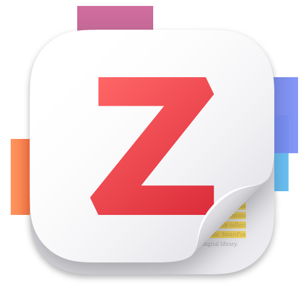

# Awesome DeepSeek Integrations 

DeepSeek APIを人気のソフトウェアに統合します。APIキーを取得するには、[DeepSeek Open Platform](https://platform.deepseek.com/)にアクセスしてください。

[English](https://github.com/deepseek-ai/awesome-deepseek-integration/blob/main/README.md)/[简体中文](https://github.com/deepseek-ai/awesome-deepseek-integration/blob/main/README_cn.md)/日本語

 
 

### アプリケーション

<table>
    <tr>
        <td>  </td>
        <td> <a href="https://github.com/deepseek-ai/awesome-deepseek-integration/blob/main/docs/chatbox/README.md">Chatbox</a> </td>
        <td> Chatboxは、Windows、Mac、Linuxで利用可能な複数の最先端LLMモデルのデスクトップクライアントです。 </td>
    </tr>
    <tr>
        <td>  </td>
        <td> <a href="https://github.com/deepseek-ai/awesome-deepseek-integration/blob/main/docs/chatgpt_next_web/README.md"> ChatGPT-Next-Web </a> </td>
        <td> ChatGPT Next Webは、GPT3、GPT4、Gemini ProをサポートするクロスプラットフォームのChatGPTウェブUIです。 </td>
    </tr>
    <tr>
        <td>  </td>
        <td> <a href="https://github.com/deepseek-ai/awesome-deepseek-integration/blob/main/docs/liubai/README.md">Liubai</a> </td>
        <td> Liubaiは、WeChat上でDeepSeekを使用してノート、タスク、カレンダー、ToDoリストを操作できるようにします！ </td>
    </tr>
    <tr>
        <td>  </td>
        <td> <a href="https://github.com/deepseek-ai/awesome-deepseek-integration/blob/main/docs/pal/README.md"> Pal - AI Chat Client (iOS, ipadOS) </a> </td>
        <td> Palは、iOS上でカスタマイズされたチャットプレイグラウンドです。 </td>
    </tr>
    <tr>
        <td>  </td>
        <td> <a href="https://www.librechat.ai/docs/configuration/librechat_yaml/ai_endpoints/deepseek">LibreChat</a> </td>
        <td> LibreChatは、DeepSeekをシームレスに統合してAIインタラクションを強化するカスタマイズ可能なオープンソースアプリです。 </td>
    </tr>
    <tr>
        <td>  </td>
        <td> <a href="https://github.com/deepseek-ai/awesome-deepseek-integration/blob/main/docs/rss_translator/README.md"> RSS Translator </a> </td>
        <td> RSSフィードをあなたの言語に翻訳します！ </td>
    </tr>
    <tr>
        <td>  </td>
        <td> <a href="https://github.com/deepseek-ai/awesome-deepseek-integration/blob/main/docs/enconvo/README.md"> Enconvo </a> </td>
        <td> Enconvoは、AI時代のランチャーであり、すべてのAI機能のエントリーポイントであり、思いやりのあるインテリジェントアシスタントです。</td>
    </tr>
    <tr>
        <td></td>
        <td><a href="https://github.com/deepseek-ai/awesome-deepseek-integration/blob/main/docs/cherrystudio/README.md">Cherry Studio</a></td>
        <td>プロデューサーのための強力なデスクトップAIアシスタント</td>
    </tr>
    <tr>
        <td>  </td>
        <td> <a href="https://github.com/deepseek-ai/awesome-deepseek-integration/blob/main/docs/tomemo/README.md"> ToMemo (iOS, ipadOS) </a> </td>
        <td> フレーズブック+クリップボード履歴+キーボードiOSアプリで、キーボードでの迅速な出力にAIマクロモデリングを統合しています。</td>
    </tr>
    <tr>
        <td>  </td>
        <td> <a href="https://github.com/buxuku/video-subtitle-master">Video Subtitle Master</a></td>
        <td> ビデオの字幕を一括生成し、字幕を他の言語に翻訳することができます。これはクライアントサイドのツールで、MacとWindowsの両方のプラットフォームをサポートし、Baidu、Volcengine、DeepLx、OpenAI、DeepSeek、Ollamaなどの複数の翻訳サービスと統合されています。</td>
    </tr>
    <tr>
        <td>  </td>
        <td> <a href="https://github.com/UnknownEnergy/chatgpt-api/blob/master/README.md">Chatworm</a> </td>
        <td> Chatwormは、複数の最先端LLMモデルのためのウェブアプリで、オープンソースであり、Androidでも利用可能です。 </td>
    </tr>
    <tr>
        <td>  </td>
        <td> <a href="https://github.com/tisfeng/Easydict">Easydict</a></td>
        <td> Easydictは、単語の検索やテキストの翻訳を簡単かつエレガントに行うことができる、簡潔で使いやすい翻訳辞書macOSアプリです。大規模言語モデルAPIを呼び出して翻訳を行うことができます。</td>
    </tr>
    <tr>
        <td>  </td>
        <td> <a href="docs/raycast/README.md">Raycast</a></td>
        <td> <a href="https://raycast.com/?via=ViGeng">Raycast</a>は、macOSの生産性ツールで、いくつかのキーストロークでツールを制御できます。DeepSeek AIを含むさまざまな拡張機能をサポートしています。</td>
    </tr>
    <tr>
        <td>  </td>
        <td> <a href="https://github.com/deepseek-php/deepseek-php-client/blob/master/README.md">PHP Client</a> </td>
        <td> Deepseek PHP Clientは、Deepseek APIとのシームレスな統合のための堅牢でコミュニティ主導のPHPクライアントライブラリです。 </td>
    </tr>
    <tr>
        <td>  </td>
        <td> <a href="https://github.com/deepseek-php/deepseek-laravel/blob/master/README.md">Laravel Integration</a> </td>
        <td> LaravelアプリケーションとのシームレスなDeepseek API統合のためのLaravelラッパー。</td>
    </tr>
    <tr>
        <td>  </td>
        <td> <a href="docs/zotero/README.md">Zotero</a></td>
        <td> <a href="https://www.zotero.org">Zotero</a>は、研究成果を収集、整理、注釈、引用、共有するのに役立つ無料で使いやすいツールです。</td>
    </tr>
    <tr>
        <td>  </td>
        <td> <a href="docs/Siyuan/README.md">SiYuan</a> </td>
        <td> SiYuanは、完全にオフラインで使用できるプライバシー優先の個人知識管理システムであり、エンドツーエンドの暗号化データ同期を提供します。</td>
    </tr>
    <tr>
        <td>  </td>
        <td> <a href="https://github.com/ArvinLovegood/go-stock/blob/master/README.md">go-stock</a> </td>
        <td>go-stockは、Wailsを使用してNativeUIで構築され、LLMによって強化された中国株データビューアです。</td>
    </tr>
    <tr>
        <td>  </td>
        <td> <a href="docs/wordware/README.md">Wordware</a> </td>
        <td><a href="https://www.wordware.ai/">Wordware</a>は、誰でも自然言語だけでAIスタックを構築、反復、デプロイできるツールキットです。</td>
    </tr>
    <tr>
        <td>  </td>
        <td> <a href="https://github.com/langgenius/dify/">Dify</a> </td>
        <td> <a href="https://dify.ai/">Dify</a>は、アシスタント、ワークフロー、テキストジェネレーターなどのアプリケーションを作成するためのDeepSeekモデルをサポートするLLMアプリケーション開発プラットフォームです。 </td>
    </tr>
    <tr>
        <td>  </td>
        <td> <a href="https://github.com/enricoros/big-AGI/blob/v2-dev/README.md">Big-AGI</a> </td>
        <td><a href="https://big-agi.com/">Big-AGI</a>は、誰もが高度な人工知能にアクセスできるようにするための画期的なAIスイートです。</td>
    </tr>
    <tr>
        <td>  </td>
        <td> <a href="https://github.com/LiberSonora/LiberSonora/blob/main/README_en.md">LiberSonora</a> </td>
        <td> LiberSonoraは、「自由の声」を意味し、AIによって強化された強力なオープンソースのオーディオブックツールキットであり、インテリジェントな字幕抽出、AIタイトル生成、多言語翻訳などの機能を備え、GPUアクセラレーションとバッチオフライン処理をサポートしています。</td>
    </tr>
    <tr>
        <td>  </td>
        <td> <a href="https://bobtranslate.com/">Bob</a></td>
        <td> <a href="https://bobtranslate.com/">Bob</a>は、任意のアプリで使用できるmacOSの翻訳およびOCRツールです。</td>
    </tr>
    <tr>
        <td>  </td>
        <td> <a href="https://agenticflow.ai/">AgenticFlow</a> </td>
        <td> <a href="https://agenticflow.ai/">AgenticFlow</a>は、マーケターがAIエージェントのためのエージェンティックAIワークフローを構築するためのノーコードプラットフォームであり、数百の毎日のアプリをツールとして使用します。</td>
    </tr>
</table>

### AIエージェントフレームワーク

<table>
    <tr>
        <td>  </td>
        <td> <a href="https://github.com/deepseek-ai/awesome-deepseek-integration/blob/main/docs/anda/README.md">Anda</a> </td>
        <td>高度にコンポーザブルで自律的かつ永続的な記憶を持つAIエージェントネットワークを構築するために設計されたRustフレームワーク。</td>
    </tr>
</table>

### RAGフレームワーク

<table>
    <tr>
        <td>  </td>
        <td> <a href="https://github.com/deepseek-ai/awesome-deepseek-integration/blob/main/docs/ragflow/README.md"> RAGFlow </a> </td>
        <td> 深い文書理解に基づいたオープンソースのRAG（Retrieval-Augmented Generation）エンジン。RAGFlowは、あらゆる規模の企業や個人に対して、ユーザーのさまざまな複雑な形式のデータに対して信頼性のある質問応答と根拠のある引用を提供するための簡素化されたRAGワークフローを提供します。 </td>
    </tr>
</table>

### IMアプリケーションプラグイン

<table>
    <tr>
        <td>  </td>
        <td> <a href="https://github.com/deepseek-ai/awesome-deepseek-integration/blob/main/docs/huixiangdou/README_cn.md">HuixiangDou (wechat,lark)</a> </td>
        <td>個人のWeChatおよびFeishuでのドメイン知識アシスタントで、質問に答えることに焦点を当てています。</td>
    </tr>
    <tr>
        <td>  </td>
        <td> <a href="https://github.com/RockChinQ/QChatGPT">QChatGPT （QQ）</a> </td>
        <td> 高い安定性、プラグインサポート、リアルタイムネットワーキングを備えたQQチャットボット。 </td>
    </tr>
</table>

### ブラウザ拡張機能

<table>
    <tr>
        <td>  </td>
        <td> <a href="https://github.com/deepseek-ai/awesome-deepseek-integration/blob/main/docs/immersive_translate/README.md"> Immersive Translate </a> </td>
        <td> Immersive Translateは、バイリンガルのウェブページ翻訳プラグインです。 </td>
    </tr>
    <tr>
        <td>  </td>
        <td> <a href="https://github.com/deepseek-ai/awesome-deepseek-integration/blob/main/docs/immersive_reading_guide/README.md"> Immersive Reading Guide </a> </td>
        <td> サイドバーなし!!! 没入型のAIウェブ要約、質問をする... </td>
    </tr>
    <tr>
        <td>  </td>
        <td> <a href="https://github.com/deepseek-ai/awesome-deepseek-integration/blob/main/docs/chatgpt_box/README.md"> ChatGPT Box </a> </td>
        <td> ChatGPT Boxは、ブラウザに統合されたChatGPTで、完全に無料です。 </td>
    </tr>
    <tr>
        <td>  </td>
        <td> <a href="https://github.com/deepseek-ai/awesome-deepseek-integration/blob/main/docs/hcfy/README.md"> hcfy (划词翻译) </a> </td>
        <td> hcfy (划词翻译)は、複数の翻訳サービスを統合するウェブブラウザ拡張機能です。 </td>
    </tr>
    <tr>
        <td>  </td>
        <td> <a href="docs/Lulu Translate/README.md"> Lulu Translate </a> </td>
        <td> このプラグインは、マウス選択翻訳、段落ごとの比較翻訳、およびPDF文書���訳機能を提供します。DeepSeek AI、Bing、GPT、Googleなどのさまざまな翻訳エンジンを利用できます。 </td>
    </tr>
    <tr>
        <td>  </td>
        <td> <a href="https://fluent.thinkstu.com/"> FluentRead </a> </td>
        <td> 誰もが母国語のような読書体験を持つことができる革新的なオープンソースのブラウザ翻訳プラグイン </td>
    </tr>
</table>

### VS Code拡張機能

<table>
    <tr>
        <td>  </td>
        <td> <a href="https://github.com/deepseek-ai/awesome-deepseek-integration/blob/main/docs/continue/README.md"> Continue </a> </td>
        <td> Continueは、IDEのオープンソースの自動操縦です。 </td>
    </tr>
    <tr>
        <td>  </td>
        <td> <a href="https://github.com/deepseek-ai/awesome-deepseek-integration/blob/main/docs/cline/README.md"> Cline </a> </td>
        <td> Clineは、CLIとエディタを使用できるAIアシスタントです。 </td>
    </tr>
</table>

### neovim拡張機能

<table>
    <tr>
        <td>  </td>
        <td> <a href="https://github.com/deepseek-ai/awesome-deepseek-integration/blob/main/docs/avante.nvim/README.md"> avante.nvim </a> </td>
        <td> avante.nvimは、IDEのオープンソースの自動操縦です。 </td>
    </tr>
    <tr>
        <td>  </td>
        <td> <a href="docs/llm.nvim/README.md"> llm.nvim </a> </td>
        <td> NeovimでLLMと対話できる無料の大規模言語モデル（LLM）プラグイン。Deepseek、GPT、GLM、Kimi、またはローカルLLM（ollamaなど）など、任意のLLMをサポートします。 </td>
    </tr>
    <tr>
        <td>  </td>
        <td> <a href="docs/codecompanion.nvim/README.md"> codecompanion.nvim </a> </td>
        <td> Neovimでシームレスに統合されたAI駆動のコーディング。 </td>
    </tr>
</table>

### JetBrains拡張機能

<table>
    <tr>
        <td>  </td>
        <td> <a href="https://ide.unitmesh.cc/quick-start"> AutoDev </a> </td>
        <td>‍AutoDevは、JetBrainのIDEでのオープンソースのAIコーディングアシスタントです。 </td>
    </tr>
    <tr>
        <td>  </td>
        <td> <a href="https://plugins.jetbrains.com/plugin/21410-onegai-copilot"> Onegai Copilot </a> </td>
        <td>Onegai Copilotは、JetBrainのIDEでのAIコーディングアシスタントです。 </td>
    </tr>
    <tr>
        <td>  </td>
        <td> <a href="https://github.com/deepseek-ai/awesome-deepseek-integration/blob/main/docs/continue/README.md"> Continue </a> </td>
        <td> Continueは、IDEのオープンソースの自動操縦です。 </td>
    </tr>
    <tr>
        <td>  </td>
        <td> <a href="https://plugins.jetbrains.com/plugin/18336-chinese-english-translate">Chinese-English Translate</a> </td>
        <td> JetBrainのIDEでの複数の翻訳サービス。 </td>
    </tr>
    <tr>
        <td>  </td>
        <td> <a href="https://plugins.jetbrains.com/plugin/24851-ai-git-commit">AI Git Commit</a> </td>
        <td> このプラグインは、コードの変更に基づいてコミットメッセージを自動生成するためにAIを使用します。 </td>
    </tr>
</table>

### Cursor

<table>
    <tr>
        <td>  </td>
        <td> <a href="https://www.cursor.com/"> Cursor </a> </td>
        <td>‍AIコードエディタ</td>
    </tr>
</table>

### Emacs

<table>
    <tr>
        <td>  </td>
        <td> <a href="https://github.com/karthink/gptel"> gptel </a> </td>
        <td>EmacsのためのシンプルなLLMクライアント</td>
    </tr>
    <tr>
        <td>  </td>
        <td> <a href="https://github.com/milanglacier/minuet-ai.el"> Minuet AI </a> </td>
        <td>コードでインテリジェンスとダンス💃</td>
    </tr>
</table>

### その他

<table>
    <tr>
        <td>  </td>
        <td> <a href="https://github.com/deepseek-ai/awesome-deepseek-integration/tree/main/docs/siri_deepseek_shortcut"> siri_deepseek_shortcut </a> </td>
        <td> DeepSeek APIを装備したSiri </td>
    </tr>
    <tr>
        <td>  </td>
        <td> <a href="https://github.com/rubickecho/n8n-deepseek"> n8n-nodes-deepseek </a> </td>
        <td> DeepSeek APIをワークフローに直接統合するためのN8Nコミュニティノード。 </td>
    </tr>
    <tr>
        <td>  </td>
        <td> <a href="https://github.com/BerriAI/litellm"> LiteLLM </a> </td>
        <td> 100以上のLLM APIをOpenAI形式で呼び出すためのPython SDK、プロキシサーバー（LLMゲートウェイ）。DeepSeek AIもサポートし、コスト追跡も可能です。 </td>
    </tr>
    <tr>
        <td>  </td>
        <td> <a href="https://github.com/mem0ai/mem0"> Mem0 </a> </td>
        <td> Mem0は、AIアシスタントにインテリジェントなメモリレイヤーを追加し、パーソナライズされたインタラクションと継続的な学習を可能にします。 </td>
    </tr>
    <tr>
        <td>  </td>
        <td> <a href="https://geneplore.com/bot"> Geneplore AI </a> </td>
        <td> Geneplore AIは、Deepseek v3およびR1を搭載した最大のAI Discordボットの1つを運営しています。 </td>
    </tr>
    <tr>
        <td>  </td>
        <td> <a href="docs/promptfoo/README.md"> promptfoo </a> </td>
        <td> LLMプロンプトをテストおよび評価し、DeepSeekモデルを含む。さまざまなLLMプロバイダーを比較し、回帰をキャッチし、応答を評価します。 </td>
    </tr>
</table>
