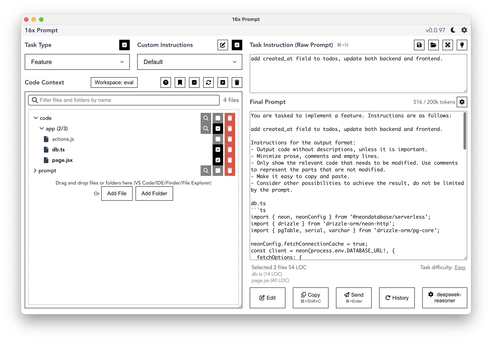
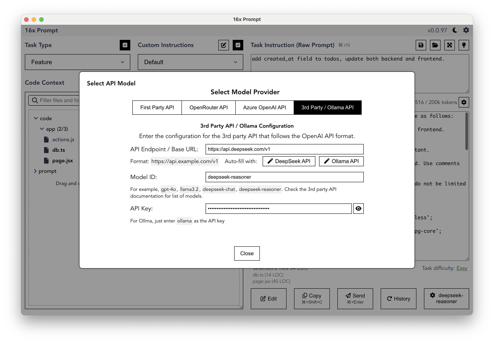

# [16x Prompt](https://prompt.16x.engineer/)

AI Coding with Context Management.

16x Prompt helps developers manage source code context and craft prompts for complex coding tasks on existing codebases.

# UI

## Integrate with DeepSeek API

1. Click on the model selection button at bottom right
2. Click on "DeepSeek API" to automatically fill in API Endpoint
3. Enter model ID, for example `deepseek-chat` (for DeepSeek V3) or `deepseek-reasoner` (for DeepSeek R1)
4. Enter your API key

