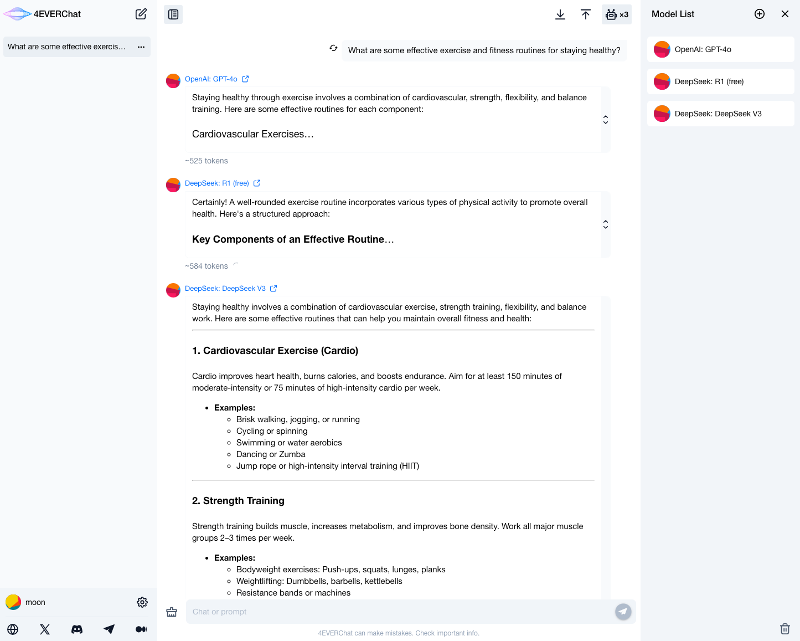
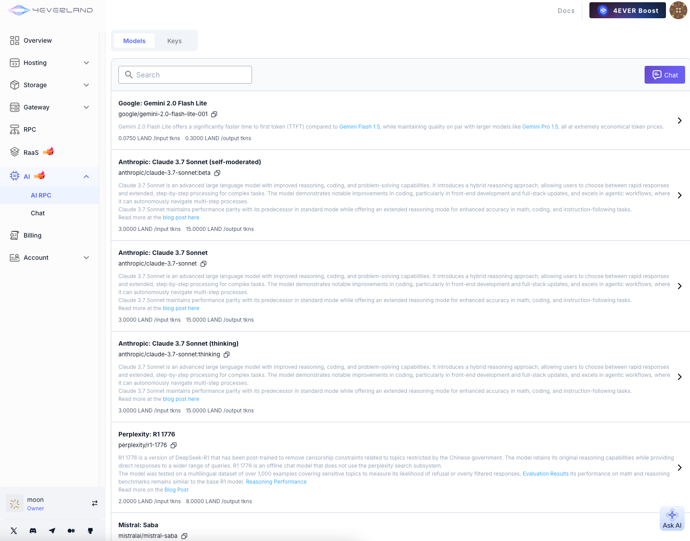
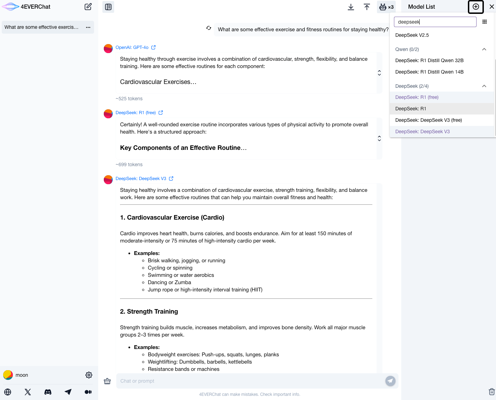

 

# [4EVERChat](https://chat.4everland.org/)

[4EVERChat](https://chat.4everland.org) is a large language model selection platform that seamlessly integrates hundreds of mainstream LLM models (such as ChatGPT, Deepseek, Grok, etc.). Developers can compare the response performance differences of various models in real-time, accurately identifying the optimal engine for their business needs. The platform requires no API key configuration and is ready to use out of the box.

Its underlying technology relies on [4EVERLAND AI RPC](https://docs.4everland.org/ai/ai-rpc/quick-start), which not only enables zero-cost switching between hundreds of models through a unified API endpoint but also monitors service status in real-time and automatically activates backup nodes. It dynamically selects model combinations with fast response times and low inference costs, creating an AI development infrastructure that balances stability and cost-effectiveness.

🔗 

4EVERChat: https://chat.4everland.org/

4EVERLAND: https://www.4everland.org/

​ 

## UI

####  4EVERChat

#### 4EVER AI RPC

## Add Deepseek Model

