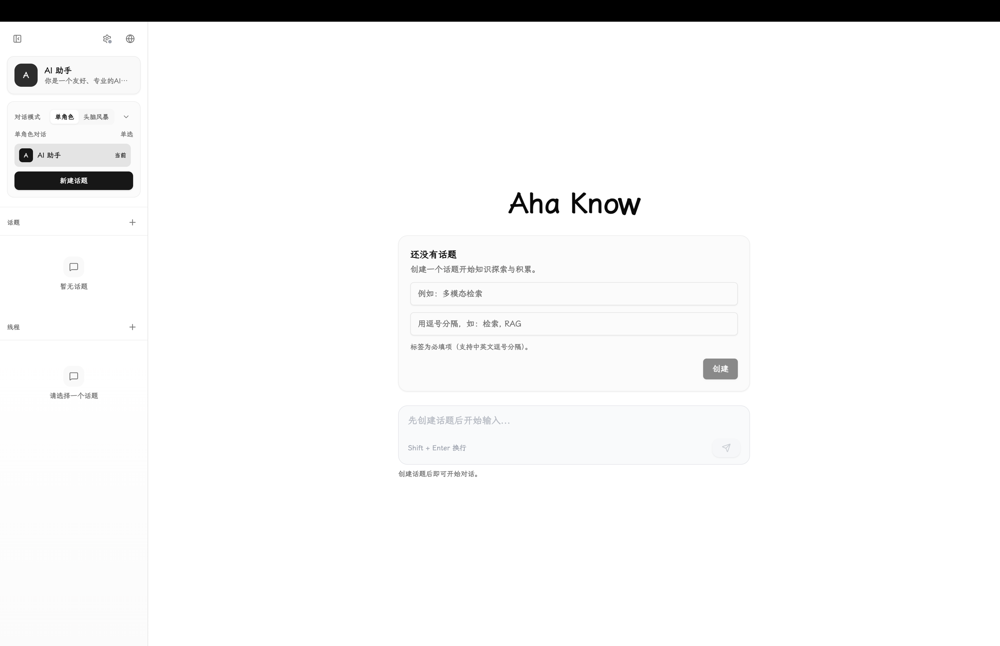
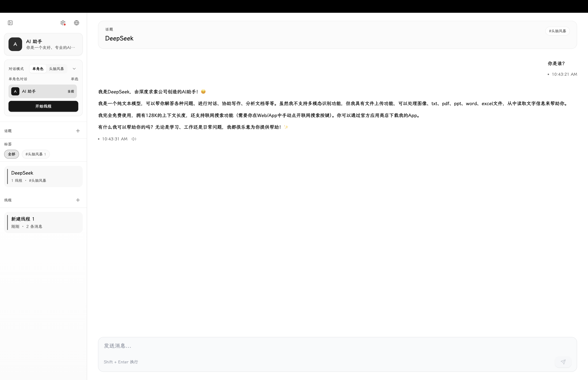

# [AhaKnow Chat](https://github.com/IHKYoung/AhaKnowChat)

AhaKnow Chat is a local-first AI chat workspace that works with DeepSeek through any OpenAI-compatible API. It supports topic-based threads, reusable roles, multi-role brainstorming, and browser-native local storage.

## UI

## In Use

## Settings

## Integrate with DeepSeek API

Because AhaKnow Chat uses an OpenAI-compatible API surface, DeepSeek can be integrated directly without additional backend code.

### Step by step

1. Open `Settings` and go to the `AI Provider` tab.
2. Set `Base URL` to `https://api.deepseek.com`.
3. Paste your own DeepSeek API key into the `API Key` field.
4. Click `Test Connection` to verify the endpoint and fetch available models.
5. Choose a default model:
   - `deepseek-chat` for general chat and everyday use
   - `deepseek-reasoner` for stronger reasoning tasks
6. Save the configuration, create a topic, then start a thread and chat with DeepSeek.

### Notes

- AhaKnow Chat stores configuration locally in the browser for the web version.
- If you deploy the web client on Vercel, the target DeepSeek endpoint must allow browser requests and CORS.
- You can also connect to DeepSeek through compatible gateways or proxies, as long as they expose an OpenAI-compatible API.
