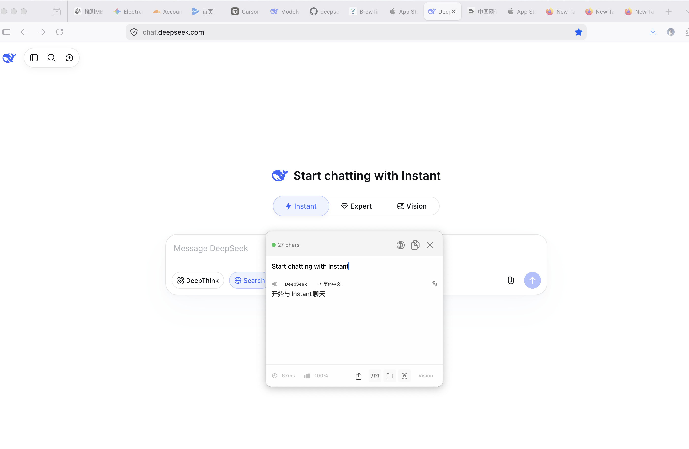
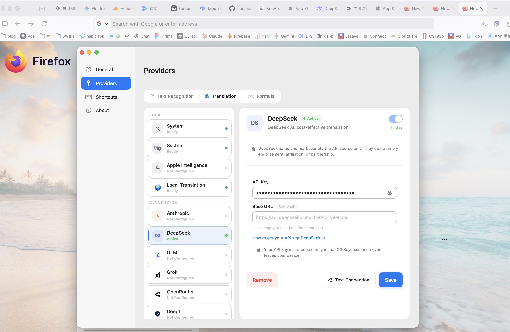

# [ClariRec](https://clarirec.com/)

ClariRec is a native macOS OCR and translation app. It extracts text from screenshots, clipboard images, and files with on-device Vision OCR, then optionally translates with your own API key — including DeepSeek.

## Features

- Screenshot OCR (`⌥S`), clipboard OCR (`⌥V`), and file OCR
- On-device system OCR by default; no ClariRec account required
- BYOK translation with DeepSeek and other providers (API key stays on your Mac)
- Optional offline local translation model and macOS system translation
- Result window with copy/export, Smart Cleanup, and Markdown tables
- Shortcuts and `clarirec://` URL scheme automation

## UI

## Integrate with DeepSeek API

1. Get an API key from the [DeepSeek Open Platform](https://platform.deepseek.com/api_keys).
2. Open **ClariRec → Settings → Providers**.
3. Select **DeepSeek** in the provider list.
4. Paste your API key into **API Key**.
5. Click **Test Connection** to verify the key.
6. Set **DeepSeek** as the **Translation Engine** (in Providers or the result window).

Built-in defaults (no endpoint setup required):

- Endpoint: `https://api.deepseek.com/chat/completions`
- Default model: `deepseek-v4-flash`

Your key is stored in the macOS Keychain. ClariRec talks to DeepSeek’s official API directly — no proxy or intermediate server.

## Use

1. Capture text with screenshot OCR (`⌥S`), clipboard OCR (`⌥V`), or file OCR.
2. In the result window, run translation (or enable auto-translate).
3. Or translate selected text via macOS Services / clipboard hotkey (`⌥T`) when DeepSeek is the active translation engine.

## Get it

[Website](https://clarirec.com/) · [Mac App Store](https://apps.apple.com/cn/app/clarirec/id6757385283?mt=12) · macOS 14.0+

> ClariRec is not affiliated with, endorsed by, or sponsored by DeepSeek. “DeepSeek” is used only to identify a supported BYOK translation provider.
