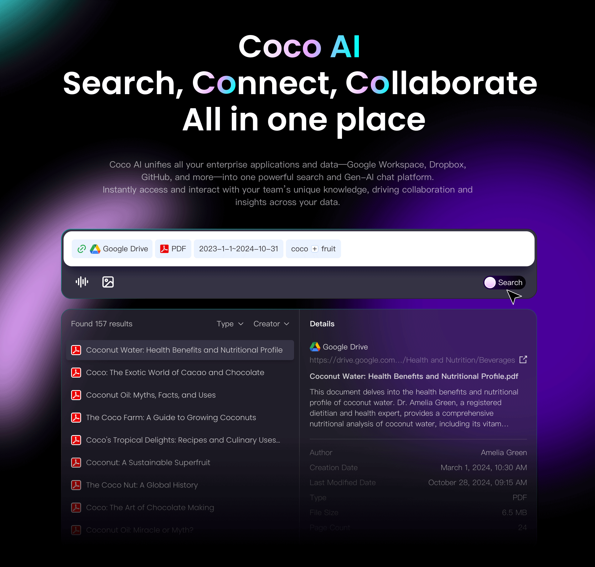
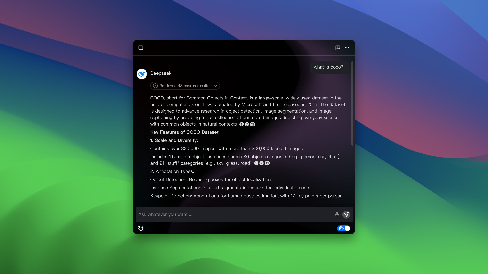
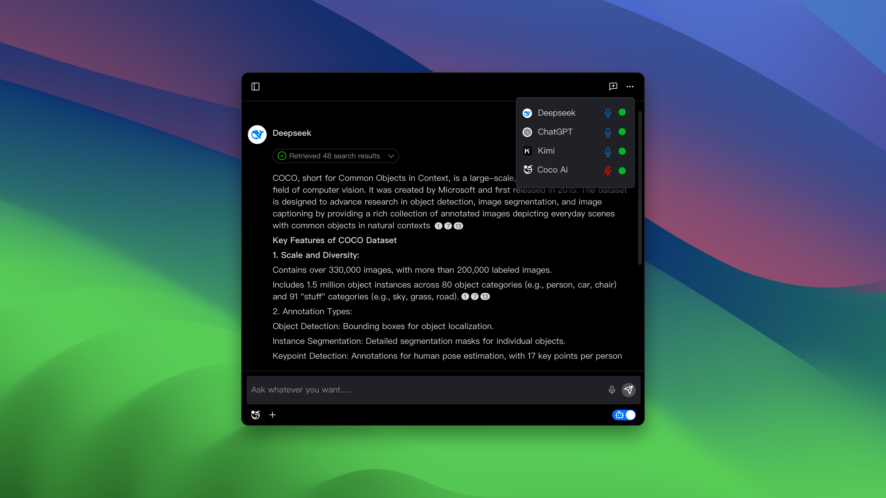
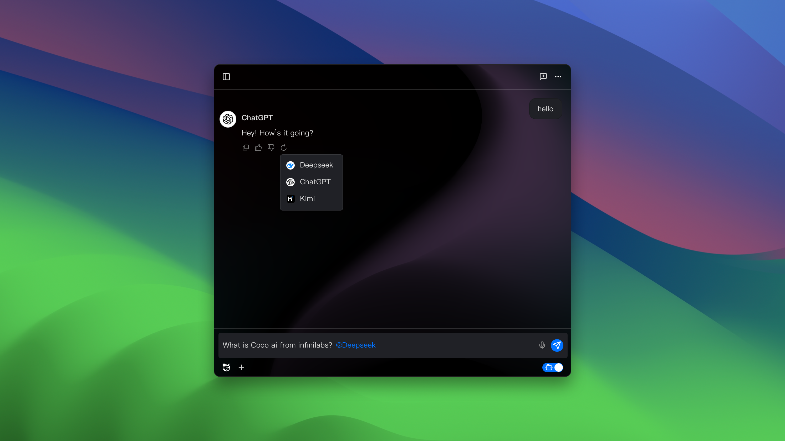
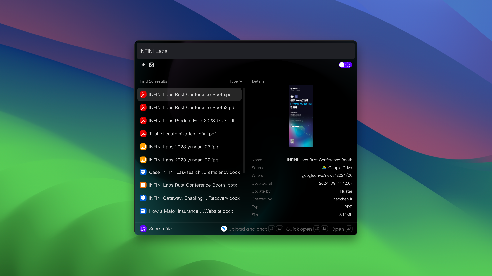
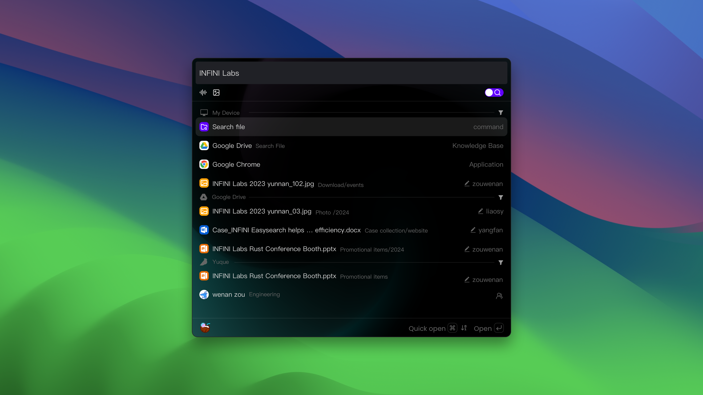

<!-- TEXT_SECTION:header:END -->

# Coco AI - Connect & Collaborate

Coco AI 是一个统一的搜索平台，能够将您企业的所有应用程序和数据——包括 Google Workspace、Dropbox、Confluence Wiki、GitHub 等——整合到一个强大而统一的搜索界面中。这个仓库包含了适用于桌面端和移动端的 COCO 应用程序。用户可以通过该应用在不同平台上搜索和操作企业数据。

此外，Coco 还提供了一个面向团队的生成式人工智能聊天工具——可以将其想象为专为您的团队量身定制的 Deepseek，它能够与团队独特的知识体系和内部资源相结合。Coco 通过即时提供信息访问和基于企业特定数据的人工智能驱动洞察，增强了团队协作能力。

# UI

