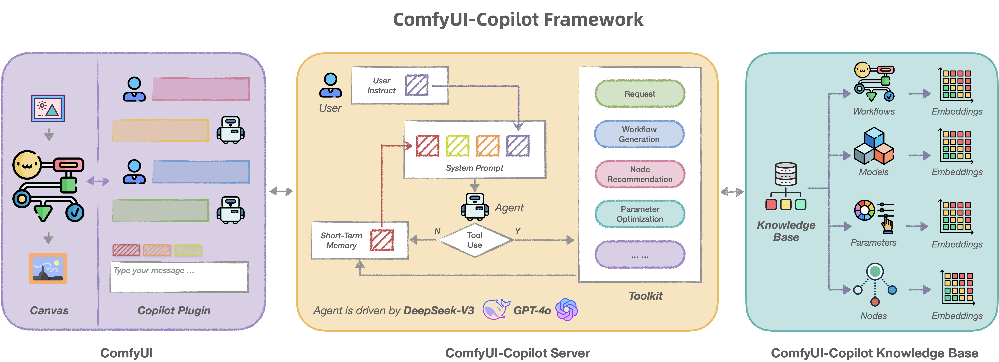
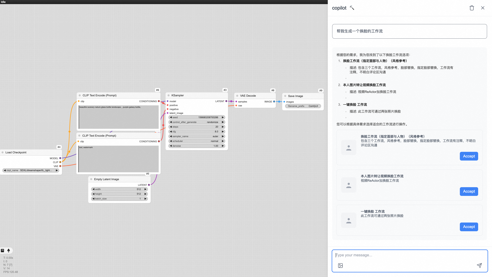
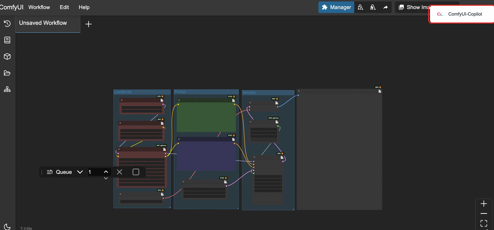
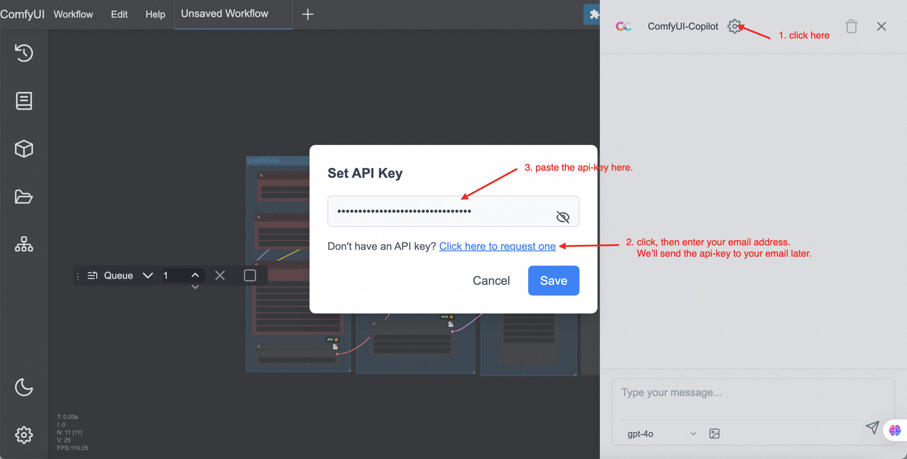

<div align="center">

# 🎯 ComfyUI-Copilot: Your Intelligent Assistant for Comfy-UI

<!-- Enhancing Image Generation Development with Smart Assistance -->

<h4 align="center">

<div align="center">
 


</h4>


👾 _**Alibaba International Digital Commerce**_ 👾

:octocat: [**Github**](https://github.com/AIDC-AI/ComfyUI-Copilot)

</div>

https://github.com/user-attachments/assets/0372faf4-eb64-4aad-82e6-5fd69f349c2c

## 🌟 Introduction

Welcome to **ComfyUI-Copilot**, an intelligent assistant built on the Comfy-UI framework that simplifies and enhances the AI algorithm debugging and deployment process through natural language interactions.

Whether it's generating text, images, or audio, ComfyUI-Copilot offers intuitive node recommendations, workflow building aids, and model querying services to streamline your development process.

<div align="center">

</div>


---

## 🤔 Why Choose ComfyUI-Copilot?

- 🍀 **Ease of Use**: Lower the barriers to entry with natural language interaction, making Comfy-UI accessible even for beginners.
- 🍀 **Smart Recommendations**: Leverage AI-driven node suggestions and workflow implementations to boost development efficiency.
- 🍀 **Real-Time Assistance**: Benefit from round-the-clock interactive support to address any issues encountered during development.

---

## 🔥 Core Features

- 💎 **Interactive Q&A Bot**: Access a robust Q&A platform where users can inquire about model intricacies, node details, and parameter utilization with ease.
- 💎 **Natural Language Node Suggestions**: Employ our advanced search mechanism to swiftly identify desired nodes and enhance workflow construction efficacy.


- 💎 **Node Query System**: Dive deeper into nodes by exploring their explanations, parameter definitions, usage tips, and downstream workflow recommendations.


- 💎 **Smart Workflow Assistance**: Automatically discern developer needs to recommend and build fitting workflow frameworks, minimizing manual setup time.


- 💎 **Model Querying**: Prompt Copilot to seek foundational models and 'lora' based on requirements.
- 💎 **Up-and-Coming Features**:
  
  - **Automated Parameter Tuning**: Exploit machine learning algorithms for seamless analysis and optimization of critical workflow parameters.
  - **Error Diagnosis and Fix Suggestions**: Receive comprehensive error insights and corrective advice to swiftly pinpoint and resolve issues.

---

## 🚀 Getting Started

**Repository Overview**: Visit the [GitHub Repository](https://github.com/AIDC-AI/ComfyUI-Copilot) to access the complete codebase.

1. **Installation**:
   
   ```bash
   cd ComfyUI/custom_nodes
   git clone git@github.com:AIDC-AI/ComfyUI-Copilot.git
   ```
   
   or
   
   ```bash
   cd ComfyUI/custom_nodes
   git clone https://github.com/AIDC-AI/ComfyUI-Copilot
   ```
2. **Activation**: After running the ComfyUI project, find the Copilot activation button at the top-right corner of the board to launch its service.

<<<<<<< HEAD
3.  **KeyGeneration**：Enter your email address on the link, the api-key will automatically be sent to your email address later.
=======

3.  **KeyGeneration**：Enter your name and email address on the link, and the api-key will automatically be sent to your email address later.
>>>>>>> 62f0878737649971dd8c5e71c3c44e2328a38e74
    


---

## 🤝 Contributions

We welcome any form of contribution! Feel free to make issues, pull requests, or suggest new features.

---

## 📞 Contact Us

For any queries or suggestions, please feel free to contact: ComfyUI-Copilot@service.alibaba.com.

---

## 📚 License

This project is licensed under the MIT License - see the [LICENSE](https://opensource.org/licenses/MIT) file for details.
