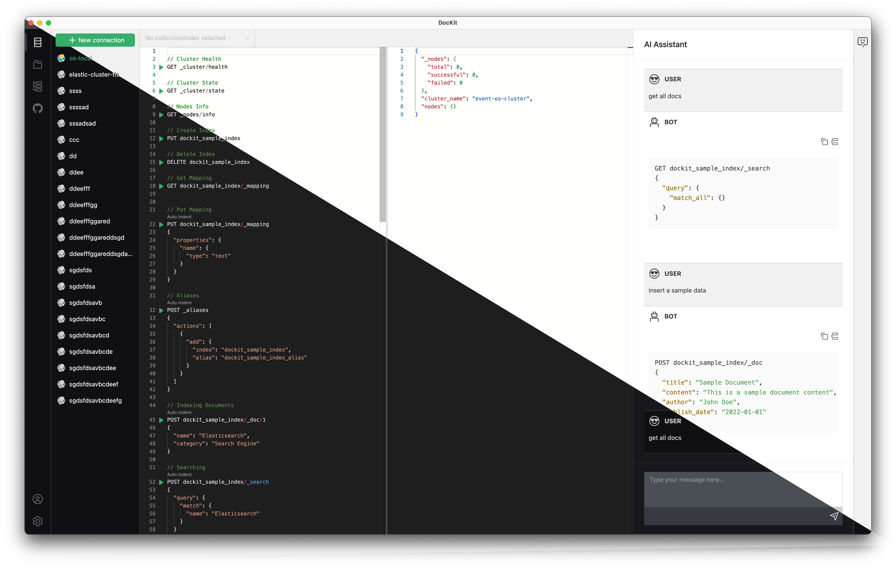

<div align="center">
<a href="https://github.com/geek-fun/dockit"></a>
</div>
<h1 align="center">DocKit</h1>
<div align="center">

[](https://github.com/geek-fun/dockit/actions/workflows/node.yml)
[](https://github.com/geek-fun/dockit/actions/workflows/release.yml)
[](https://snyk.io/test/github/geek-fun/dockit)
[](https://codecov.io/gh/geek-fun/dockit)
[](https://badge.fury.io/gh/geek-fun%2Fdockit)
[](https://opensource.org/licenses/Apache-2.0)


</div>
Here's the translated `README_cn.md` file:


[DocKit](https://dockit.geekfun.club/) 是一个AI驱动的桌面客户端，专为NoSQL数据库设计，支持Mac、Windows和Linux上的Elasticsearch和OpenSearch。通过集成DeepSeek等大型模型，DocKit可以帮助开发者编写复杂的DSL查询，并为数据管理和分析提供更好的体验。


## 客户端界面


## 功能特点

DocKit提供多种功能以满足您的特定需求：

- **用户友好界面**：通过DocKit直观的界面轻松浏览您的Elasticsearch/OpenSearch服务器。
- **高级搜索功能**：高效执行复杂搜索并分析您的数据。
- **跨平台支持**：适用于Mac、Windows和Linux，确保与您的操作系统兼容。
- **开源**：DocKit是一个开源项目，允许社区贡献和持续改进。
- **多服务器支持**：同时连接多个Elasticsearch/OpenSearch服务器，简化您的工作流程。
- **AI驱动搜索**：利用AI驱动的搜索功能增强数据分析和可视化。
- **暗黑模式支持**：DocKit提供暗黑模式以保护您的眼睛并提高生产力。
- **多窗口支持**：DocKit支持多窗口操作，允许您同时查看和编辑多个索引和文档。
- **多语言支持**：DocKit提供多种语言版本，确保全球用户易于使用。
- **集群管理与监控**：DocKit提供集群管理和监控功能，帮助您轻松管理和监控Elasticsearch集群的健康状况、节点、分片和索引。

## 路线图

- [ ] MongoDB支持
- [ ] DynamoDB支持
- [ ] 待定

## 安装

可以从[这里](https://github.com/geek-fun/dockit/releases)免费下载。

## 构建指南

### 前提条件

* Node.js >= 20
* NPM >= 10

### 克隆代码

```bash
git clone https://github.com/geek-fun/dockit.git --depth=1
```

### 安装依赖

```bash
npm install
```

### 编译和运行

```bash
npm run tauri dev
```
## 关于
### 微信公众号


### 赞助
如果这个项目对您有帮助，欢迎给我买杯咖啡 ☕️。

* Github赞助
  [](https://github.com/sponsors/[geek-fun])

* 微信赞助
  
