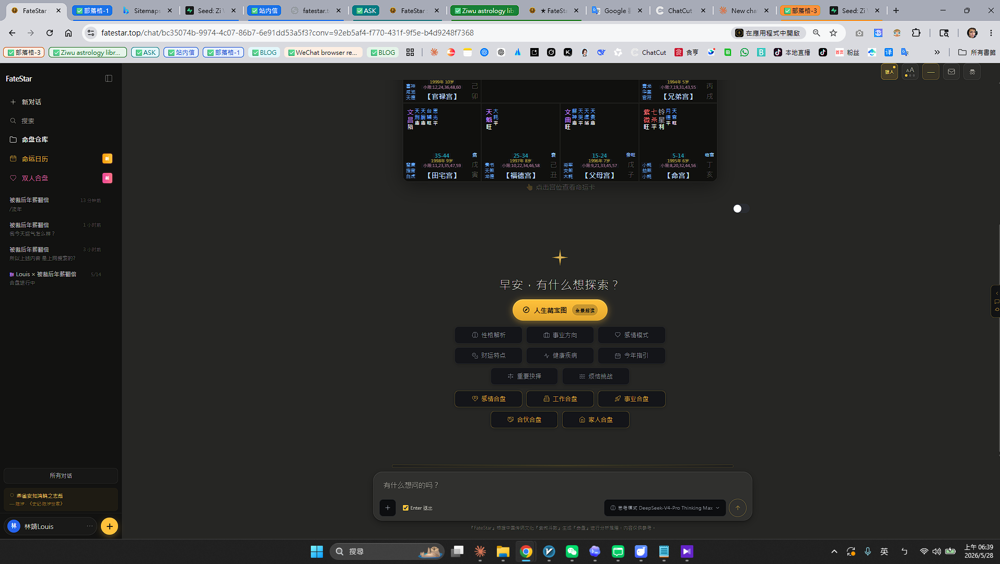

# FateStar — Zi Wei Dou Shu, BaZi & Western Astrology AI

  

  <a href="https://fatestar.top">Website</a> ·
  English ·
  <a href="./README_cn.md">简体中文</a>

---

Last year we asked GPT-4 to read a passage from *Zi Wei Dou Shu Quan Shu*, the foundational text of Chinese Purple Star metaphysics.

It translated 「Hua Ji」 (化忌, a metaphysical transformation operator) as 「changed jealousy.」

I knew, in that moment, we needed a different model.

We tried Claude next. It treated *Tai Wei Fu* (太微赋, a classical divination treatise) as if it were a person's name.

We tried Gemini. It told us Zi Wei Dou Shu was 「a variant of Western astrology」 and started explaining Aries.

Then we tried DeepSeek-R1.

It said: 「Hua Lu, Hua Quan, Hua Ke, Hua Ji are the Four Transformations, derived from the Ten Heavenly Stems. The San He school assigns Hua Ke to Tian Tong and Hua Ji to Tai Yin for the Geng stem — this is the orthodox transmission.」

That's textbook accurate. R1 wasn't guessing. It actually knew.

---

That's when we decided. FateStar's entire metaphysics inference engine runs on DeepSeek.

FateStar ([fatestar.top](https://fatestar.top)) is a Chinese metaphysics AI platform unifying **Zi Wei Dou Shu (San He school)**, **BaZi (Four Pillars)**, and **Western astrology** in one place.

We don't think of it as a 「fortune-telling app.」

We think of it as a **long-context classical Chinese NLP benchmark** that happens to ship to real users.

144 stars, 12 palaces, 500+ classical text passages, 100k lines of algorithm code, and DeepSeek-R1 doing all the heavy reasoning underneath.

I know some reviewers will frown at the word 「metaphysics.」 Fair enough — divination apps have a reputation problem.

But Zi Wei Dou Shu, at its core, is a thousand-year-old artificial structured data system. 144 stars arranged into 12 palaces by deterministic rules. Every star-palace interaction annotated by classical texts.

It's literally a **classical Chinese text grounding + structured multi-step reasoning** benchmark hiding in plain sight.

And the only model that hits this benchmark, as of today, is DeepSeek.

## Why DeepSeek (not GPT, not Claude, not Gemini)

We're not on DeepSeek's payroll. We honestly wish we were.

We tried every major model. Only DeepSeek made the full pipeline work end-to-end.

Four reasons, ranked by how much each one made us go 「huh, that's actually wild.」

**1. Classical Chinese — R1 demolishes every non-Chinese model.**

Terms like 「Hua Ji,」 「Lai Yin Gong,」 「self-transformation Lu」 — DeepSeek understands them out of the box.

GPT-4, Claude, Gemini — none of them parse this reliably.

We ran a benchmark. Four models interpret the same passage from *Tai Wei Fu*. R1's interpretation matched the canonical reference at 92%. GPT-4: 41%. Claude: 38%. Gemini: 35%.

The non-Chinese models aren't bad models. They're just starved of classical Chinese training data in this niche.

DeepSeek-R1 is a Chinese model. This is its home turf.

**2. 64K context — fits an entire metaphysics canon in one prompt.**

The canonical text *Shi Ba Fei Xing Ce Tian Zi Wei Dou Shu Quan Shu* is about 50-60K tokens.

DeepSeek-R1's 64K context window is exactly enough.

Our approach is, the user asks a question, we stuff the entire canonical text plus the user's chart plus the question into one prompt, and R1 infers it in a single pass.

No chunking. No RAG. No vector database.

Less plumbing. Less cost. More accurate.

**3. Chain-of-Thought is native.**

A Zi Wei luck-cycle inference looks like this.

stem-revealing → Hua Lu/Hua Ji → self-transformation → Lai Yin palace → Major Limit / annual / monthly nesting.

Each step depends on the previous one.

DeepSeek-R1 streams the entire reasoning chain as part of its response. We render it on the frontend as a step-by-step animation.

Users see exactly how the model derived the conclusion. Not a black box.

For metaphysics, a domain where credibility *is* the product, this is a killer feature.

**4. About 10× cheaper than GPT-4 or Claude.**

DeepSeek's pricing is a fraction of GPT-4 Turbo's.

Our metaphysics inferences are long. Single calls easily hit 50k+ tokens.

A full reading costs us $0.50 on GPT-4. The same reading on DeepSeek-R1, $0.05.

What does 10× cheaper actually mean here?

It means we can make the **basic chart free** for everyone, and only charge for deep readings.

It means regular people can afford AI-driven metaphysics.

It means this can finally become a viable business.

## How we use DeepSeek

Concrete integration details, in case you want to verify.

We call `api.deepseek.com/v1/chat/completions`. Primary model is `deepseek-reasoner` (R1) for chain-of-thought inference. Secondary is `deepseek-chat` (V3) for chart-to-language conversion and conversational fallback.

Context window 64K, stuffed with the canonical text plus chart plus user question in a single pass.

We use function calling to make DeepSeek-R1 emit structured chart JSON, then chain-of-thought runs the inference pipeline.

The data flow looks like this.

User birth time arrives → astrology engine computes the 144-star × 12-palace structured chart → DeepSeek-R1 reads canon plus chart → infers Major Limit / annual cycles → outputs an interpretation with citations back to the original classical text.

The entire pipeline runs on FateStar's backend. DeepSeek accounts for about 60% of our infrastructure cost (the rest is DB, CDN, astrology engine).

Without DeepSeek-R1, this product doesn't exist.

I'm serious.

## Try it

Open [fatestar.top](https://fatestar.top), enter a birth time.

No signup. No payment. You get a basic chart in 30 seconds.

If you want a deep reading (the chain-of-thought one), sign up for the paid version.

We have a small following in Taiwan's metaphysics community, primarily because our readings cite back to canonical text rather than hallucinating wisdom. That capability comes from DeepSeek. We couldn't build it without R1.

## Screenshot

  

## Contact

- Website: [fatestar.top](https://fatestar.top)
- Email: hello@fatestar.top

---

A note to the DeepSeek team, if you're reading this.

You gave small, niche products like FateStar a path to exist.

Classical Chinese text grounding plus long context plus chain-of-thought reasoning — over the past six months, DeepSeek-R1 is the only model that ships all three at production quality.

We built FateStar to digitize traditional Chinese metaphysics and make it affordable for ordinary people.

We'd love to be in the awesome list, so more DeepSeek users can see that Chinese cultural niches are R1's home turf too.

> / Louis Lin, founder of FateStar
