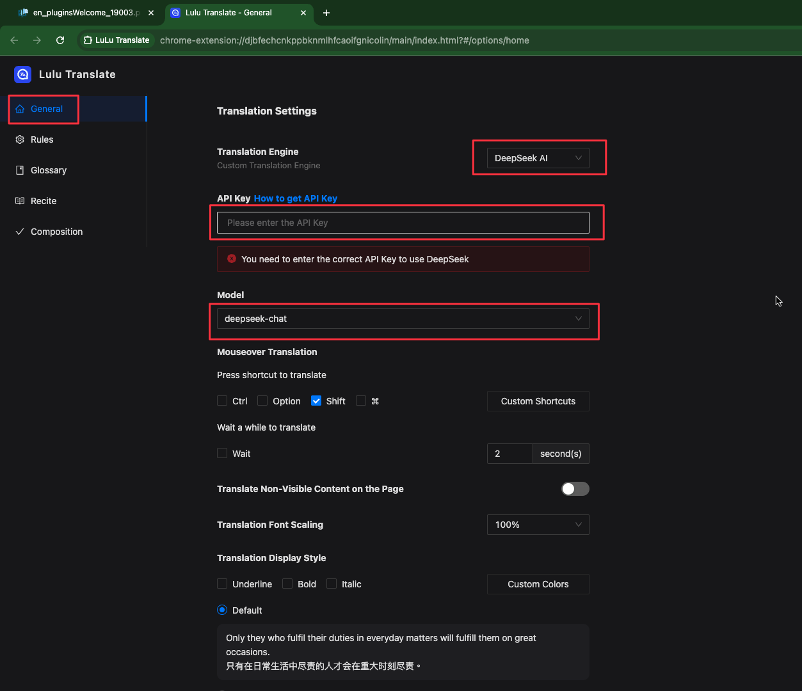

# [Lulu Translate](https://www.eudic.net/v4/en/app/plugins)

The plugin provides mouse selection translation, paragraph-by-paragraph comparison translation, and PDF document translation functionalities. It can utilize various translation engines, such as DeepSeek AI, Bing, GPT, Google, etc.

## UI

## Configure DeepSeek API

