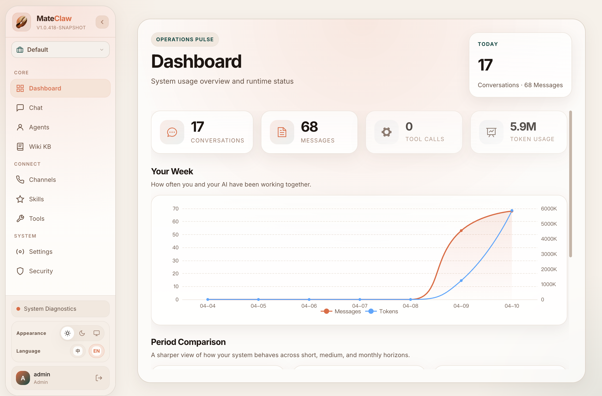

# [MateClaw](https://github.com/matevip/mateclaw)

> **Most AI tools die when their vendor has a bad day. Most forget you the moment the tab closes. Most give you a chatbox and call it a product.**

[MateClaw](https://github.com/matevip/mateclaw) is an open-source personal AI operating system built on Spring Boot 3.5 + Spring AI Alibaba. One JAR. Apache 2.0. The same agent answers in the **web console**, the **desktop app**, the **embeddable widget**, the **Java plugin SDK**, and **8 IM channels** — DingTalk, Feishu, WeChat Work, WeChat, Telegram, Discord, QQ, Slack. Same brain. Same memory. Same skills. Different doors.

DeepSeek V4 Pro and V4 Flash are wired in as builtin models — 1M context, thinking-mode reasoning streamed alongside the answer and preserved across the conversation. Drop DeepSeek into a multi-vendor failover chain alongside DashScope, OpenAI, Anthropic, Gemini, Kimi, Ollama, LM Studio, MLX, and more; when the primary vendor returns 401 or times out, the next picks up mid-sentence and the user sees the answer finish.

## UI

## What's in the box

- **Agent runtime** — ReAct for iterative reasoning, Plan-and-Execute for multi-step work, on Spring AI Alibaba's StateGraph runtime.
- **LLM Wiki** — drop in PDFs, markdown, scraped pages. The wiki digests them into linked pages with `[[wiki-style links]]` and per-sentence citations you can click back to the source chunk.
- **Memory lifecycle** — post-conversation extraction, scheduled consolidation, dreaming workflows. Plus per-workspace `AGENTS.md` / `SOUL.md` / `PROFILE.md` / `MEMORY.md` files.
- **Skills + MCP + Tool Guard** — `SKILL.md` packages from the ClawHub marketplace, MCP servers over stdio / SSE / Streamable HTTP, and an RBAC + approval-flow guard that pauses risky tool calls before they run.
- **Multimodal creation** — TTS, STT, image, music, video, Tencent Hunyuan 3D. Unified async pipeline streams progress over SSE.
- **Enterprise basics** — JWT auth, RBAC per agent / per model / per tool, full audit trail, Flyway migrations that auto-heal on upgrade.

## Integrate with DeepSeek API

#### 1. Install MateClaw

Three paths — pick the one that doesn't make you sigh.

- **Desktop** — download from [GitHub Releases](https://github.com/matevip/mateclaw/releases). Bundles JRE 21. Double-click. Mac, Windows, Linux.
- **Docker** — `git clone https://github.com/matevip/mateclaw.git && cd mateclaw && cp .env.example .env && docker compose up -d` → console at `http://localhost:18080`.
- **Source** — `cd mateclaw-server && mvn spring-boot:run` → console at `http://localhost:18088`.

Default login `admin` / `admin123` — change it.

#### 2. Add DeepSeek

In the admin console:

1. **Settings → Model Providers** → find **DeepSeek** → paste your [DeepSeek API Key](https://platform.deepseek.com/api_keys) → enable. Drag DeepSeek to the top of the failover chain to make it primary, or slot it after another provider as a fallback.
2. **Settings → Models** — `deepseek-v4-pro` and `deepseek-v4-flash` are already there as builtins (1M context, thinking-mode).
3. **Agents** → edit any agent → set its model to **DeepSeek V4 Pro** (hard reasoning) or **DeepSeek V4 Flash** (fast turns) → save.

That's the whole setup. Reasoning content streams alongside the answer and is preserved across the conversation, not thrown away after the turn.

#### 3. Use it

- **Web / Desktop** — open the console, pick the agent, talk. SSE streaming; tool calls and reasoning render live.
- **IM channels** — under **Channels**, attach a webhook for any of the 8 supported platforms. Same agent. Same memory. Same skills.
- **Wiki** — under **Wiki**, create a knowledge base, upload raw materials, let the digester build linked pages with citations.
- **Skills** — under **Skills → Marketplace**, install or upload a Skill bundle. Loaded at runtime, no restart. Subject to Tool Guard approval.
- **Embed** — `mateclaw-webchat` is a one-`<script>` widget. Drop it on any site to expose a specific agent.

---

The point isn't the channel list. The point is that the AI on the other end remembers you, runs your tools, and reasons under your control — not in someone else's cloud. Plug DeepSeek V4 into it and you have an engine that's both fast and willing to think.

Same brain. Five doors. That's the whole idea.

For more information, please refer to [MateClaw on GitHub](https://github.com/matevip/mateclaw) and the [documentation](https://claw.mate.vip/docs).
