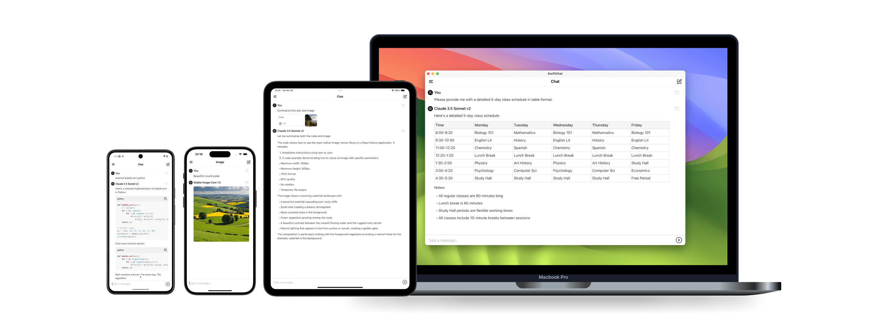
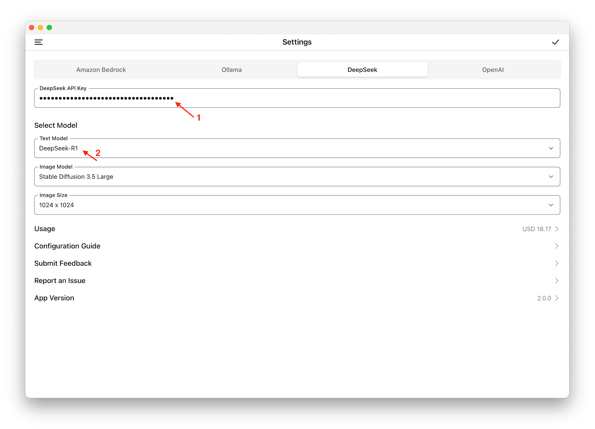
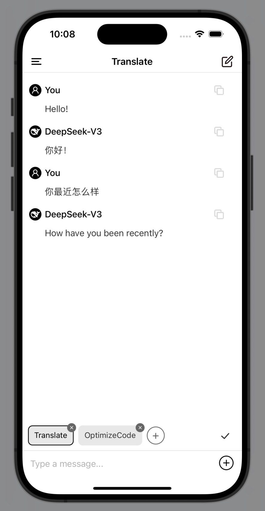

# [SwiftChat](https://github.com/aws-samples/swift-chat)

[SwiftChat](https://github.com/aws-samples/swift-chat) is a lightning-fast, cross-platform AI chat application built with React Native. It delivers native performance on Android, iOS, iPad, Android tablets and macOS. Features include real-time streaming chat, rich Markdown support (tables, code blocks, LaTeX), AI image generation, customizable system prompts, quick model switching, and multimodal capabilities. Supports multiple AI providers including DeepSeek, Amazon Bedrock, Ollama and OpenAI Compatible Models. The minimalist UI design and optimized architecture ensure instant launch and responsive interactions across all platforms.

## UI

## Integrate with Deepseek API

## Using System Prompt with DeepSeek

For more information, Please refer to [SwiftChat GitHub](https://github.com/aws-samples/swift-chat)
