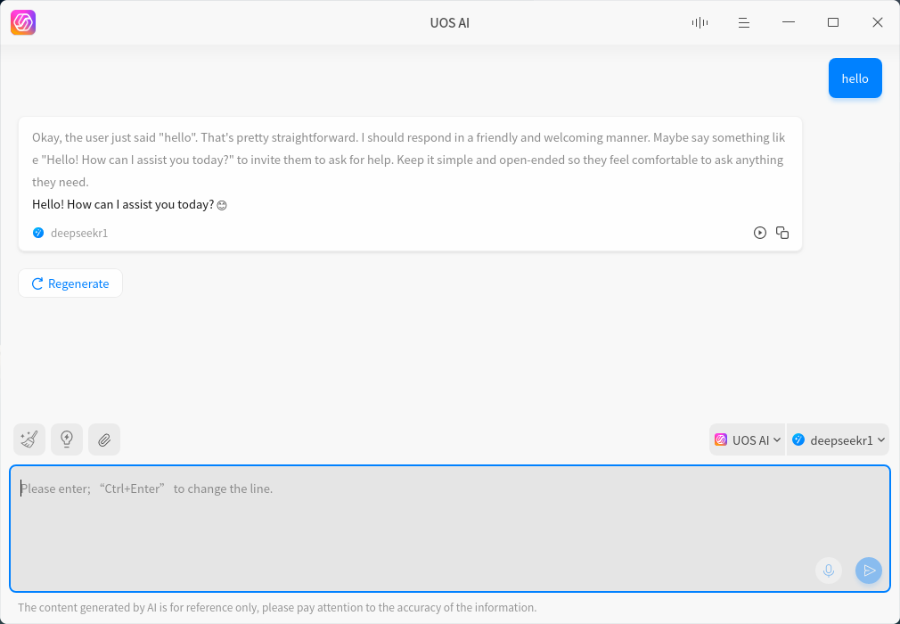
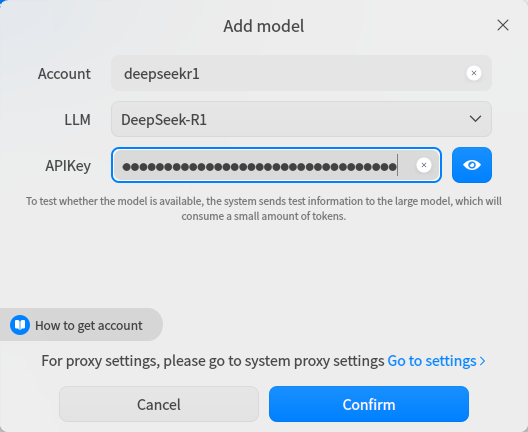
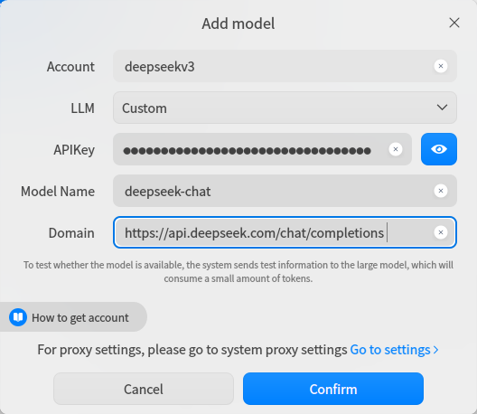

___

___

# [UOS AI](https://www.deepin.org)

UOS AI is a powerful AI assistant application within the Deepin operating system. 

It offers unique cross-application capabilities, enabling deep integration with built-in email and browser applications, providing you with contextualized AI capabilities.

# UI

## Integrate with DeepSeek API

## Default Option

1. Open the "Settings" option in UOS AI, select "DeepSeek-R1" in the "Model Configuration" under "Online model-Add" to enter the UOS AI model addition interface.

2. Select "DeepSeek-R1" in the "LLM".

3. Fill in any name in the "Account".

4. Enter your API key in the "APIKey".

## Custom Option

1. Select "Custom" in the "LLM".
2. Enter any name you like in the "Account".
3. Enter your API key in the "APIKey".
4. Add the name of the model you want to use in the "Model Name".
   -  For DeepSeek-V3, enter: deepseek-chat
   - For DeepSeek-R1, enter: deepseek-reasoner
5. Enter the following request address to "Domain": https://api.deepseek.com/chat/completions

