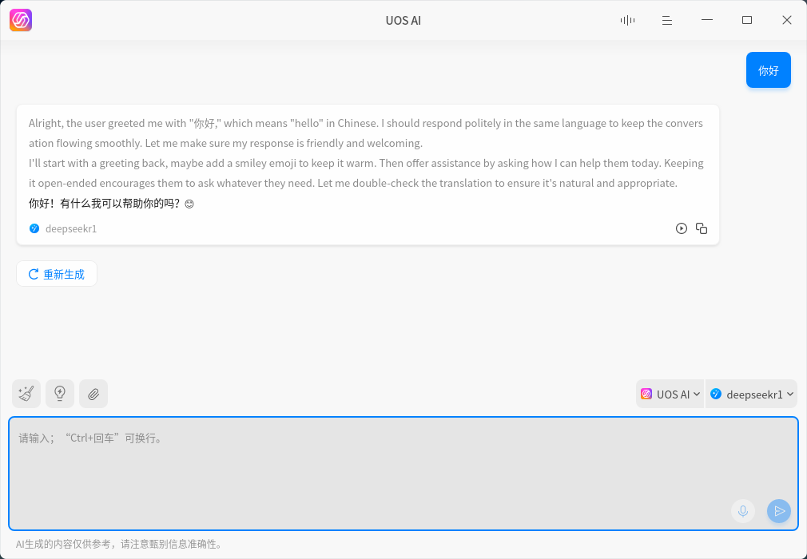
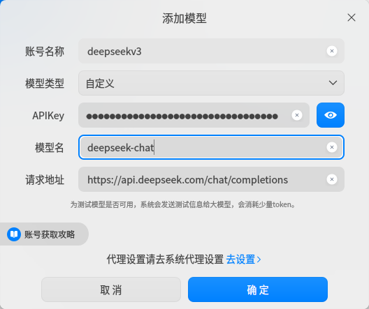

___

___

# [UOS AI](https://www.deepin.org)

UOS AI是Deepin操作系统中功能强大的AI助手应用。

它具有独特的跨应用能力，可以深度集成到系统自带的邮箱、浏览器中，为您提供场景化的AI能力。

# 界面

## 接入DeepSeek API

## 默认添加

1. 打开 UOS AI 的「设置」选项，在「模型配置」中选择「在线模型-添加」，进入UOS AI的添加模型界面。

2. 在「模型类型」中选择「DeepSeek-R1」。

3. 在「账号名称」中随意填写名称。

4. 在「APIKey」中填写您的API key。

## 自定义添加

1. 在「模型类型」中选择「自定义」。
2. 在「账号名称」中随意填写名称。
3. 在「APIKey」中填写您的API key。
4. 「模型名」添加要使用的模型名称。
   -  DeepSeek-V3填写：deepseek-chat
   - DeepSeek-R1填写：deepseek-reasoner

5. 「请求地址」填写：https://api.deepseek.com/chat/completions

