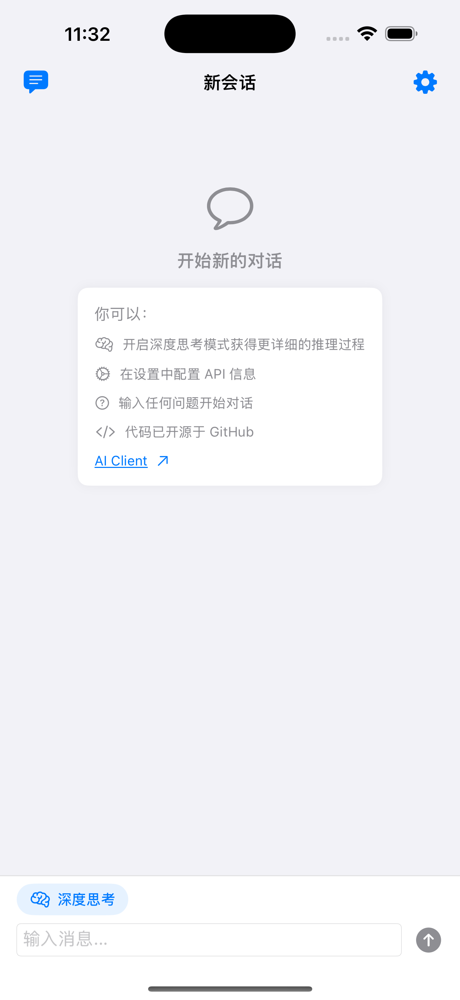
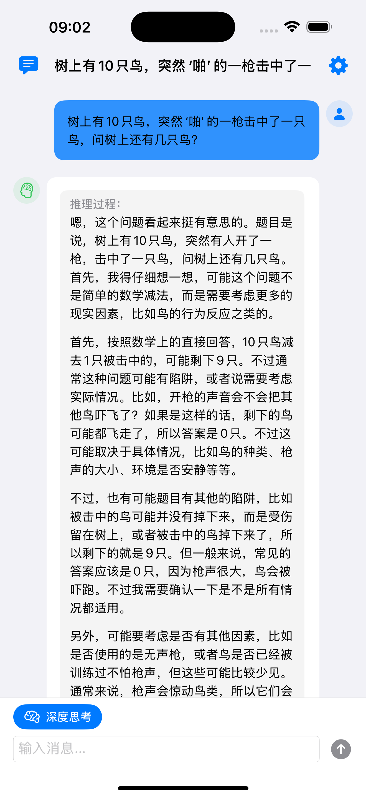
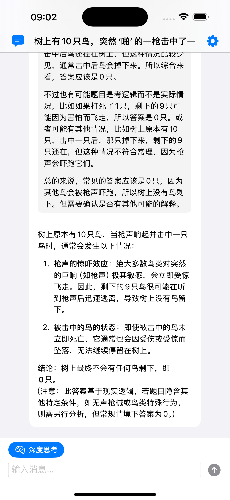
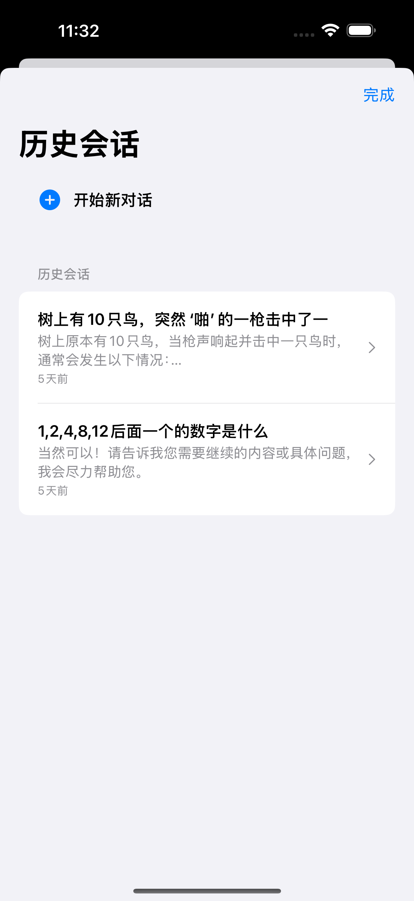
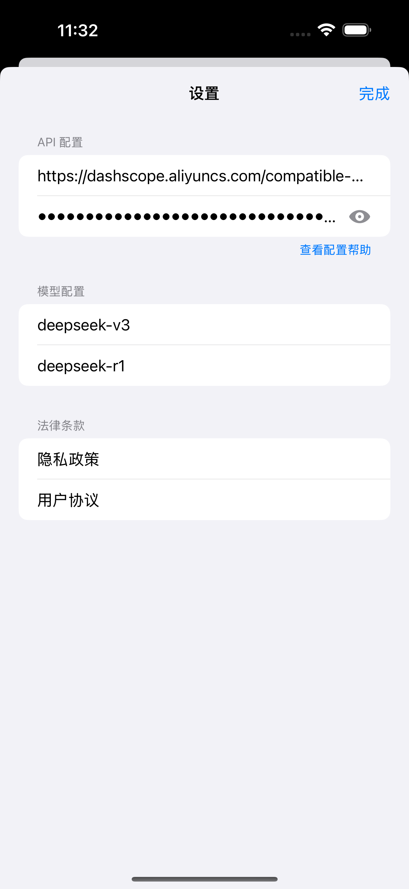

# [AI Client](https://apps.apple.com/cn/app/ai-client-%E6%94%AF%E6%8C%81deepseek%E6%8E%A8%E7%90%86/id6742068866)

AI Client是一款专为DeepSeek API用户打造的iPhone手机客户端，支持DeepSeek官方API、用户自部署的DeepSeek推理模型API、以及第三方阿里云提供的DeepSeek API。

## UI

## 核心特性：
- 完全开源，代码透明可信
- 支持DeepSeek官方API
- 兼容阿里云DeepSeek服务API
- 支持自部署DeepSeek推理模型API
- 数据完全保存在本地，严格保护用户数据隐私
- 简洁界面设计，专注对话本质
- 支持多轮对话
- 支持DeepSeek V3和DeepSeek R1模型

