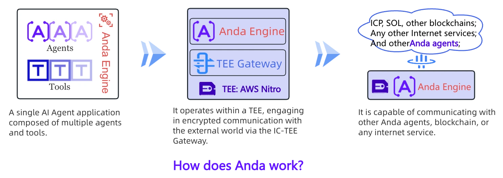

# `Anda`

> 🤖 一个专为 AI 智能体开发设计的 Rust 语言框架，致力于构建高度可组合、自主运行且具备永久记忆能力的 AI 智能体网络。

**Anda 源代码**：[https://github.com/ldclabs/anda](https://github.com/ldclabs/anda)

**AI Agent 应用实例**：[https://x.com/AndaICP](https://x.com/AndaICP)

Anda 使用 DeepSeek 作为首要的 LLM 服务提供商，以提供强大的智能体思考和决策能力。

## 🐼 简介

`Anda` 是一个创新的智能体开发框架，旨在构建一个高度可组合、自主性强且具有永久记忆的 AI 智能体网络。通过连接各行各业的智能体，Anda 致力于打造一个超级 AGI 系统，推动人工智能向更高层次发展。

### ✨ 核心特性

1. **可组合性**：
   Anda 智能体专注于解决特定领域的问题，并通过灵活组合不同的智能体来应对复杂任务。当单个智能体无法独立解决问题时，它能够与其他智能体协作，形成强大的问题解决网络。这种模块化设计使得 Anda 能够灵活应对多样化的需求。

2. **简洁性**：
   Anda 的设计理念强调简洁易用，旨在帮助开发者快速构建功能强大且高效的智能体。同时，非开发者也可以通过简单的配置创建自己的智能体，降低了技术门槛，使更多人能够参与到智能体的开发与应用中。

3. **可信性**：
   Anda 智能体运行在基于可信执行环境（TEEs）的去中心化可信计算环境（dTEE）中，确保了智能体的安全性、隐私性和数据完整性。这种架构为智能体的运行提供了高度可信的基础设施，保障了数据和计算过程的安全。

4. **自主性**：
   Anda 智能体从 ICP 区块链获取永久身份和加密能力，并结合大语言模型的思考和决策能力，使其能够根据自身的经验和知识自主、高效地解决问题。这种自主性使智能体能够适应动态环境，并在复杂场景中做出高效决策。

5. **永久记忆**：
   Anda 智能体的记忆状态存储在 ICP 区块链和 dTEE 的可信存储网络中，确保其能够持续升级算法、积累知识并不断进化。这种永久记忆机制使智能体能够长久运行，甚至实现“永生”，为构建超级 AGI 系统奠定基础。

### 🧠 愿景与目标

Anda 的目标是通过创建和连接无数智能体，构建一个开放、安全、可信、高度协同的智能体网络，最终实现超级 AGI 系统。我们相信，Anda 将为各行各业带来革命性的变革，推动人工智能技术在更广泛的领域中落地应用，为人类社会创造更大的价值。