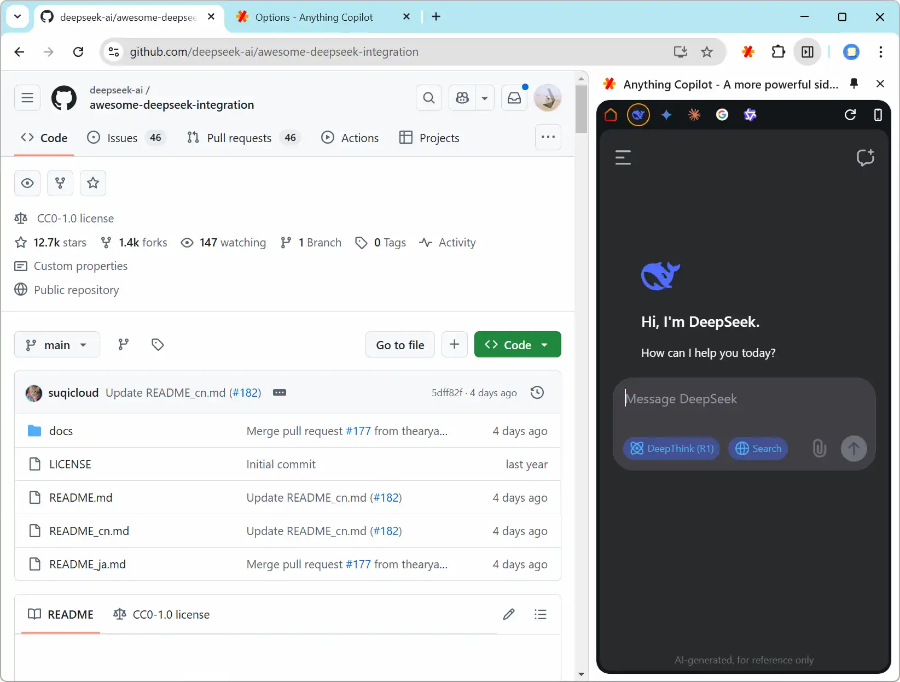

# [**Anything Copilot**](https://github.com/baotlake/anything-copilot)

>  Anything Copilot is a browser extension that enables seamless access to mainstream AI tools directly from your sidebar. For instance, you can open AI chat interfaces like DeepSeek within the sidebar, effectively transforming it into your AI Copilot that remains accessible while you browse.

**Install in Chrome Web Store**： [Anything Copilot - A more powerful sidebar, split-screen, and AI assistant](https://chromewebstore.google.com/detail/anything-copilot-a-more-p/lilckelmopbcffmglfmfhelaajhjpcff)

**Install in Edge Add-ons**： [Anything Copilot - A more powerful sidebar, split-screen, and AI assistant](https://microsoftedge.microsoft.com/addons/detail/anything-copilot-a-more/lbeehbkcmjaopnlccpjcdgamcabhnanl)

