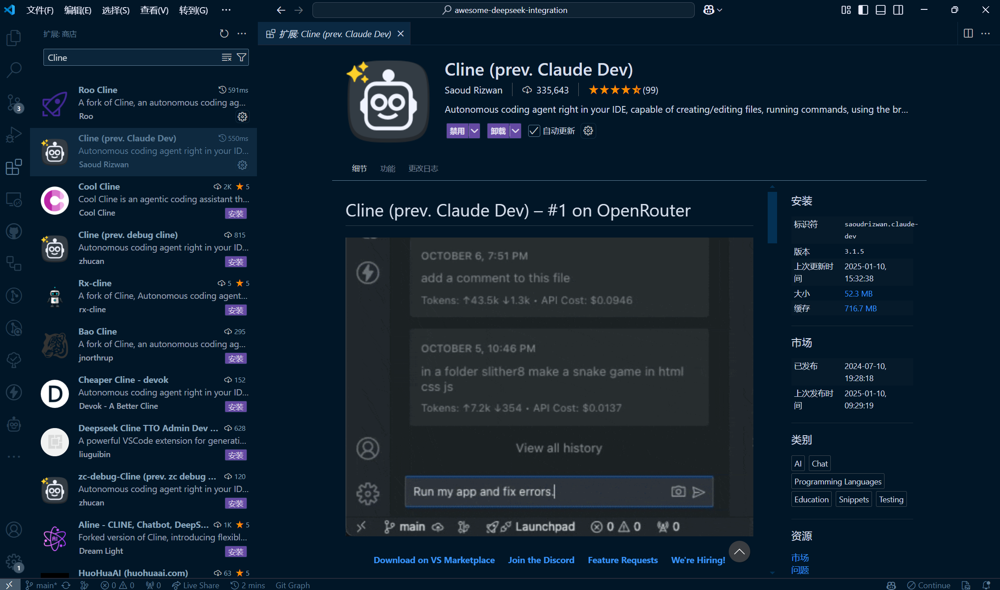
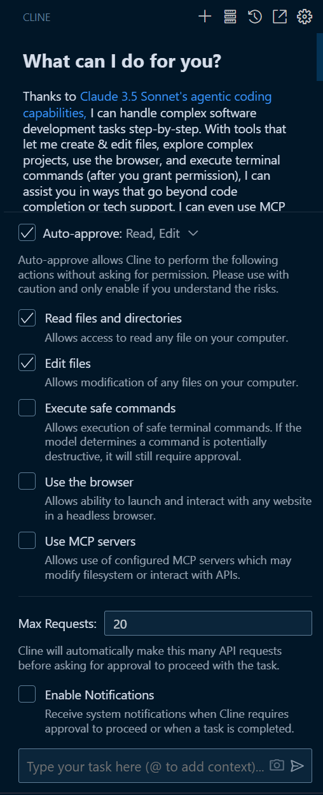
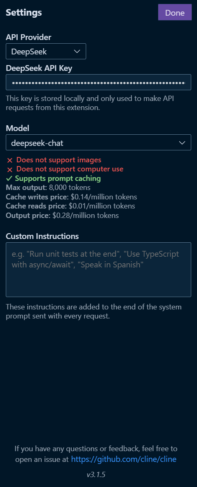
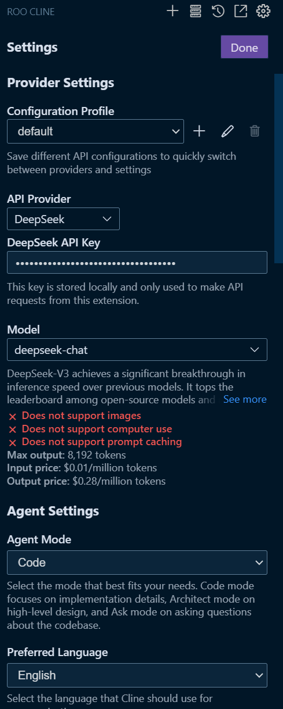

# [Cline](https://github.com/cline/cline)

Cline 是一款能够使用您的 CLI 和编辑器的 AI 助手。

## 安装

## Cline 的主要特点

1. **基于 Claude 3.5 Sonnet 的智能编码**：Cline 利用先进的 AI 技术，逐步处理复杂的软件开发任务，超越简单的代码补全或技术支持。

2. **文件与项目管理**：Cline 可以创建、编辑和浏览大型项目中的文件，实现无缝的代码库导航和修改。

3. **终端集成**：在用户授权的情况下，Cline 可以执行终端命令并监控其输出，从而动态响应开发服务器错误等问题。

4. **浏览器自动化**：对于 Web 开发，Cline 可以在无头浏览器中启动网站，与页面交互（点击、输入、滚动），并捕获截图和控制台日志，以调试运行时错误和视觉问题。

5. **人机交互安全保障**：每次文件更改和终端命令都需要通过 GUI 获得用户批准，确保在探索智能 AI 功能时提供一个安全可控的环境。

6. **上下文感知辅助**：Cline 分析文件结构、源代码 AST 并运行正则表达式搜索，以理解现有项目，确保在不超出上下文窗口的情况下提供高效且相关的帮助。

7. **主动错误处理**：Cline 监控 linter/编译器错误，并在文件编辑过程中主动修复诸如缺少导入和语法错误等问题。

8. **模型上下文协议 (MCP)**：Cline 可以通过 MCP 创建新工具来扩展其功能，从而持续适应用户需求。

9. **轻松完成任务**：任务完成后，Cline 会以简单的终端命令（例如 `open -a "Google Chrome" index.html`）呈现结果，用户只需点击一下即可执行。

## 用户界面

## 与 DeepSeek API 集成

## 最佳实践

1. **关闭 Cline 的 Auto Approve 功能**：建议在使用 DeepSeek 时，关闭 Cline 的 Auto Approve 功能，以降低资源消耗，降低多请求因并发带来的卡顿风险。

2. **使用 Cline 改版**：例如 Roo-Cline 或 ALine。这些改版携带的上下文相对短，处理请求时表现更为流畅，且缓存命中率更高，可以帮助节省 API 调用成本。

3. **慎用 DeepSeek 处理大型工程**：对于大型代码工程，不建议使用 DeepSeek + Cline。大型工程通常会携带大量代码上下文，会导致 API 请求处理速度明显变慢。

4. **更换其他 LLM 提供商**：建议您在使用 Cline 时，更换其他 LLM 提供商，以获得更流畅的体验。

## Roo Cline

