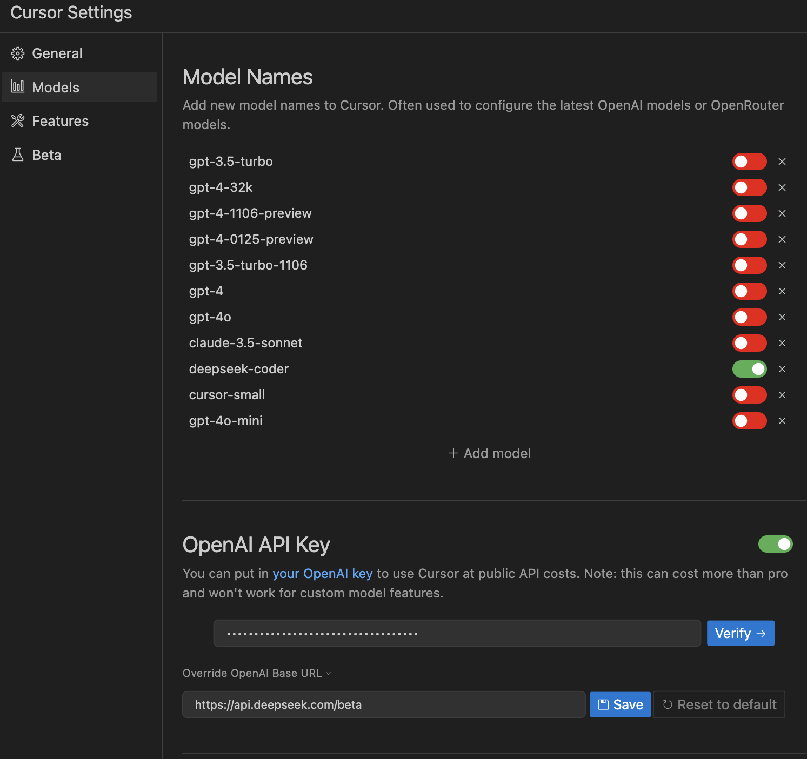

# [Cursor](https://www.cursor.com/)

  Cursor 是一个 AI 代码编辑器

## 只需按照以下步骤操作：

1. 在 Cursor 设置中禁用所有模型
2. 添加 `deepseek-coder` 作为新模型
3. 在 Open AI API Key 中添加 https://api.deepseek.com/beta 作为 URL - 添加您的 API 密钥。

# UI

