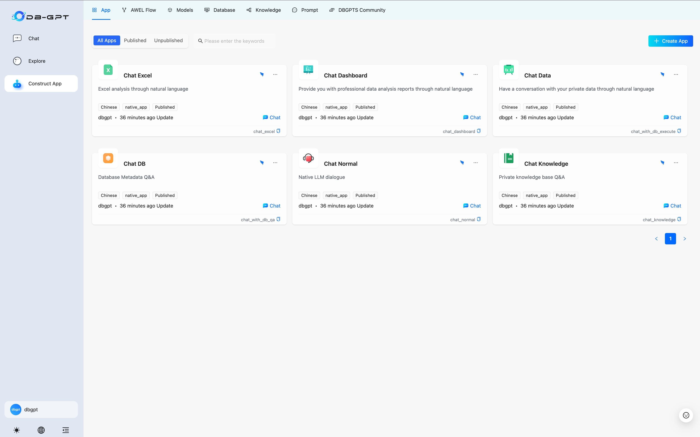
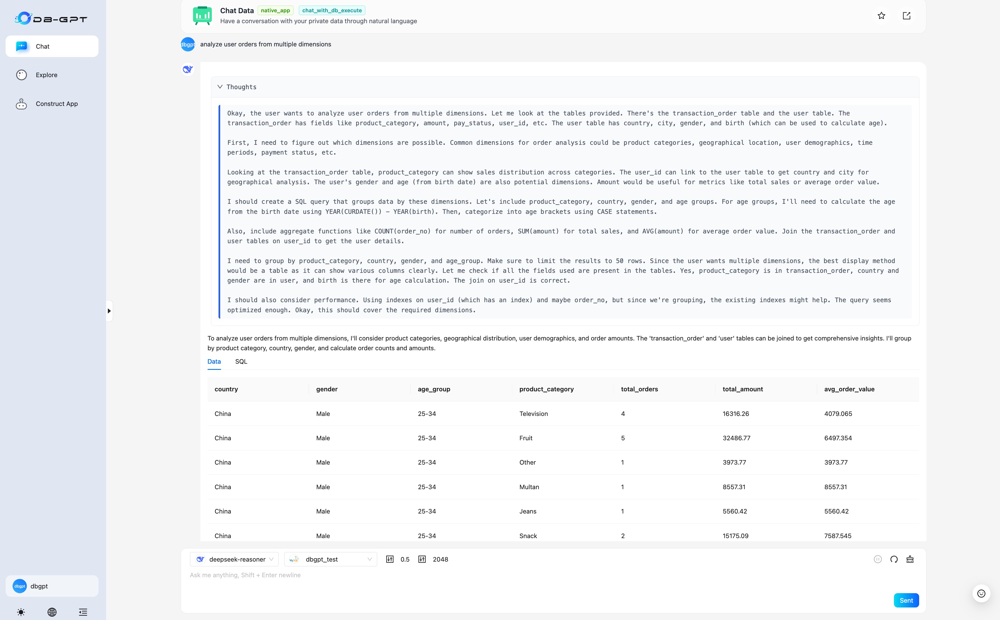
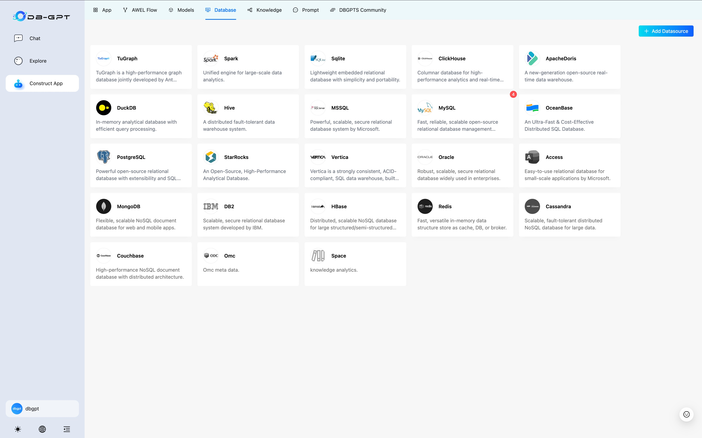

# [DB-GPT](https://github.com/eosphoros-ai/DB-GPT)

🤖 DB-GPT is an open source AI native data app development framework with AWEL(Agentic Workflow Expression Language) and agents.

The purpose is to build infrastructure in the field of large models, through the development of multiple technical capabilities such as multi-model management (SMMF), Text2SQL effect optimization, RAG framework and optimization, Multi-Agents framework collaboration, AWEL (agent workflow orchestration), etc. Which makes large model applications with data simpler and more convenient.
## UI

## Data Analysis with Deepseek API

## Datasources

