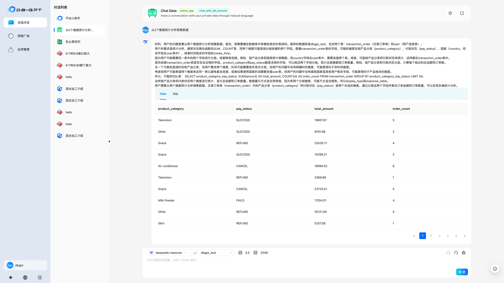
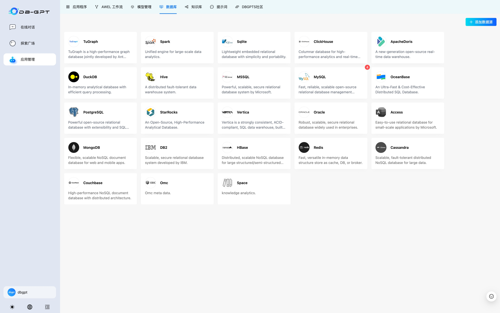

# [DB-GPT](https://github.com/eosphoros-ai/DB-GPT)

DB-GPT是一个开源的AI原生数据应用开发框架(AI Native Data App Development framework with AWEL(Agentic Workflow Expression Language) and Agents)。

目的是构建大模型领域的基础设施，通过开发多模型管理(SMMF)、Text2SQL效果优化、RAG框架以及优化、Multi-Agents框架协作、AWEL(智能体工作流编排)等多种技术能力，让围绕数据库构建大模型应用更简单，更方便。

## UI

## 数据分析 with Deepseek API

## Datasources

