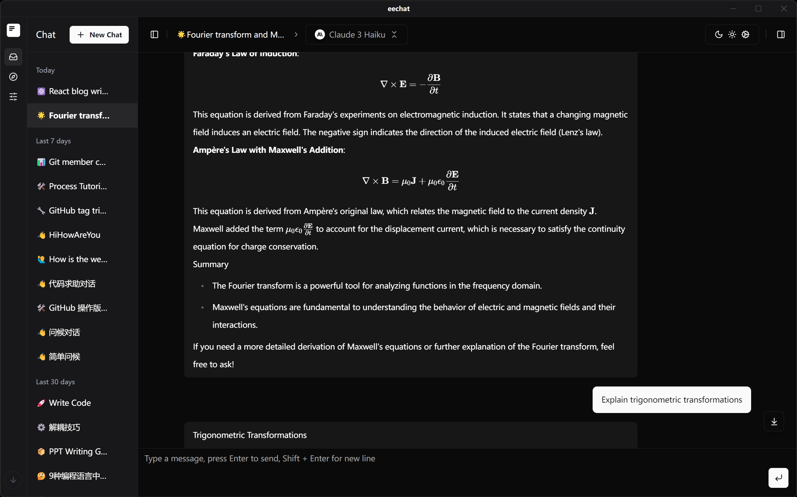
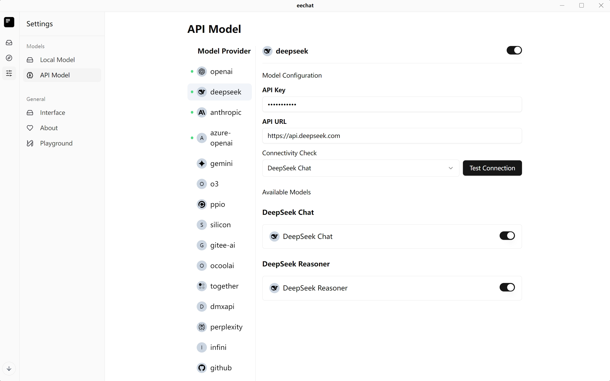
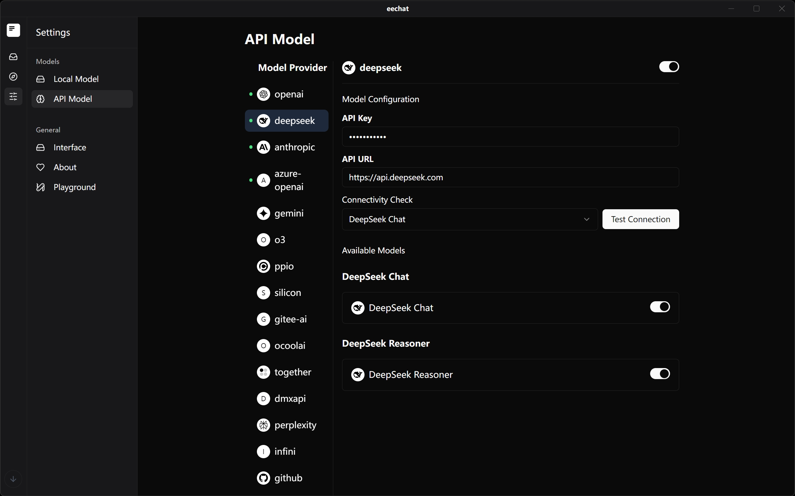

<div align="center">
  
  <h1><a href="https://ee.chat">eechat</a> </h1>
  <p>🚀 强大的本地化 AI 聊天应用 - 安全、高效、个性化</p>
  <p> <a href="./README.md"> English</a> |  简体中文  </p>

  <p style="margin-top:20px">
    <a href="#核心优势">核心优势</a> •
    <a href="#主要功能">主要功能</a> •
    <a href="#本地化部署">本地化部署</a> •
    <a href="#快速开始">快速开始</a> •
    <a href="#技术栈">技术栈</a> •
    <a href="#参与贡献">参与贡献</a> •
    <a href="#开源协议">开源协议</a>
  </p>
  
</div>



## 核心优势

eechat是一款专注于本地化部署的 AI 聊天应用，为用户提供安全、私密且高效的人工智能对话体验。

### 🔒 数据安全与隐私保护

- **完全本地存储**：所有对话数据均存储于本地，杜绝隐私泄露风险





- **离线能力**：初始化设置后无需持续联网
- **API 自定义**：可连接自有 AI 模型 API 或第三方服务，全程掌控数据流向




### 💬 卓越对话体验

- **多会话管理**：轻松创建和管理多个独立对话
- **历史追溯**：自动保存全部对话记录，支持随时查阅与续聊
- **完美 Markdown 支持**：精准渲染代码块、表格、数学公式等格式
- **智能代码高亮**：自动检测并高亮多种编程语言代码块

### 🎨 个性化定制

- **主题切换**：内置明暗双色模式，适应不同场景需求
- **提示词管理**：保存常用提示模板，提升对话效率
- **模型参数调节**：灵活调整温度值、最大输出等参数获取最佳响应

### 🔌 强大扩展性

- **插件生态**：支持功能扩展，满足特定场景需求
- **多模型集成**：轻松对接 OpenAI、Anthropic 等各类 AI 模型 API
- **自定义模型支持**：配置使用自有本地或远程 AI 模型

## 主要功能

### 增强智能对话

- **上下文理解**：AI 可在长对话中保持语境连贯
- **多轮优化**：针对复杂查询的增强交互体验
- **知识库整合**：连接自定义知识库获取更精准的领域响应

### 开发者友好

- **代码生成与解释**：优化多编程语言的代码生成能力
- **API 文档生成**：协助开发者快速生成接口文档
- **调试辅助**：帮助识别代码问题并提供修复建议

### 生产力工具

- **文档摘要**：快速提炼长文档核心内容
- **思维导图生成**：将复杂概念转化为结构化视图
- **多语言翻译**：支持多种语言的高质量互译

## 本地化部署

eechat专为本地化部署设计，确保您的数据安全和最佳使用体验。

### 系统要求

- Windows 10/11 64 位
- macOS 10.15+
- Linux (Ubuntu 18.04+, Debian 10+)
- 最低 4GB 内存
- 500MB 可用存储空间
- 支持 CUDA 的 GPU（可选）8GB+（Windows）

### 安装方式

#### 下载预编译包

从[发布页面](https://github.com/Lucassssss/eechat/releases)下载适用于您系统的安装包：

#### 源码编译

```bash
# 克隆仓库
git clone https://github.com/Lucassssss/eechat.git
cd eechat

# 安装依赖
npm install

# 开发模式运行
npm run dev

# 构建应用
npm run build
```