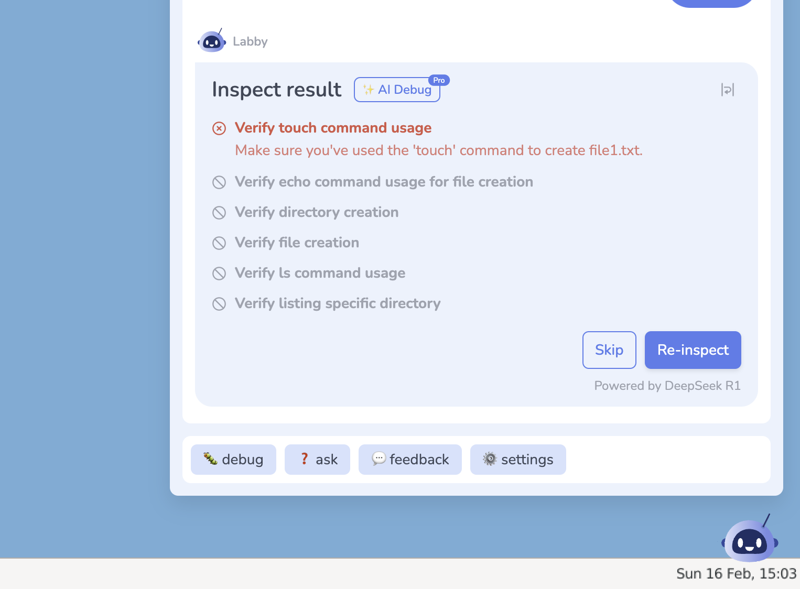
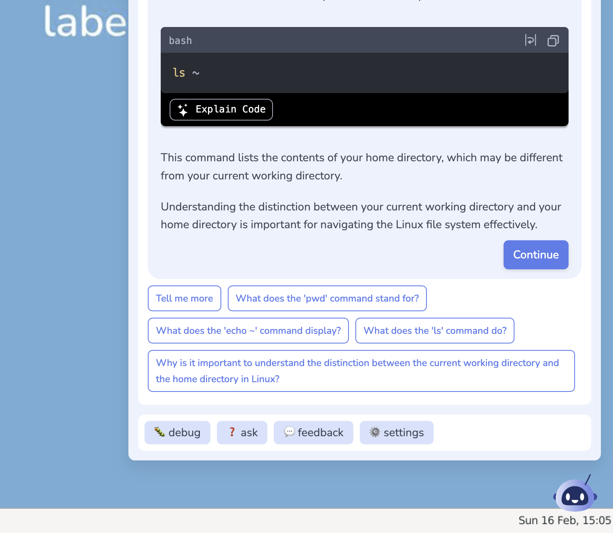
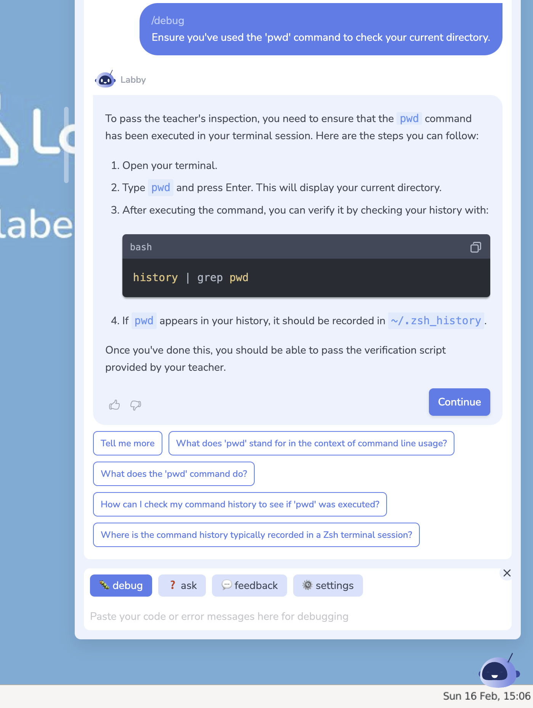

# [Labby by LabEx](https://labex.io/)

LabEx is an interactive, hands-on learning platform dedicated to coding and technology. It combines labs, AI assistance, and virtual machines to provide a no-video, practical learning experience.

Labby is a DeepSeek R1-powered learning assistant that supports automatic verification of student's practice code and provides instant feedback, debugging, and code generation.

## Auto Verification

## Related Questions

## Debugging and Code Generation

