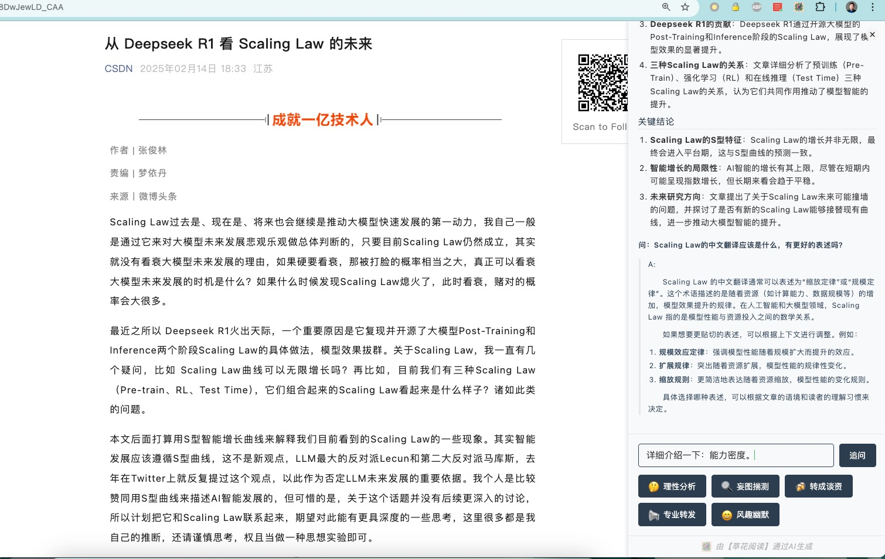

# Refine Reader （Chrome Extension）

  

  An AI-powered intelligent reading assistant dedicated to helping users quickly understand and extract article essentials, with interactive reading support.

## ✨ Key Features

- 🤖 **AI Smart Summary**: One-click generation of core viewpoints, key arguments, and crucial conclusions
- 🌏 **Multi-language Support**: Supports Simplified Chinese, Traditional Chinese, English, Japanese, and Korean
- 🎨 **Theme Switching**: Multiple elegant themes including Chinese Ink and Spring Vibes
- 💬 **Reading Interaction**: Supports multi-turn dialogue based on article content
- ⚡️ **Quick Inquiry**: Built-in question templates for instant professional insights

## 🛠️ Supported AI Models

- OpenAI (GPT-4/3.5)
- Tongyi Qianwen
- DeepSeek
- Claude
- Ollama (Local Deployment)
- More integrations coming soon

## 🚀 Quick Start

1. Install Refine Reader extension from Chrome Web Store
2. Click the extension icon to enter settings and configure AI model
3. Open any article page and click "AI Smart Summary"
4. Enjoy the intelligent reading experience!

## 🎯 Use Cases

- 📚 Quickly grasp key points of long articles
- 📝 Generate professional article analysis
- 🗣️ Obtain multi-perspective interpretations
- 📢 One-click content sharing generation

  

  

  

## 🔒 Privacy Protection

- All configuration information stored locally only
- API keys securely encrypted
- No collection of personal user information

## 👨‍💻 Developer

- GitHub: [wzfukui/refinereader](https://github.com/wzfukui/refinereader)
- Website: [https://refinereader.cuihuaer.com](https://refinereader.cuihuaer.com)
