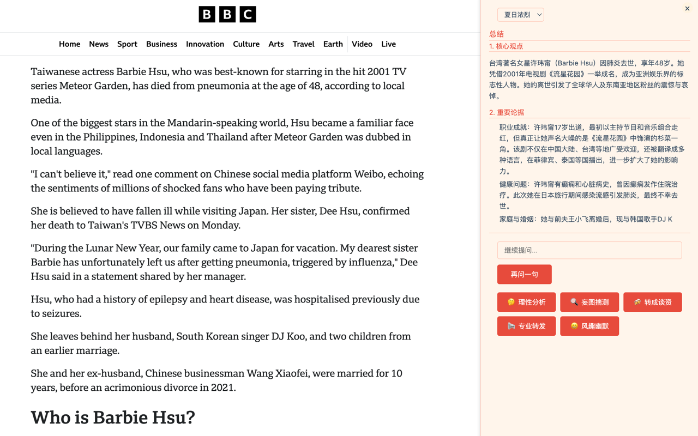
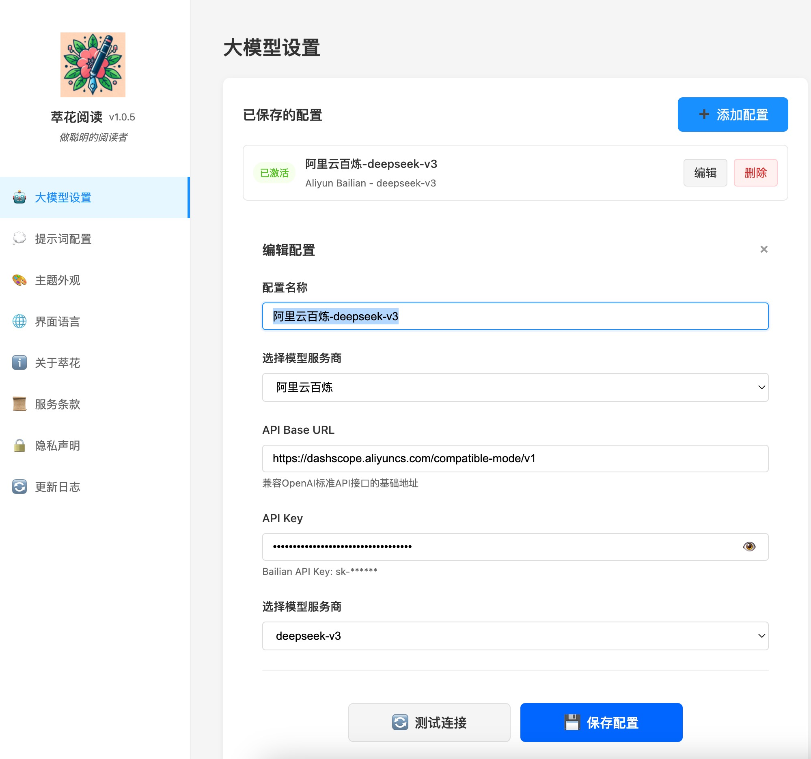

# 萃花阅读 (Refine Reader, Chrome扩展)

  

  一款基于 AI 的智能阅读助手，致力于帮助用户快速理解和提炼文章精华，支持阅读互动。

## ✨ 主要功能

- 🤖 **AI 智能总结**：一键生成文章核心观点、重要论据和关键结论
- 🌏 **多语言支持**：支持中文简体、中文繁体、英文、日文、韩文
- 🎨 **主题切换**：内置水墨中文、春意盎然等多种精美主题
- 💬 **阅读互动**：支持基于文章内容的多轮对话
- ⚡️ **快速提问**：内置多种提问模板，一键生成专业见解

## 🛠️ 支持的 AI 模型

- OpenAI (GPT-4/3.5)
- 通义千问
- DeepSeek
- Claude
- Ollama (本地部署)
- 更多集成中

## 🚀 快速开始

1. 在 Chrome 商店安装萃花阅读扩展
2. 点击扩展图标，进入设置页面配置 AI 模型
3. 打开任意文章页面，点击"AI智能总结"
4. 享受智能阅读体验！

## 🎯 使用场景

- 📚 快速掌握长文章重点
- 📝 生成专业的文章分析
- 🗣️ 获取多角度的解读见解
- 📢 一键生成分享内容

  

  

  

## 🔒 隐私保护

- 所有配置信息仅存储在本地
- API 密钥安全加密存储
- 不收集任何用户个人信息

## 👨‍💻 开发者

- GitHub：[wzfukui/refinereader](https://github.com/wzfukui/refinereader)
- 网站：[https://refinereader.cuihuaer.com](https://refinereader.cuihuaer.com)

