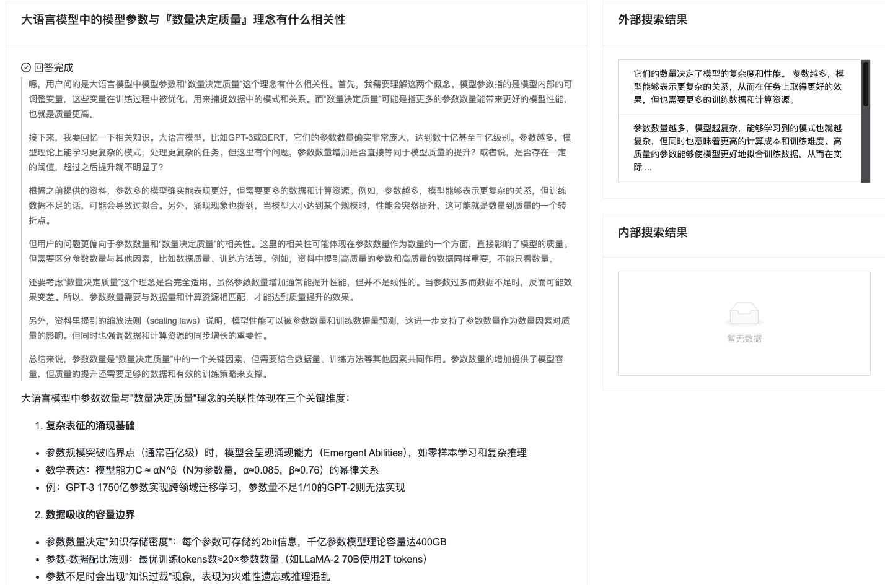

# RuZhi AI Notes

RuZhi AI Notes is an intelligent AI knowledge management tool dedicated to providing users with one-stop knowledge management and application services, including AI search and exploration, AI results to notes conversion, note management and organization, knowledge presentation and sharing, etc.

## Core Advantages

### 1. Powerful AI Model Support
- Integrated with DeepSeek thinking model
- According to user feedback, compared to similar products, our model:
  - More stable
  - Higher output quality
  - Can integrate with enterprise internal knowledge bases

### 2. Convenient Content Management
- One-click save AI conversation content to notes
- Support for various export formats:
  - Markdown
  - Word documents
  - PDF files
  - PPT presentations
  - Resume templates
  and more formats

### 3. Upcoming Features
- Task management list
- To-do tracking
- Calendar management
- More intelligent features
- Multi-platform clients

## Usage Guide

#### Method 1: Search
1. Search for "RuZhi AI Notes" in search engines
2. Register

#### Method 2: Direct Link Access
1. Visit our official link https://ruzhiai.perfcloud.cn/
2. Complete the registration process
   - The system will automatically create an application for you after registration
   - You can then start using all features
