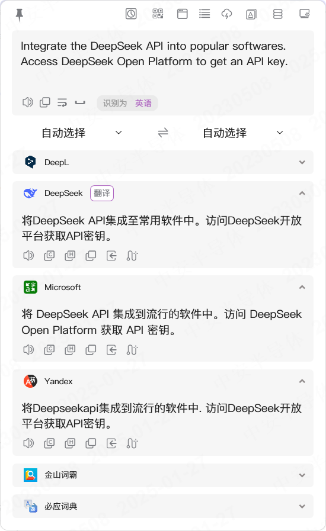
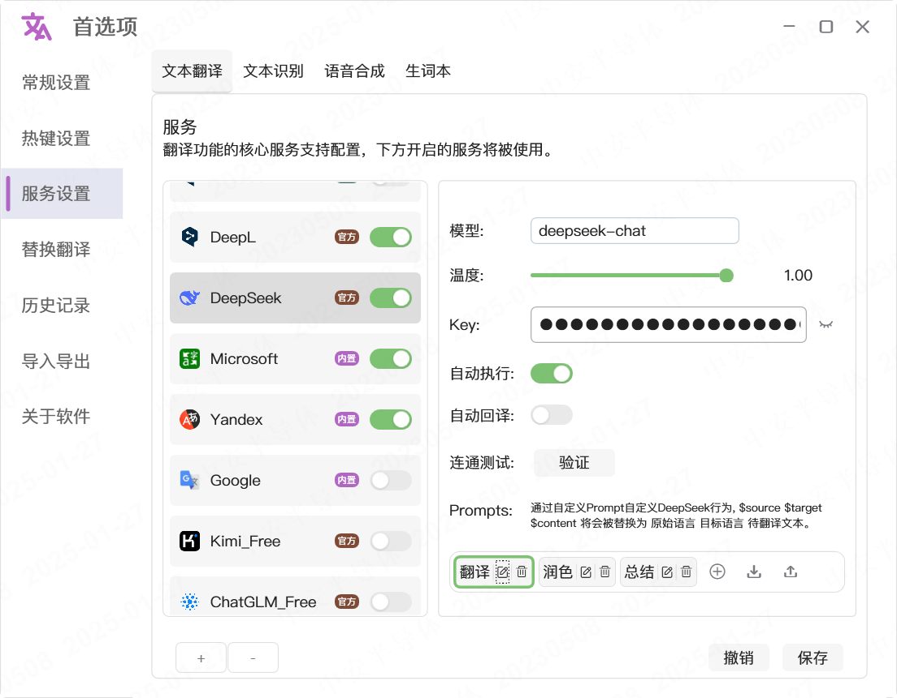
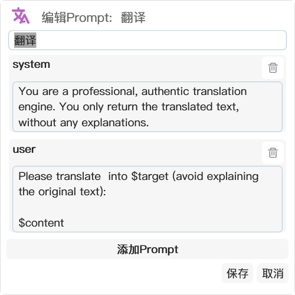

 

# [`STranslate`](https://stranslate.zggsong.com/)

STranslate 是一款即用即走的翻译、OCR工具

## 翻译

支持多种翻译语言，支持输入、划词、截图、监听剪贴板、监听鼠标划词等多种翻译方式，支持同时显示多个服务翻译结果，方便比较翻译结果

## OCR

支持中英日韩完全离线OCR，基于 PaddleOCR，效果优秀反应迅速，支持截图、剪贴板、文件OCR，支持静默OCR，同时支持微信、百度、腾讯、OpenAI、Google等OCR

## 服务

支持DeepSeek、OpenAI、Gemini、ChatGLM、百度、微软、腾讯、有道、阿里等十多家翻译服务接入；同时还提供免费API可供选择；内置微软、Yandex、Google、金山词霸等内置服务可做到开箱即用

## 特色

支持回译、全局TTS、写作(选中后直接翻译替换内容)、自定义Prompt、二维码识别、外部调用等等功能

## 主界面

## 配置

