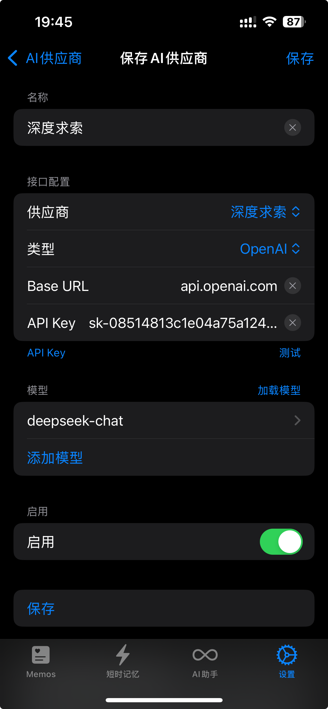
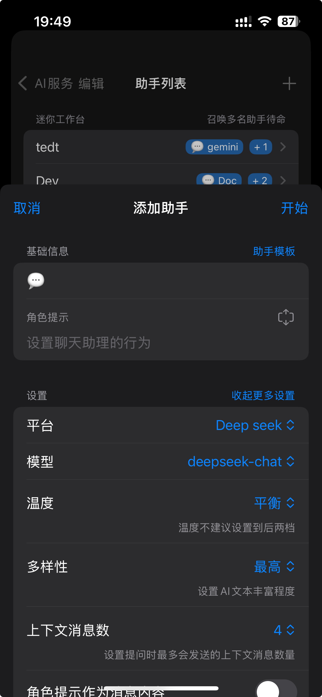

# [ToMemo](https://apps.apple.com/cn/app/tomemo/id1610843304)

ToMemo 是一款短语合集 + 剪切板历史 + 键盘输出的 iOS 应用，集成了 AI 大模型，可以在键盘中快速输出使用。

## UI

## Integrate with Deepseek API

- 进入「设置-扩展-AI 服务-AI 供应商」，点击右上角「添加」，在**供应商**中选择「DeepSeek」。
- 在**API Key**中输入你的 API Key。
- 点击「测试」按钮，测试填入是否可用。
- 点击「加载模型」，选择需要使用的模型
- 打开「启用」后，点击「保存」

## Use

- 进入「设置-扩展-AI 服务」，
- 点击「AI 助手」进入 AI 助手页面，
- 右上角添加 AI 助手，可以在模型中选择「深度求索」
- 开始和 Deepseek 聊天

