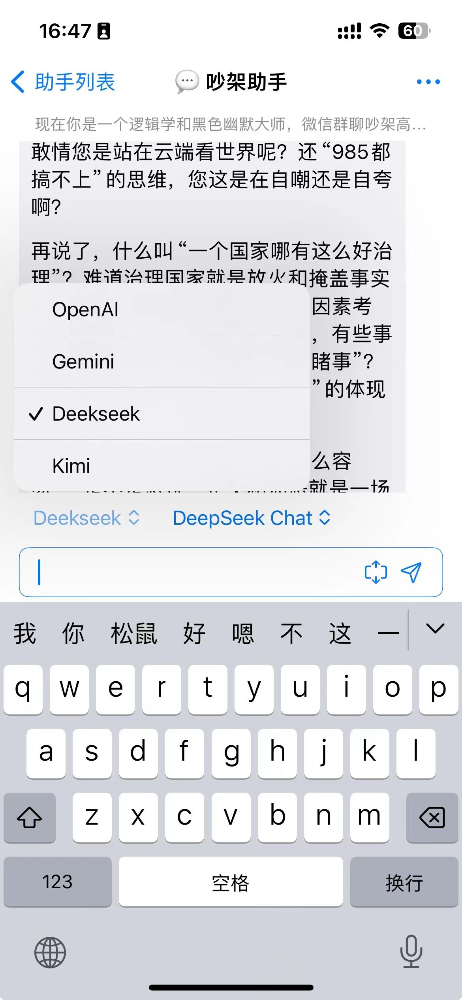
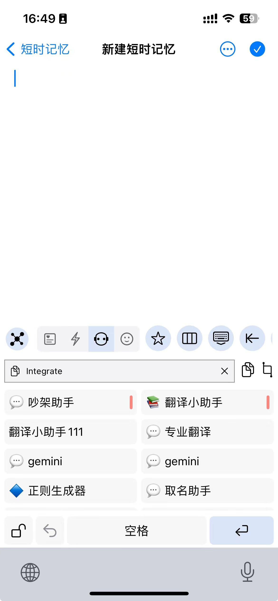
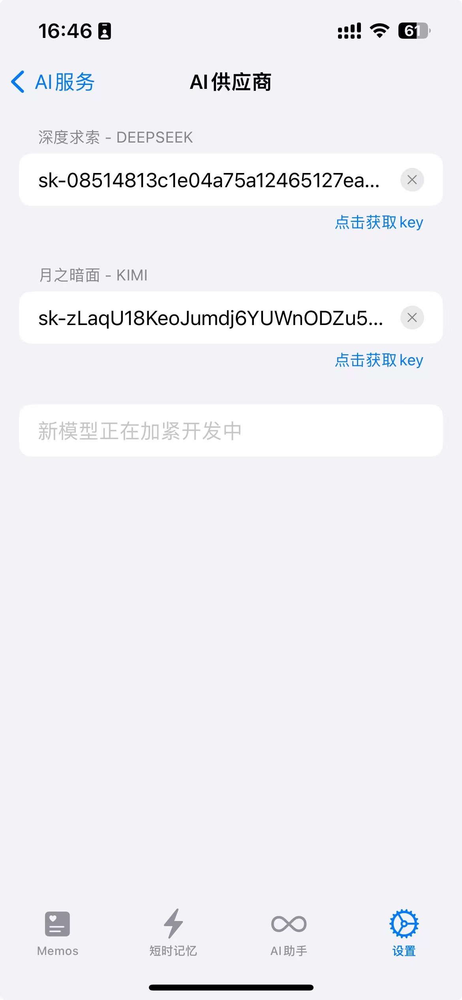

# [ToMemo](https://apps.apple.com/cn/app/tomemo/id1610843304)

ToMemo 是一款短语合集 + 剪切板历史 + 键盘输出的 iOS 应用，集成了 AI 大模型，可以在键盘中快速输出使用。

## UI

## Integrate with Deepseek API

进入设置-扩展-AI 服务-AI 供应商，即可添加 Deepseek API Key。
添加完成后，可以 AI 服务页面中开启底部 Tab 页，方便应用中直接与 Deepseek 对话。

