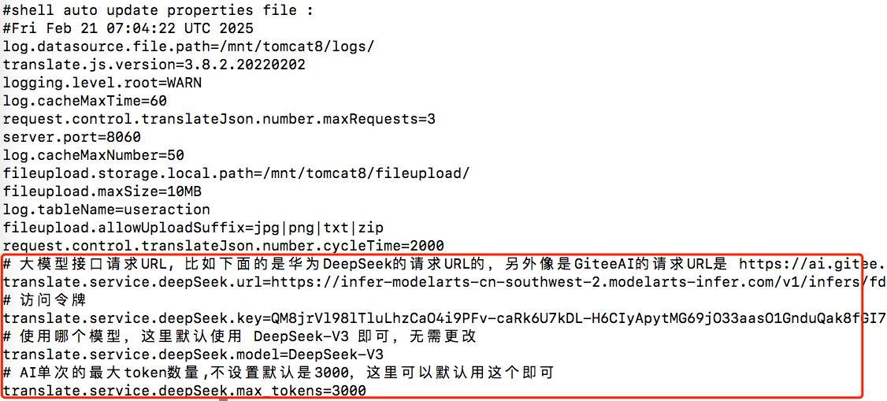
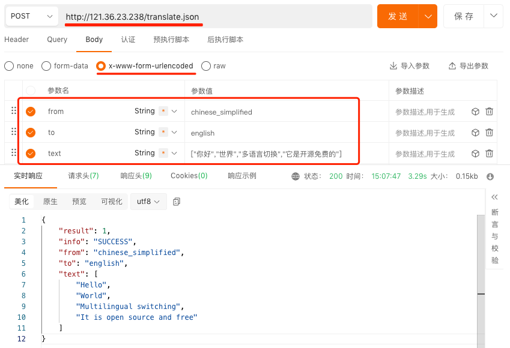

<h1 align="center">
    translate.js
</h1>
<h4 align="center">
    それはフロントエンド開発者向けのAI i18nで、2行のJSでHTMLの全自動翻訳を実現します。 <br/>
    AIに任せて、ページの変更なし、言語設定ファイルなし、APIキーなし、SEOに優しい！
</h4> 

  

# 使用方法
### 1. テキスト翻訳APIの展開
まず、テキスト翻訳のオープンインターフェースを展開し、一度に複数のテキストをバッチ翻訳することをサポートし、同時に多層キャッシュシステムを内蔵して、AI翻訳の時間を最大限に短縮します。これにより、ユーザーが使用時に瞬時に遅延なく翻訳できる能力を実現します。

##### 1.1 サーバー仕様
1コア1GB、20GBのシステムディスク、1MBの帯域幅で、オペレーティングシステムはCentOS 7.4（7.0〜7.9でも可）で完璧に動作します。

##### 1.2 インストール
````
wget https://gitee.com/mail_osc/translate/raw/master/deploy/install_translate.service.sh -O install.sh && chmod -R 777 install.sh && sh ./install.sh
````

##### 1.3 DeepSeek パラメータの設定

編集 application.properties ：
````
vi /mnt/tomcat8/webapps/ROOT/WEB-INF/classes/application.properties
````
その後、最後にいくつかの設定を追加します： 
````
# 大規模モデルインターフェースリクエストURL、例えば以下のものはHuawei DeepSeekのリクエストURLです。また、GiteeAIのリクエストURLは https://ai.gitee.com/v1/chat/completions 他のプラットフォームからは自分で取得して入力できます
translate.service.deepSeek.url=https://infer-modelarts-cn-southwest-2.modelarts-infer.com/v1/infers/fd53915b-8935-48fe-be70-449d76c0fc87/v1/chat/completions
# アクセストークン
translate.service.deepSeek.key=QM8jrVl98lTluLhzCaO4i9PFv-caRk6U7kDL-H6CIyApytMG69jO33aasO1GnduQak8fGI7dtpmbsM98Qh3ywA
# どのモデルを使用するか、ここではデフォルトで DeepSeek-V3 を使用すればよく、変更する必要はありません。
translate.service.deepSeek.model=DeepSeek-V3
# AIの単回の最大トークン数、設定しない場合デフォルトは3000で、ここではデフォルトでこれを使用すれば良いです。
translate.service.deepSeek.max_tokens=3000
````
最終の効果は以下の図のとおりです：  


##### 1.4 サービスを再起動する
````
pkill java
sudo /mnt/tomcat8/bin/startup.sh
````

##### 1.5 テキスト翻訳APIをテストする
  
ここで渡される「from」は、翻訳前の言語を表します。もしその言語がわかればそれを記入し、わからない場合や判断が難しい場合は、上記のように固定して記入してください。DeepSeekが自動的に認識し、翻訳を行います。
この翻訳APIインターフェースの詳細な説明については、以下を参照してください： [http://api.zvo.cn/translate/service/20230807/translate.json.html](http://api.zvo.cn/translate/service/20230807/translate.json.html)


### 2. htmlでtranslate.jsを使用する

**通常のウェブサイトで、ある言語をクリックして切り替える**  
以下の図に示すように、ウェブサイトの特定の場所でいくつかの言語を切り替える必要があります。
  
そのHTMLコードの末尾に以下のコードを直接追加します：  

````
<!-- ある言語の切り替えボタンを追加します。ulに class="ignore" が追加されていることに注意してください。これは、この部分のコードが翻訳されないことを意味します。 -->
<ul class="ignore">
	<li><a href="javascript:translate.changeLanguage('english');">English</a></li>|
	<li><a href="javascript:translate.changeLanguage('chinese_simplified');">简体中文</a></li>|
	<li><a href="javascript:translate.changeLanguage('chinese_traditional');">繁體中文</a></li>
</ul>

<!-- 多言語切り替えのJSを導入 -->
<script src="https://res.zvo.cn/translate/translate.js"></script>
<script>
	//デフォルトの選択言語が表示されない
	translate.selectLanguageTag.show = false; 
	//テキスト翻訳APIのホストを設定します。これは、上記の最初のステップでデプロイしたテキスト翻訳APIです。これに関する詳細は、以下を参照してください。 https://translate.zvo.cn/4068.html
	translate.request.api.host='http://121.36.23.238/'; 
	//翻訳トリガーの初期化
	translate.execute();
</script>
````

これは最も一般的なシーンでの使用例です。また、VUEやReactなどの各フレームワークや、さまざまな管理画面など、JSが実行できる環境であればどこでも使用できます！

# オープンソースリポジトリ
https://github.com/xnx3/translate  
