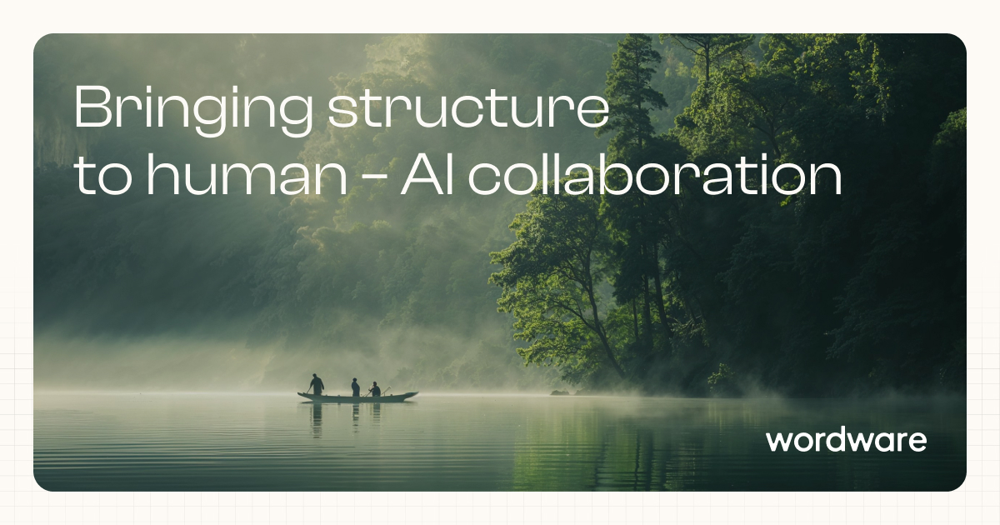
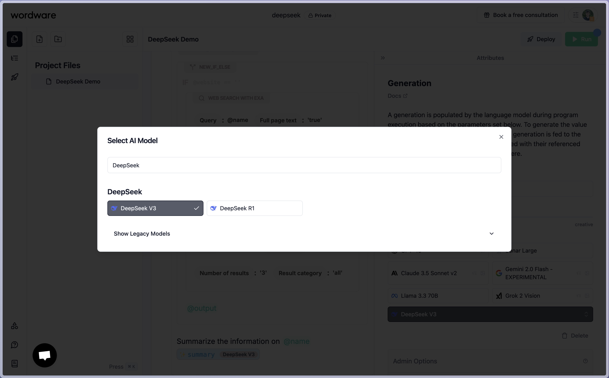
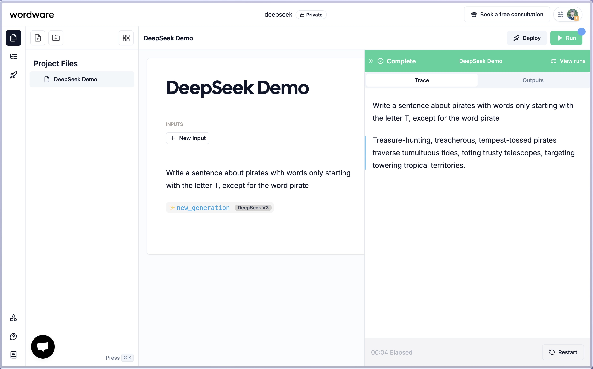
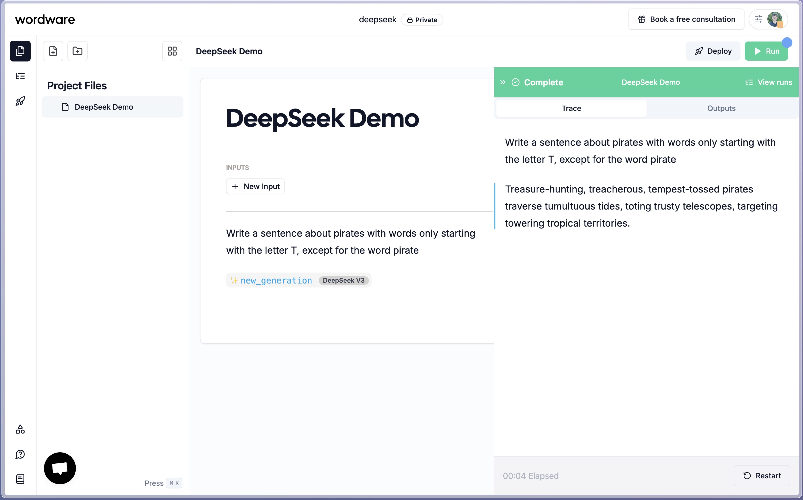
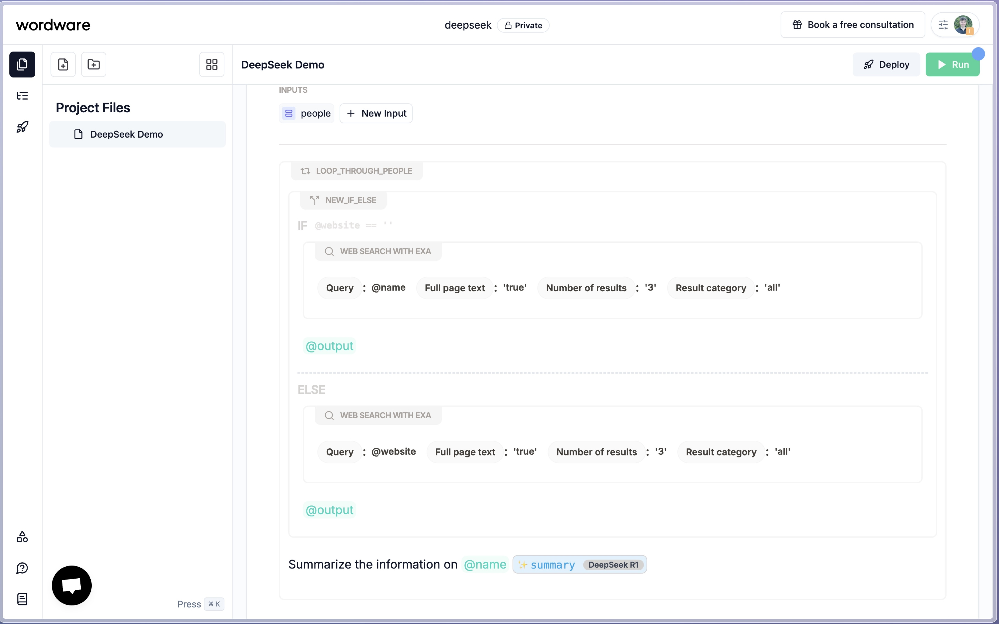

<!-- TEXT_SECTION:header:END -->

# Use DeepSeek Through Wordware

<a href="https://www.wordware.ai/">Wordware</a> is a toolkit that enables anyone to build, iterate, and deploy their AI stack with just natural language. Wordware is the easiest and fastest way to integrate both DeepSeek V3 and R1 into your LLM applications.

## Tutorial

### Create a new generation with the slash command

### Select your desired DeepSeek model

### Provide it with your context and press run. It's that simple.

### Use R1 for more advanced reasoning.

### And pair it with control blocks and tools to create more complex flows

### Refer to the <a href="https://docs.wordware.ai/tour">docs</a> to learn more.

### Try <a href="https://www.wordware.ai/">Wordware</a> out today and build something awesome!
