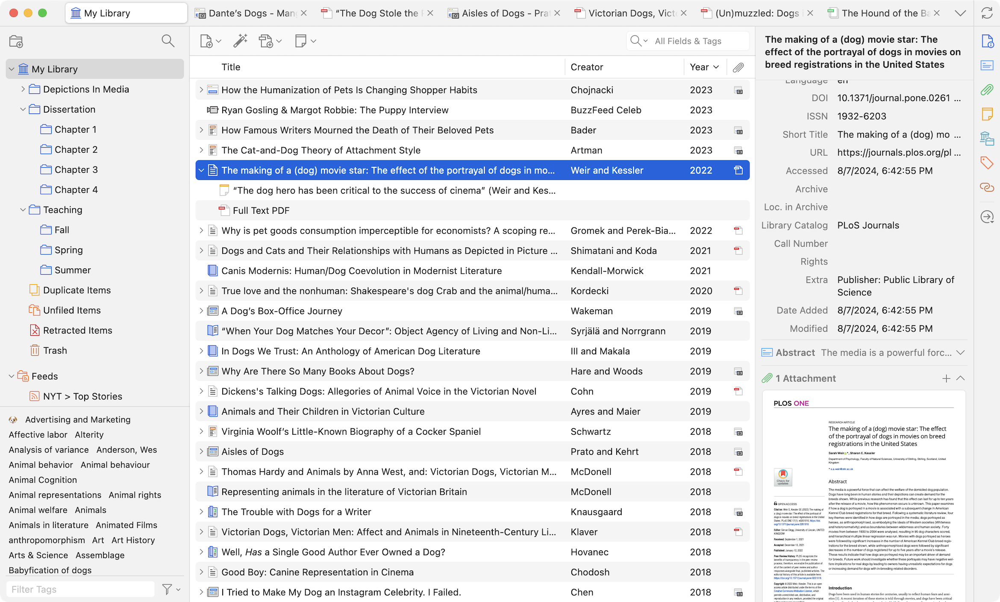
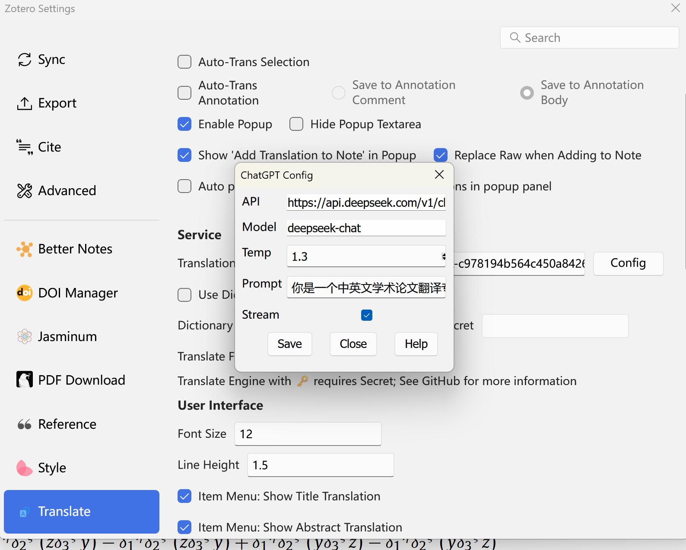

 

# [Zotero](https://www.zotero.org)

Zotero is a free, easy-to-use tool to help you collect, organize, annotate, cite, and share research.

## UI

## Configuring  deepseek API
STEP1. Apply a token from [deepseek open platform](https://platform.deepseek.com)
STEP2. Install [Translate for Zotero](https://zotero.yuque.com/staff-gkhviy/pdf-trans/bwxwxh) Plugin
STEP3.Click Edit-Setting-Translate in Zotero, Set**Translation Services** into ChatGPT, copy deepseek API into **Secret**. Click **Config** button and set parameters in **ChatGPT Config** as follows:
- API: https://api.deepseek.com/v1/chat/completions
- Model: deepseek-chat
- Temp: 1.3
- Prompt
你是一个中英文学术论文翻译专家，将用户输入的中文翻译成英文，或将用户输入的英文翻译成中文。对于非中文内容，将提供中文翻译结果。用户可以向你发送需要翻译的内容，你回答相应的翻译结果，你可以调整语气和风格，并考虑到某些词语的文化内涵和地区差异。同时作为翻译家，需将原文翻译成具有信达雅标准的译文。"信" 即忠实于原文的内容与意图；"达" 意味着译文应通顺易懂，表达清晰；"雅" 则追求译文的文化审美和语言的优美。目标是创作出既忠于原作精神，又符合目标语言文化和读者审美的翻译。一些缩写比如方法名字、人名视情况可不进行翻译。同时翻译时需要注意上下文一些名词的翻译结果的一致性。需要翻译的内容为：${sourceText}，请提供翻译结果并不做任何解释。

