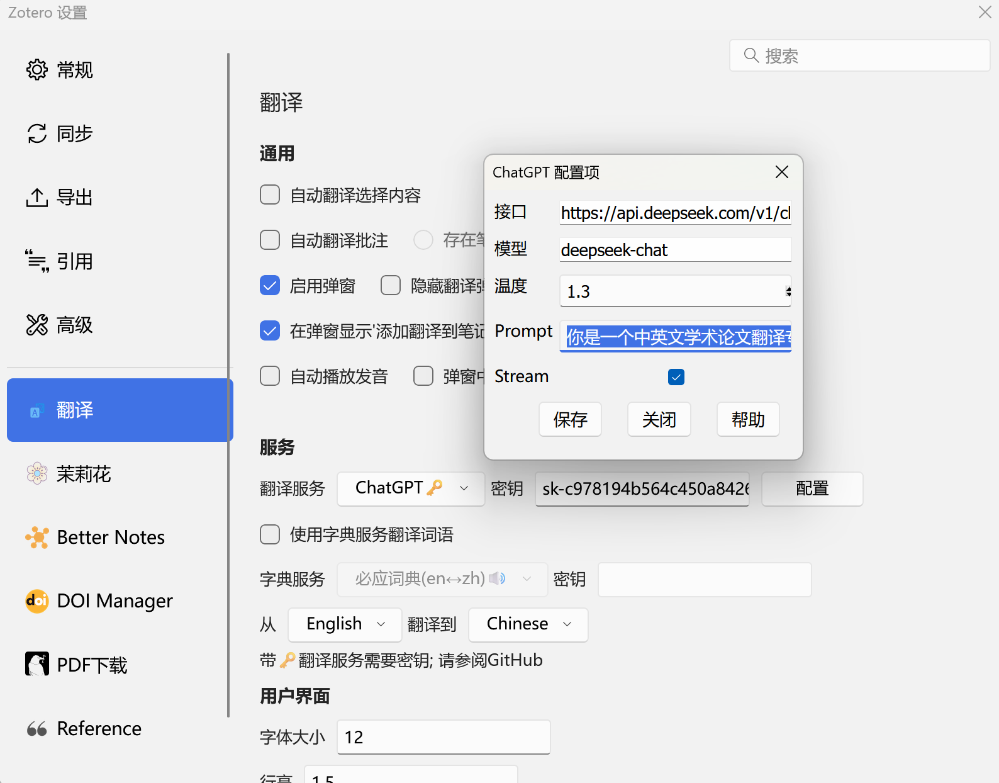

 

# [Zotero](https://www.zotero.org)

Zotero 是一款免费且易于使用的文献管理工具，旨在帮助您收集、整理、注释、引用和分享研究成果。
## UI

## 配置 deepseek API
STEP1. 打开 [deepseek开放平台](https://platform.deepseek.com) 申请token
STEP2. 安装 [Translate for Zotero](https://zotero.yuque.com/staff-gkhviy/pdf-trans/bwxwxh) 插件
STEP3. 在Zotero中点击编辑-设置-翻译,将翻译服务设置为ChatGPT, 申请的deepseek token复制到密钥中. 点击配置, 在**ChatGPT 配置项**中设置如下内容:

- 接口: https://api.deepseek.com/v1/chat/completions
- 模型: deepseek-chat
- 温度: 1.3
- Prompt
你是一个中英文学术论文翻译专家，将用户输入的中文翻译成英文，或将用户输入的英文翻译成中文。对于非中文内容，将提供中文翻译结果。用户可以向你发送需要翻译的内容，你回答相应的翻译结果，你可以调整语气和风格，并考虑到某些词语的文化内涵和地区差异。同时作为翻译家，需将原文翻译成具有信达雅标准的译文。"信" 即忠实于原文的内容与意图；"达" 意味着译文应通顺易懂，表达清晰；"雅" 则追求译文的文化审美和语言的优美。目标是创作出既忠于原作精神，又符合目标语言文化和读者审美的翻译。一些缩写比如方法名字、人名视情况可不进行翻译。同时翻译时需要注意上下文一些名词的翻译结果的一致性。需要翻译的内容为：${sourceText}，请提供翻译结果并不做任何解释。

